
# Azure Serverless and Power Apps Demo Script #

## Setup ##

- Azure
	- Set up and configure Tailwind Traders solution
- Mobile device (and/or Power Apps)
	- Running Tailwind Traders app
	- Have tested photo of form conveniently accessible
- Browser tabs
	- Form recognizer page ([https://azure.microsoft.com/en-us/services/cognitive-services/form-recognizer/](https://azure.microsoft.com/en-us/services/cognitive-services/form-recognizer/))
	- Azure portal opened to Tailwind Traders Function app's Platform features tab
- Visual Studio Code
	- Logic Apps extension installed
	- Tailwind Traders Azure Functions solution open
	- Open files
		- Scan.cs open
		- Logic Apps workflow open

## Script ##

1. Start with the Tailwind Traders Power App.

    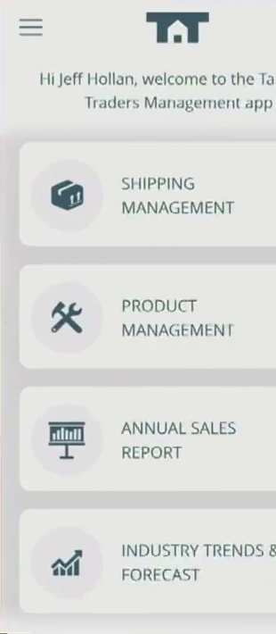

    _Hello everyone. I'm here to talk about serverless computing in Azure. As many of you already know, serverless technology can be used to dramatically increase your productivity so that you can build and ship applications faster. But what I'm going to focus on today is how easy it is to combine serverless computing with complimentary services like Power Apps, Cognitive Services, and Logic Apps to solve real problems._

    _In this demo, I'm going to show you how Tailwind Traders is using the breadth of Azure's serverless platform to improve their operations. They have many regional distribution centers that are constantly receiving shipments. As part of the process, they are always exchanging paper forms that must be manually reviewed to ensure the deliveries are complete and in the right place. Plus, it has historically been very time-consuming and error-prone for employees to update the company's business software to reflect so many changes in inventory._

1. Navigate to **Shipping Management**.

    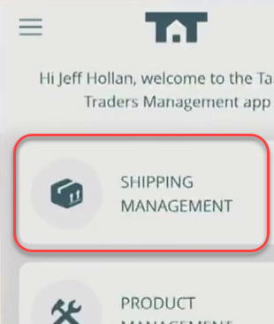

    _As part of an effort to modernize their processes, Tailwind Traders has built a few things on top of serverless technology. We'll start off with one of their line of business mobile applications. It doesn't really look different from any mobile app. In fact, the app itself is not very special. But what makes it special is who built it and how._

    _This application was built by non-developer employees at Tailwind Traders. We like to think of them as "citizen developers". They have special domain knowledge about the kinds of problems they're trying to solve, so they use Power Apps to construct the exact solutions they need. Thanks to an intuitive visual design experience, these citizen developers are able to drag and drop the elements they need into the user experience in the way that makes sense to them. Even developers with experience building depth mobile experiences with technologies like Xamarin will find that Power Apps can often be the best solution for rapidly delivering a basic user experience over data._

    _Calling back to our scenario, we mentioned that the bottleneck in productivity is the human employee. They need to read the paper shipment form, interpret it, and then enter it into the business software. The obvious opportunity here is to have the application itself read, interpret, and import the data. This would enable the employee to apply their unique human skills in a supervisory role._

    _Let's walk through the process of receiving a shipment. We'll start with a paper form received along with an incoming shipment. Ordinarily an employee would take a photo of the form using the app, but for this demo I'll just select one I took earlier._

1. Click **Scan Shipment** and select the form photo.

    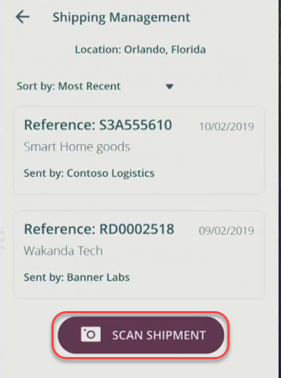

    _However, now we just have a photo of the form in memory. There was no service out there that could convert this form into structured data. Fortunately, Tailwind Traders knew that there was an answer with machine learning and artificial intelligence, but the warehouse team didn't have any subject matter expertise on how to actually do it._

1. Click **Process**.

    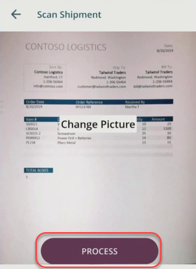

    _This is where the magic happens. Since the team has all kinds of past forms in their records, they were able to upload scans of those forms to Azure Cognitive Services. They could then train their own unique form recognizer service to identify which forms had which data in which locations. With enough samples, the service would learn to automatically read these kinds of forms for them and return structured data to the application._

1. Wait for the service to return the parsed form.

    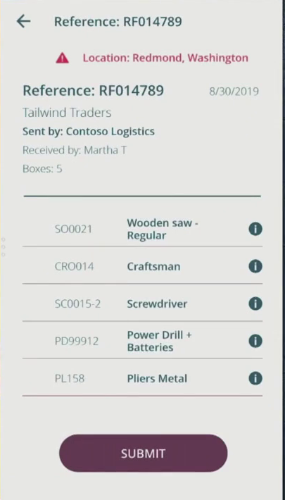

    _Now that the service has parsed the form for us, we-as humans-can validate the data much more easily. We can confirm that the products and numbers look correct._

1. Click through to a specific product and confirm the content. Return back to the parsed form view.

    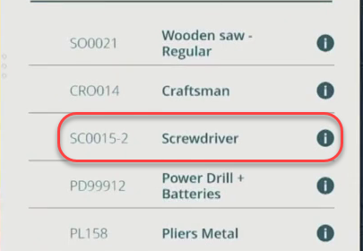

    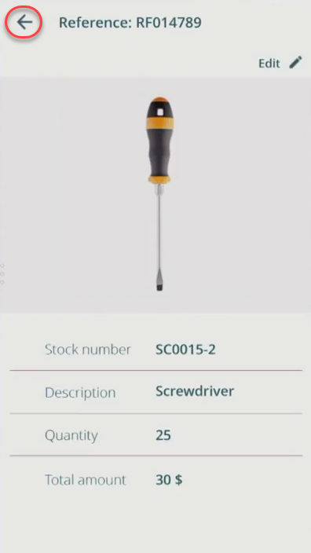

    _However, something that might have slipped by me if I weren't paying close attention is that this shipment was destined for Redmond, WA. Fortunately, the app has detected that I'm somewhere else and is raising that as a warning to make sure I don't accidentally sign off on a mis-delivery._

1. Click the location warning. Decline to change the location.

    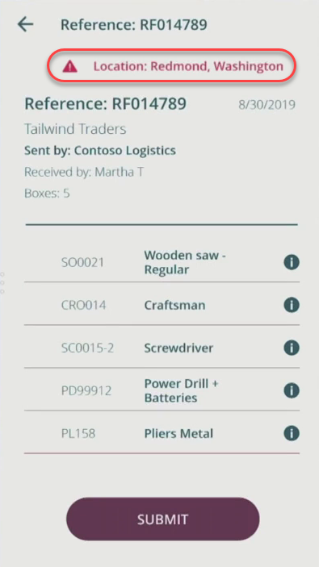

    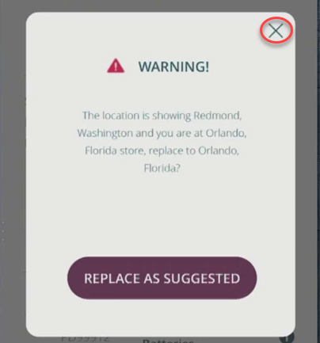

    _There are so many ways this application can improve our warehouse operations and quality._

1. Switch to the **Form Recognizer** browser tab.

    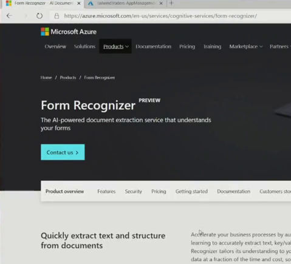

    _For services like the Form Recognizer, you don't even need specialized expertise. You can simply follow the instructions provided to train a service to recognize and parse forms for you. It's really that simple. And there are many other cognitive services just like it available._

1. Switch to **Visual Studio Code** open to **Scan.cs**.

    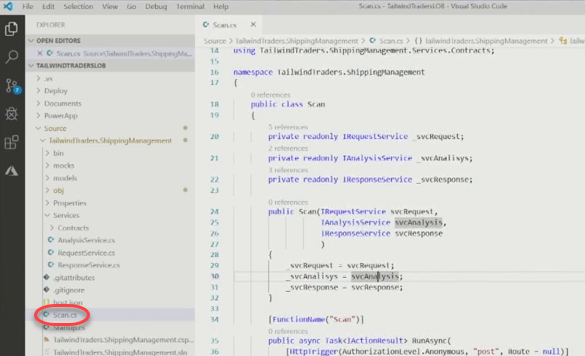

    _Another great thing about this application is that it relies on serverless technology. Teams worry about the technical and financial commitment required to allocating and managing service infrastructure. That's not a problem with Azure Functions. They were able to create a function that did exactly what they needed, and then deployed it without having to worry about scale. This service was written in C#, but it could have been written in PowerShell, Python, JavaScript, Java, or anything else._

1. Reference code as necessary from the **RunAsync** method.

    

    _The function already starts with a scanned form. From line 1 we're right in the middle of our business logic, which means we don't invest effort in application plumbing. Once the function is called, we send the upload to the form recognizer service and process the results against some business rules. We can validate things like inventory and location to help the employee be more productive and accurate. It's easy to debug in Visual Studio or Visual Studio Code, and you can deploy to Azure seamlessly. Once deployed, the scale is virtually unlimited. If a million forms come in at once, Azure will automatically scale out the function to serve them all._

1. Switch to the **Azure portal** browser tab. Make sure you are on the **Platform features** tab for the function app.

    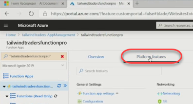

    _The Azure Functions Premium plan gives you even more control over how and when your application scales._

1. Click **Scale out** from under **App Service plan**.

    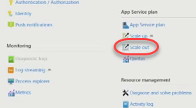

    _For example, you can configure a minimum number of instances be pre-warmed so that they are always ready to go when a request comes in. This might be the case after a weekend where you want the first request Monday morning to complete as fast as any other. There are a lot of options, and now you can make the engineering tradeoffs you need to deliver the results you're looking for._

1. Use the navigation breadcrumb to back out to the previous view. Highlight the **Networking** option from under **Networking**.

    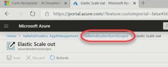

    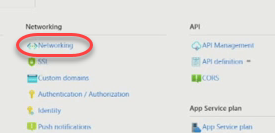

    _You can also configure secure private networking if your function needs to access other resources, whether in Azure on on-premises. Plus, all functions can get free SLL certificates from Azure for custom domains. These options for secure integration are critical, especially for companies like Tailwind Traders, who have plenty of brownfield and greyfield applications they still rely on for their core business processes._

1. Switch to **Visual Studio Code** and bring up the Logic Apps workflow.

    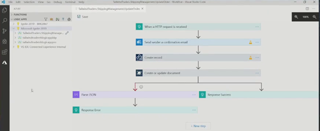

    _Once our application has the shipping form processed and it's ready to submit, the app needs to integrate with a variety of systems to complete the workflow. Unfortunately, it can get really complex to integrate all of these systems together, but that's where Logic Apps comes in. Logic Apps enables you to define serverless workflows to orchestrate the flow of data across these various endpoints._

1. Walk through the Logic Apps workflow.

    _With the Visual Studio Code extension, you can design your Logic App workflows using a visual workflow editor. In this case, we are specifying that a form submission should trigger a confirmation email to the supplier. Then we want to create a record in Dynamics for our business software, followed by a record in Cosmos DB to be used our web application. One of the great things about Logic Apps is that all of these connections are premade components._

1. Show the Logic Apps connectors available.

    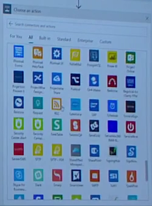

    _There are over 200 connectors available, and they allow you to coordinate your process without having to write any code for SQL or Oracle or Salesforce or anything else. And if you need to connect something that isn't yet supported, you can just have your Logic App call an Azure Function where you do anything you want._

1. Right-click the workflow in the Azure Functions Explorer and highlight **Add to Project**.

    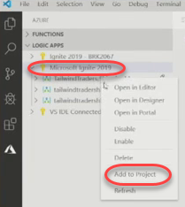

    _Plus, you can even export the workflows themselves as templates so that they can be versioned alongside your application in source control._

    _Back in the app, let's submit the form. This will kick off the workflow that integrates with all of those downstream systems._

1. Return to the running app and click **Submit**.

    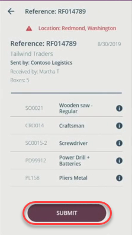

    _As we've seen here, Tailspin Traders was able to inject some machine learning, some automation, and a whole lot of integration into a key application. But thanks to Azure serverless technologies, the developers and IT teams haven't had to worry about the concerns that come with provisioning and managing infrastructure. This means that more time and resources can be invested in delivering business value. Serverless is going to play a bigger and bigger role moving forward, so get started today._

