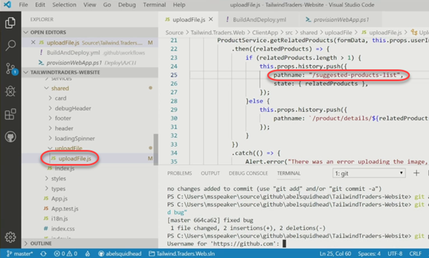
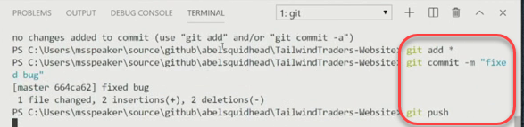
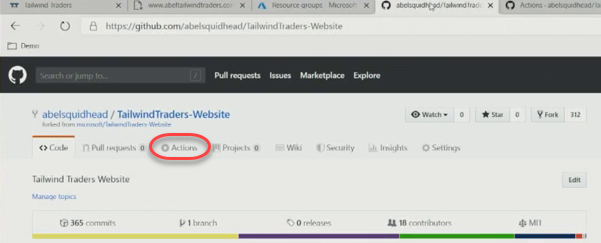
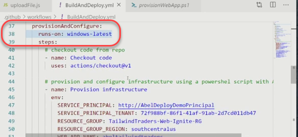
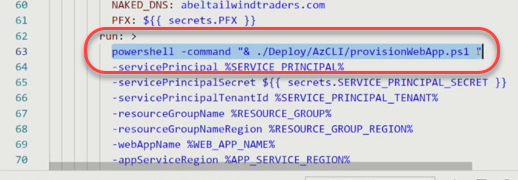
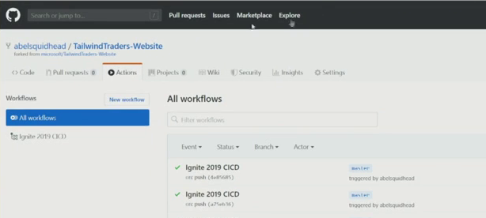
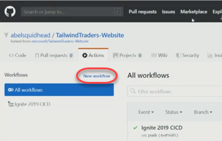
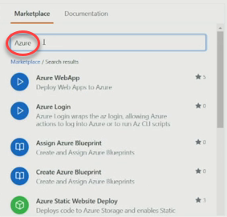

<a name="Title"></a>
# GitHub and Azure with GitHub Actions Demo Script #

<a name="Setup"></a>
## Setup ##

- Azure
	- Demo resource group created
- GitHub
	- Base project forked
	- CI/CD configuration updated to point to your environment and settings
- Browser tabs
	- Local version of project at home page
	- Production site at home page
	- Azure resource group for project
	- GitHub repo root for your fork [https://github.com/actions/typescript-action](https://github.com/actions/typescript-action)
- Visual Studio Code
	- Connect to your Tailwind Traders repo
	- Open the Tailwind Traders solution
	- Open files
		- Source/ClientApp/src/shared/uploadFile/uploadFile.js
		- .github/workflows/BuildAndDeploy.yml

<a name="Script"></a>
## Script ##

1. Start with browser tab open to local site home page.

    _Good afternoon everybody. I'm here to talk about GitHub Actions. It is a workflow engine built directly into the GitHub platform, and it enables you to create all kinds of automated workflows. It's a dream come true for any DevOps professional._

    _In this demo we're going to review some of the great things you can do for your CI/CD pipelines. In this scenario, I work for Tailwind Traders, and I'm responsible for making sure the website is delivering for the company. Right now we're looking at an instance running locally on my machine._

    _Unfortunately, this version has a bug. Tailwind Traders has a picture search feature that enables you to find products from the catalog by uploading a photo of the item you're looking for. However, I just received a report that it doesn't seem to be working. We can repro the bug by uploading a photo of a popular product that I know we sell._

	

1. Upload multi-tool image using web site UI. There should be no results.

    _But as you can see, there are no search results, even though I know there should be. This is definitely a problem, so let's switch over to the production website to investigate whether the issue is also happening there._

    

    

1. Switch to the production web site tab. It should be showing that the page cannot be reached.

    _It looks like the production situation is even worse than we expected. The entire site is down. But there's no need to panic. We can switch over to the Azure portal to find out exactly what's going on._

    

1. Switch to the Azure portal tab. This should be open to the project's resource group. The group should be empty.

    _As you can see here, all of our resources are missing. It's almost like someone came in here and completely deleted everything in preparation for this demo..._

    

    _This is actually good news for us, because it's the perfect way to illustrate how powerful Actions are. Since our DevOps team follows best practices, one of our investments was in defining our infrastructure as code. This means that every time we run a CI/CD pipeline, all required resources will be provisioned according to our specifications. Thanks to our DevOps process, I should only have to worry about fixing my version locally and then committing it to GitHub. When GitHub sees the commit, it will kick off the CI/CD pipeline. The pipeline will build the application, provision and configure the infrastructure, and finally deploy the site to production._

    _Now let's see it in action. The first thing we need to do is to fix the bug. It's a relatively minor bug related to using the wrong path name, so I know exactly how to fix it._

1. Switch to Visual Studio Code and bring up **uploadFile.js**. Make the change below.

    

    ```
    pathname: "/new-products-list",
    ```
    to

    ```
    pathname: "/suggested-products-list",
    ```
    _We'll skip past local testing and commit it to the repo on GitHub._

1. Save, commit, and push the changes to GitHub.

    

    _Once the commit has been detected, GitHub will spin up our CI/CD workflow. Let's switch to that tab to take a look._

1. Switch to the browser tab open to your GitHub project and navigate to **Actions**.

    

    _Here we can see that the workflow is up and running. We can follow along in real time as it builds the app, provisions the resources, and deploys the bits._

1. Click the newly created workflow.

    

    _This will take a moment to run, so let's step over to another tab so I can show you how to create one of these workflows._

1. Return to Visual Studio Code. Scroll up in the **Explorer** tab and expand the **.github/workflows** path.

    

    _Here we are in the root of the repository. Note that there's a .github directory with a workflows directory inside of it. This is where YAML workflow definition files are stored. Our CI/CD pipeline is defined in BuildAndDeploy.yml, so let's dig into it._

1. Open **BuildAndDeploy.yml**.

    _The pipeline has been organized into three jobs: build, provisionAndConfigure, and deploy. Each job is just a set of steps to be run in a specified environment._

1. Locate the **build** job and highlight the **runs-on** setting.

    

    _For example, the build job uses a Windows virtual machine. If you need Linux or Mac, you can simply change this setting and you'll get what you need. The steps that follow describe how the build is to be performed as a series of actions._

1. Highlight the **provisionAndConfigure** job.

    

    _The next job provisions and configures the Azure resources we need. Note that this job is configured to run in parallel to the build job. Since they're not dependent on each other, we're able to get our builds out faster by running them at the same time._

1. Locate the call to **powershell** within the **provisionAndConfigure** job.

    

    _All of the heavy lifting is done in our PowerShell script and uses the settings defined in the job. This file gives us the ultimate flexibility to do anything, like provisioning VMs, configuring DNS settings, setting SSL certs, and more._

1. Highlight the **deploy** job.

    

    _The final job is to deploy. This job needs both the build and provision jobs to complete, so it waits for them to finish._

1. Locate the **azure/webapps-deploy@v1** step within the **deploy** job.

    

    _When everything is ready, it uses an action provided by Microsoft to deploy our solution to the Azure app service._

    _Using YAML to describe workflows is great because we can treat it like any other source file. In addition to the version tracking benefits, it also means that someone forking a repo gets not only the code to build the solution, but also the code needed to provision and deploy it._

1. Switch to the browser tab open to the GitHub Actions workflow.

    

    _However, one of the challenges with YAML's versatility is that it can be challenging to work with._

1. Click **New workflow**.

    

    _Fortunately, GitHub has made the experience much smoother by providing a substantial library of starter workflows you can customize to meet your needs. When you create a new workflow, there are tons of templates you can begin with. Let's create a new workflow for a Go project so you see how much we start with._

1. Scroll through the list and locate the **Go** template. Click **Set up this workflow**.

    

    _All we need to do now is to customize it for our specific solution details and we already have a CI pipeline. If we want to add more actions, we can easily search the Marketplace for them. In our case, we would want to deploy to Azure, so let's search for that._

1. Use the **Marketplace** search option to search for **"Azure"**.

    

    _There are new actions being added all the time, so this experience just keeps getting better every day. And, of course, you can write your own custom actions to perform any task that isn't yet supported._

1. Switch to the browser tab on the **Typescript Action** template project page.

    

    _It's all done in JavaScript, so anything you can do in code can become an action. GitHub even provides a robust Action template with step-by-step instructions on how to implement whatever you need._

1. Switch to the browser tab for your running CI/CD workflow.

    

    _Now let's go check in on our CI/CD workflow. By now it has finished, so our site has been built, provisioned, and deployed. If we return to the Azure portal, we can refresh the resource group to see that it now has the resources we need to run the site._

1. Switch to the Azure portal tab open to your resource group. Refresh the page to show resources have been provisioned.

    

    _We can also switch over to the site itself to refresh and confirm it's up and running._

1. Switch to the production site browser tab. Refresh it to confirm the site is running.

    

    _But what about our bug? Has it been fixed? Let's upload our photo to the production site and make sure._

1. Upload the multi-tool photo to confirm functionality.

    

    _As designed, we're now getting the correct search results._

    _While we're here, let's zoom in on the address bar of my browser. First, note that we're not using an Azure URL. This is my custom domain, which was automatically configured as part of the CI/CD pipeline. Also notice that it's using a legit SSL cert, which was configured automatically by the pipeline. We went from nothing to a complete, secure, production-ready web site all thanks to configuration in code and GitHub Actions._

    _We all know that GitHub is the premier service for social coding and open source projects. And now, with Actions v2, CI/CD is built right into the platform. This demo just showed you how you can use Actions to do pretty much anything you need in your DevOps cycle, so don't wait to get started. Go grab your GitHub accounts and let's start building CI/CD pipelines today._

