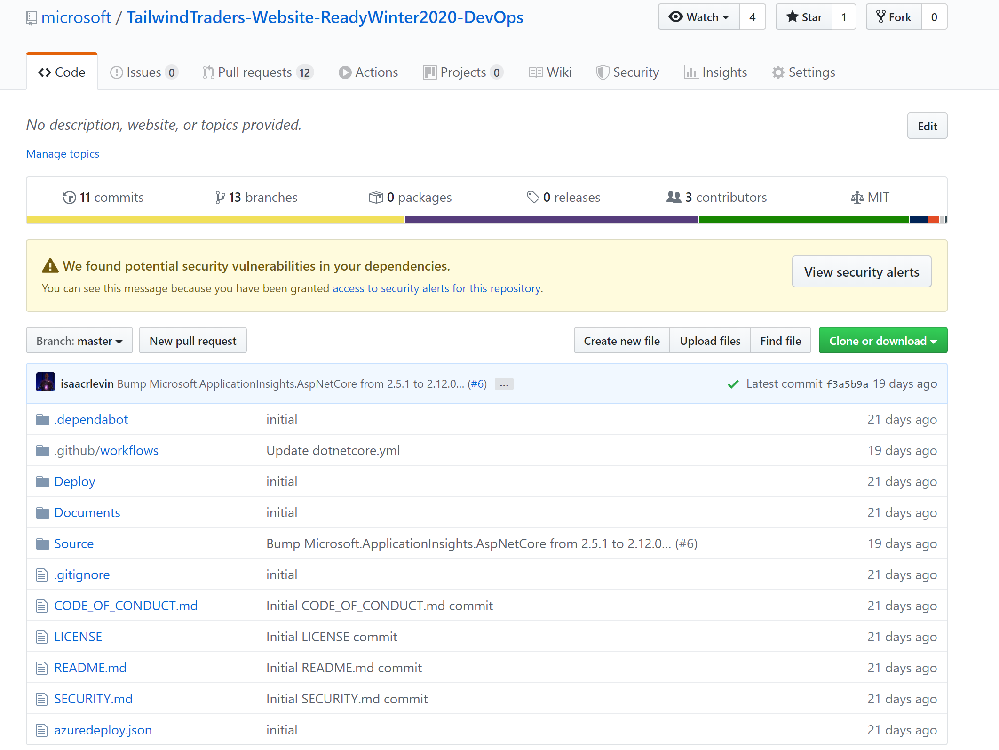
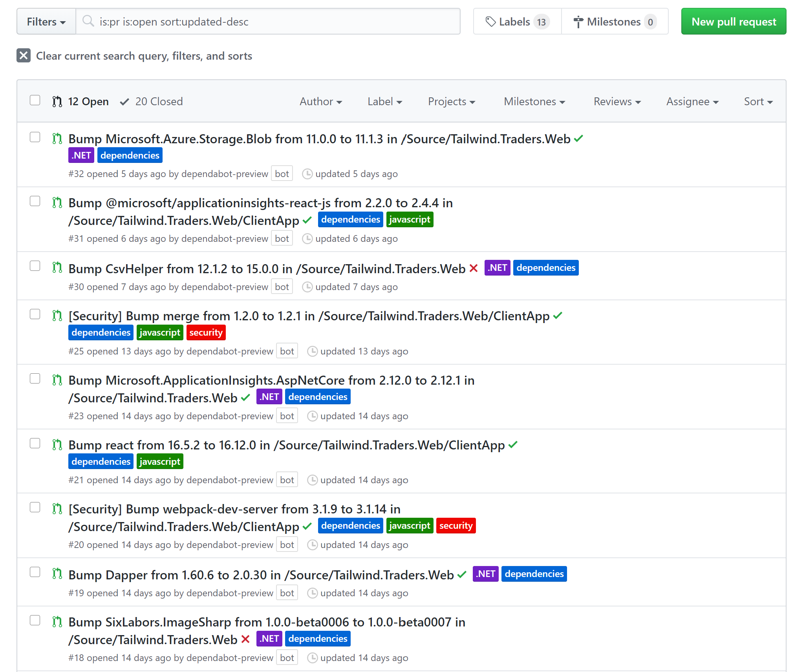
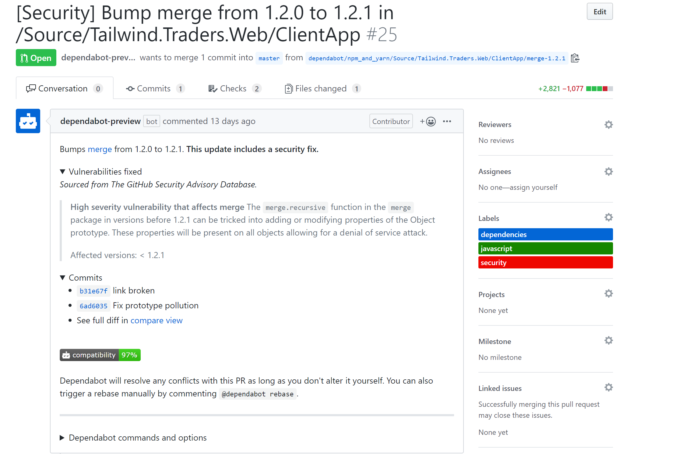
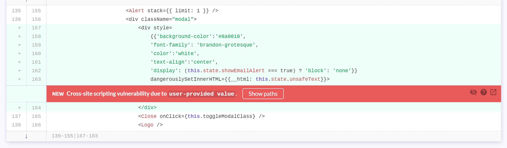
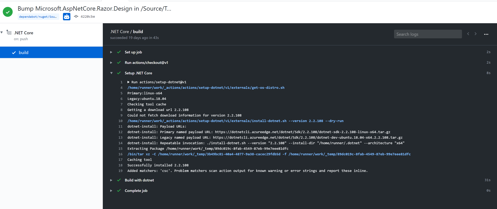
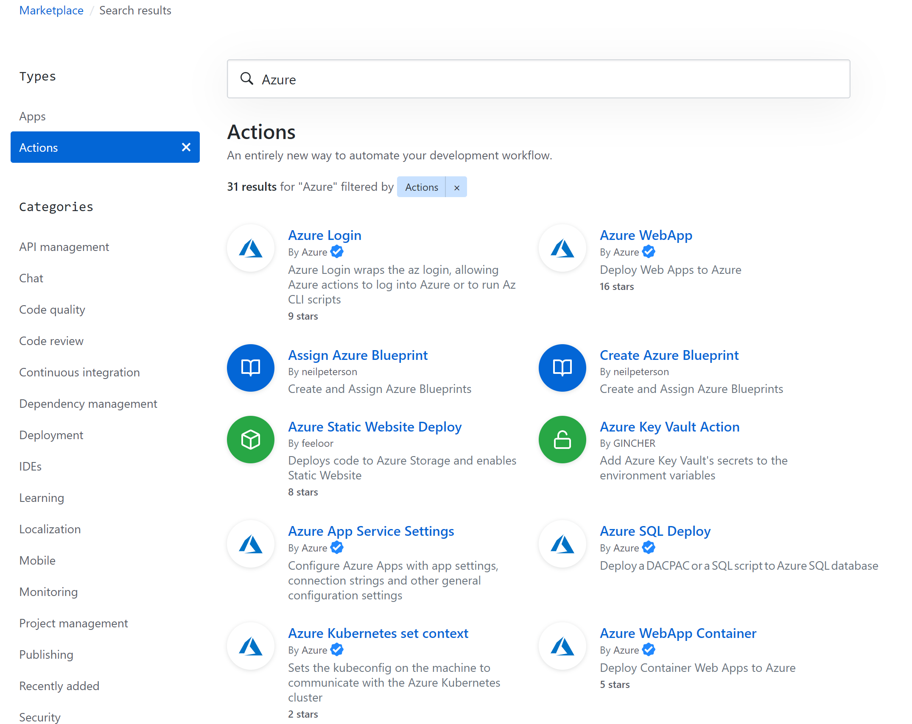

# Update and Secure with GitHub Demo Script #

## Setup ##

There is minimal setup required for this demo, it showcases the integration with dependency management and vulnerability scanning inside of GitHub with recent acquisitions Dependabot and Semmel.

Please open a browser and open tabs for the following sites:

- [Demo Repo Landing](https://github.com/microsoft/TailwindTraders-Website-ReadyWinter2020-DevOps)
- [Open Pull Requests for Repo](https://github.com/microsoft/TailwindTraders-Website-ReadyWinter2020-DevOps/pulls?q=is%3Apr+is%3Aopen+sort%3Aupdated-desc)
- [Open PR with Security Vulnerability Added](https://github.com/microsoft/TailwindTraders-Website-ReadyWinter2020-DevOps/pull/15)
- [GitHub Actions Log for commit](https://github.com/microsoft/TailwindTraders-Website-ReadyWinter2020-DevOps/commit/4220cbed12687a155bb4a276d7790202d1cfcf4c/checks?check_suite_id=417203303)
- [GitHub Actions Marketplace with Azure searched for](https://github.com/marketplace?utf8=%E2%9C%93&type=actions&query=Azure)

## Script ##

1. Start with browser tab open to the [Demo Repo Landing](https://github.com/microsoft/TailwindTraders-Website-ReadyWinter2020-DevOps).

    _Good afternoon everybody. I'm here to talk some key integrations to GitHub around dependency updating and security._

    _Here I am inside of that Tailwind Traders,
    GitHub repository and am met by this little banner that says,we have found potential security vulnerabilities in your dependencies translation. When we see this in our repos, we need to stop everything and resolve this issue. The integrations that I am going to show you will help you in ensuring you no longer see these messages at the top of your repo._

    

1. Switch the browser to the [Open Pull Requests for Repo](https://github.com/microsoft/TailwindTraders-Website-ReadyWinter2020-DevOps/pulls?q=is%3Apr+is%3Aopen+sort%3Aupdated-desc) tab.

    _GitHub recently acquired 2 products one of them is called Dependabot.What Dependabot does is inside your repo, install a bot that monitors the dependencies that we have identified security vulnerabilities and automatically submit a pull request._

    

1. Click on any of the open pull requests to open.

    _If you click on one of these pull requests, you can see that the pull request has a ton of useful information related to the changes made in the dependency, with links to the commits that contain the updates, as well as items fixed in that change. These updates can contain notes from the package owner and there commands you can run against the bot to control things related to how the bot operates eith this dependency in the future._

    

1. Switch the browser to the [Open PR with Security Vulnerability Added](https://github.com/microsoft/TailwindTraders-Website-ReadyWinter2020-DevOps/pull/15) tab.

    _This is great if development that you depend on has potential security issues, but what about when there are security issues in code that you have written. GitHub Advanced Security Code Scanning allows us to me notified if we write code in our repo that may introduce a security vulnerability. In a similar vain to Dependabot, a check is ran against any PR into your repo that scans your code for known security vulnerabilities and provides a report on potential impact._

    

1. Click on the 'view on LGTM.com link to direct to the vulnerability dashboard and scroll down.

    

    _If we click on the link in one of the comments, we are directed to a report on the vulnerability that was exposed with this change. Not only is the vulnerability pointed out in the code iteself, but we can see the paths that exist to this code, showing potential impact._

1. Switch the browser to the [GitHub Actions Log for commit](https://github.com/microsoft/TailwindTraders-Website-ReadyWinter2020-DevOps/commit/4220cbed12687a155bb4a276d7790202d1cfcf4c/checks?check_suite_id=417203303) tab.

    

    _Both of the PRs we just saw, like all other pull requests, can easily trigger a GitHub Action that will perform a particular workflow if the commit triggers it. Inside the Action log page, we can see all the output of commands we run to build/deploy our applications._

1. Switch the browser to the [GitHub Actions Marketplace with Azure searched for](https://github.com/marketplace?utf8=%E2%9C%93&type=actions&query=Azure) tab.

    

    _And what is great with GitHub Actions is that you don't have to write all the workflows yourself, there are over 2000 community created actions that exist in the GitHub Marketplace, including many developed by Microsoft._

    _We all know that GitHub is the premier service for social coding and open source projects. Now with Dependabot and GitHub Advanced Security Code Scanning we have the ability to have AI monitor our application's code base and notify us with changes or checks that can only benefit us._
