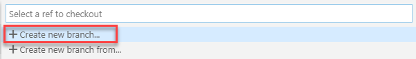
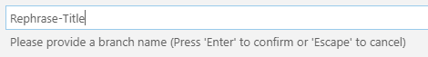
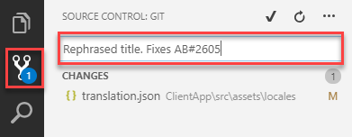
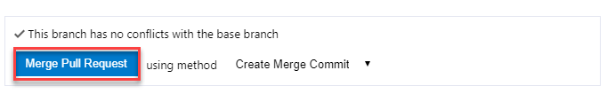

# Integrating Azure Pipelines, GitHub, and Azure Boards

## Overview

GitHub hosts over 100 million repositories containing applications of all shapes and sizes. But GitHub is just a start—those applications still need to get built, released, and managed to reach their full potential.
Azure Pipelines enables you to continuously build, test, and deploy to any platform or cloud. It has cloud-hosted agents for Linux, macOS, and Windows; powerful workflows with native container support; and flexible deployments to Kubernetes, VMs, and serverless environments.
Azure Pipelines provides unlimited CI/CD minutes and 10 parallel jobs to every GitHub open source project for free. All open source projects run on the same infrastructure that our paying customers use. That means you'll have the same fast performance and high quality of service. Many of the top open source projects are already using Azure Pipelines for CI/CD, such as Atom, CPython, Pipenv, Tox, Visual Studio Code, and TypeScript---and the list is growing every day.
In addition to Azure Pipelines, GitHub users can also benefit from Azure Boards, a set of features that enable you to plan, track, and discuss work across your teams using Kanban boards, backlogs, team dashboards, and custom reporting. You can link GitHub activities from Azure Boards by mentioning them in commits and pull requests, and even automate the state transition of linked work items when pull requests are approved.
In this demo, you'll see how easy it is to set up Azure Pipelines and Azure Boards with your GitHub projects and how you can start seeing benefits immediately.

## Key Takeaways

The key takeaways of the demo are:

- Microsoft provides the only comprehensive DevOps solution that spans from development to project management to deployment to operations.
- It doesn't matter what technologies of processes you're using---even setting up a Node.js solution on GitHub to deploy to a Linux container that connects to a Cosmos DB is a seamless, straightforward experience.
- Azure offers a practical approach to automation at every step of the DevOps lifecycle that enables companies to focus their efforts on creating business value.

## Before you begin

1. You will need a [GitHub](https://github.com) account.

1. You will need an Azure subscription.

1. An [Azure DevOps](https://dev.azure.com) account.

1. Provision the **Tailwind Traders** project to your Azure DevOps organization with the [Azure DevOps Demo Generator](https://azuredevopsdemogenerator.azurewebsites.net/?name=tailwind%20traders) Follow the [simple walkthrough](https://docs.microsoft.com/en-us/azure/devops/demo-gen/use-demo-generator-v2?view=azdevops&viewFallbackFrom=vsts") to create the project on your Azure DevOps organization.

1. You will need the [Tailwind Traders Website source code](https://github.com/Microsoft/TailwindTraders-Website).

1. Git installed from https://git-scm.com/downloads.

1. Visual Studio Code installed from https://code.visualstudio.com.

1. Azure Pipelines extension for Visual Studio Code installed from https://marketplace.visualstudio.com/items?itemName=ms-azure-devops.azure-pipelines.

1. GitHub Pull Requests extension for Visual Studio Code installed from https://marketplace.visualstudio.com/items?itemName=GitHub.vscode-pull-request-github.

1. Microsoft Teams.

### Demo Scenario

In this demo, we'll be illustrating the integration and automation benefits of Azure DevOps. *Tailwind Traders* is a fictitious retail company showcasing the future of intelligent application experiences. These reference apps are all are powered by the Azure cloud, built with best-in-class tools, and made smarter through data and AI. They want to implement continuous integration and continuous delivery pipelines so that they can quickly update their public services and take advantage of the full benefits of DevOps and the cloud.

## Walkthrough: Integrating GitHub with Azure Pipelines

### Installing Azure Pipelines from Marketplace 

1. Navigate to the **GitHub Market Place**. The GitHub Marketplace provides a variety of tools from Microsoft and 3rd parties that help you extend your project workflows. Click Marketplace from the top navigation to visit it.

    

1. Search for **pipelines** and select **Azure Pipelines**.

    

1. The Azure Pipelines offers unlimited build minutes with 10 free parallel jobs for public repositories, and 1800 build minutes per month with 1 parallel job if you’re using a private repository. Click **Install it for free** under *Pricing and Setup* towards the bottom of the page.

    

1. If you have multiple GitHub accounts, select the one you forked the Website to from the **Switch billing account** dropdown.

    

1. Click **Complete order and begin installation**.

    

1. You have the option to specify repositories to include, but for the purposes of this demo, just include all of them. Note that Azure DevOps requires the listed set of permissions to fulfill its services. Click **Install**.

    

1. You may be prompted to confirm your GitHub password to continue and also be prompted to log in to your Microsoft account. Make sure you’re logged into the one associated with your Azure DevOps account. Next, you may need to choose the Azure DevOps account and project for which Azure Pipelines need access.

    

### Configuring a YAML CI pipeline

Now that Azure Pipelines has been installed and configured, we can start building the pipelines but we will need to select a project where the pipeline will be saved. You may select the previously created Azure DevOps project from Demo Generator to hold and run the pipelines we need for continuous integration and continuous delivery. Even though there is a vNext pipeline already available, you'll create a *YAML* CI pipeline.

Every build pipeline is simply a set of tasks. Whether it's copying files,compiling source, or publishing artifacts, the existing library of tasks covers the vast majority of scenarios. You can even create your own if you have specialized needs not already covered. You're going to use YAML, a markup syntax that lends itself well to describing the build pipeline. 

1. Click the ellipsis **...** button under *Repository* and choose the forked GitHub repository.

    

    > Every build pipeline is simply a set of tasks. Whether it's copying files, compiling source, or publishing artifacts, the existing library of tasks covers the vast majority of scenarios. You can even create your own if you have specialized needs not already covered. We're going to use YAML, a markup syntax that lends itself well to describing the build pipeline. Note that the Node.js pipeline as a starting point based on an analysis of our source project. We'll replace the contents with the final YAML required for our project.

1. Select the recommended template.

    

1. Select [ARM Outputs](https://github.com/keesschollaart81/vsts-arm-outputs) task.  This task enables you to use the ARM Deployment outputs in your Azure Pipelines. Select your **Azure subscription** from Azure subscription dropdown.

   

1. Select **Build an Image** task. Here we are using [Docker task](https://docs.microsoft.com/en-us/azure/devops/pipelines/tasks/build/docker?view=vsts) to build and push application image. Select your **Azure subscription** from Azure subscription dropdown and do the same for **Push image** task as well.

    

1. Select **Variables**. In this section, we have defined Azure resource group name, location and other required parameters for the build pipeline as variables.

      

1. Now **Save** the changes and **Queue** the build. All the tasks in the pipeline will be executed sequentially and you can see the progress of the build in the live console.
  
    

1. Once the build is success go to your Azure portal and navigate to resource group **TailwindTraderWeb**. You should be able to see the following resources which were deployed during the build.

   

   And you will see a repository with the name **website** in your Container registry under **Repositories**.
  
   

## Configure Release(CD) pipeline

By using a combination of manual deployment approvals, gates, and manual intervention within a release pipeline in Azure Pipelines, you can quickly and easily configure a release pipeline with all the control and auditing capabilities you require for your DevOps CI/CD processes. **Release Gates** allow you to configure automated calls to external services, where the results are used to approve or reject a deployment. You can use gates to ensure that the release meets a wide range or criteria, without requiring user intervention.
In addition, you can install an extension that integrates with **[ServiceNow](https://docs.microsoft.com/en-us/azure/devops/pipelines/release/approvals/servicenow?view=azdevops)** to help you control and manage your deployments though service management methodologies such as ITIL. 

1. Navigate to **Pipeline » Releases**. Select **Website-CD** and click **Edit** pipeline.
   
    

1. Select **Dev** stage and click **View stage tasks** to view the pipeline tasks.

    

    You will see the tasks as below.

    

1. Select **Variables**. You need to enter your ACR and App service (which were provisioned during the build) details here. We will make use of these variable values in our pipeline tasks.
   
    

   To get the details to navigate to the Azure resource group provisioned earlier.
   Make a note of App service name

    

   Navigate to ACR and select **Access keys**. Make a note of the following details

   

   Enter the above values for the appropriate variables.

1. Come back to **Tasks** and select **Azure CLI to configure Container settings to App service** task. Here we are using Azure CLI script to set the container settings for the Azure app service we created. Select the **Azure service connection** from the drop down. 
 
    

1. Select **Deploy Container to App Service** task. Make sure you have selected **Azure subscription** and choose **App service name** value from the drop-down.
     
     

1. Select **Restart Azure App Service: tailwindtraders** task. Select the required parameters as shown below. We are using this task here to restart the app service.
 
   

1. **Save** the changes and click **+ Release -> Create a release**.

    

1. Once the release succeeds, navigate to your Azure portal. Select the app service that was created previously and browse to view the deployed application.

   

   

## Walkthrough: Integrating GitHub with Azure Boards

Teams using Azure Pipelines to continuously build and deploy their code already have a deep integration between their code and their CI/CD pipelines. Adding Azure Boards to the mix deepens the integration, providing links from the build summary to the related code and work items for end-to-end traceability.

By connecting Azure Boards with GitHub repositories, you enable linking between GitHub commits and pull requests to work items. You can use GitHub for software development while using Azure Boards to plan and track your work. Azure Boards provides the scalability to grow as your organization and business needs grow.

1. Navigate to **Boards --> Backlogs --> Tailwind Traders Team** in your Azure DevOps project.

    

1. Click the **Settings** gear icon and choose **Working with bugs**. For this scenario, choose **Bugs are managed with requirements.**

    

1. Click **New Work Item** and select the *Bug* from drop-down and add the title **Rephrase the description-For $100 or more orders**. Click **Add to top** to create the bug.

    

1. Click **View as board**.

    

1. Drag the bug to the *Active* column. This will set the status of the bug to *Active* state. Make note of the ID which will be used later for a commit and pull request.

    

1. Now, let's connect this project to use the GitHub repository. Choose **Project Settings --> GitHub connections --> Connect your GitHub Account**.

    

1. After the authorization is complete, the page returns to your Azure DevOps portal. In the Add GitHub repositories dialog, you'll see the list of repositories for which you are an administrator.

    

1. Check the ones that you want to add and then choose *Save*. When done, you should see the new connection with the selected repository listed.

    

1. Return to the web app and notice the description **For $100 or more orders**.

    

1. Open an instance of **Visual Studio Code**. 

    > We’ll start off by creating a new branch for this task. The work itself is pretty straightforward. We just need to locate the place where airports are provided to the user experience and make sure they’re being sorted by city name.

1.	Click the **master** branch at the bottom of the window.

    

1.	From the top of the screen, click **Create new branch**.

    

1. Create a branch **Rephrase-Title** in your GitHub account. 

    

1. In the *Explorer* tab of **Code**, open the file **ClientApp\src\assets\locales\translation.json**. 

    

1. Search for **home.hero.orders** and rephrase the sentence *For $100 or more orders* with **For orders worth $100 or more**. Save the file. 

    

    > We'll commit it using a comment that includes special syntax to link it to the Azure Boards task we saw earlier. Now this commit will become trackable from project management, as long as we include the phrase "Fixes AB#ID".

1. Switch to the Source Control tab and enter a commit message of “Changes airport sorting. Fixes AB#2605.”, but replace 2605 with the actual ID of the Azure Boards task. Press Ctrl+Enter and confirm the commit if prompted.

    

    > In this case, we're inheriting the title from the commit, but having the pull request mention "Fixes ##ID" will link and complete the target work item when the pull request is merged. The syntax used is **Fixes AB#[Work Item ID]** to create a link and update the state automatically when the changes reach the **master** branch. 

1. Click the **Publish Changes** button at the bottom of the screen.

    

1. When the push has completed, return to the GitHub browser tab. With the commit pushed, we'll create a pull request to drive those changes back into the master branch.

1. Click **Compare & pull request**, which should appear on its own. If not, refresh.

    

1. Change the **base fork** to point at your project. By default, it points at the original **Microsoft** repo, so be sure to change it.

    

1. The title should initialize to the commit message entered earlier. Click **Create pull request**.

1. Return to Visual Studio Code. Now we’ll switch to the other side of the pull request and take on the role of reviewer in Visual Studio Code. We can use Visual Studio Code to check out the pull request, analyze changes, and comment. Assuming we trust the fix, we can merge the pull request to update master and kick off the CI/CD.

1. Under **GitHub Pull Requests | All**, right-click the pull request and select **Checkout Pull Request**.

    

1. Expand the Changes in **Pull Request** tree. Select the **Description** from under the original pull request. If you don't see the **Description** option, click the **Pull Request #** at the bottom of the screen and review the details of the PR. 

    

1. Click **Merge Pull Request** and confirm the merge.

    

1. Once the deployment works its way through build and release, we can confirm the new functionality. Follow the CI/CD pipeline through to completion. Refresh the web app site to view the changes.

1. To confirm if the change shows up correctly, trigger the CI and then CD pipeline configured earlier. Once it completes, refresh the web app and confirm if you are able to see the changes.

    

1. Return to the Azure DevOps portal and open the Kanban board. Since the bug we were working on was linked in a pull request that was approved, Azure DevOps will automatically transition the state of the work item to **Resolved**. You can also see that the related GitHub commits and pull request were linked to the work item.

    

1. The commit and pull request information should now be visible now with the click of the **GitHub** icon in the Bug workitem card.

    