# Integrating Azure Pipelines, GitHub, and Azure Boards

## Overview

GitHub hosts over 100 million repositories containing applications of all shapes and sizes. But GitHub is just a start—those applications still need to get built, released, and managed to reach their full potential.
Azure Pipelines enables you to continuously build, test, and deploy to any platform or cloud. It has cloud-hosted agents for Linux, macOS, and Windows; powerful workflows with native container support; and flexible deployments to Kubernetes, VMs, and serverless environments.
Azure Pipelines provides unlimited CI/CD minutes and 10 parallel jobs to every GitHub open source project for free. All open source projects run on the same infrastructure that our paying customers use. That means you'll have the same fast performance and high quality of service. Many of the top open source projects are already using Azure Pipelines for CI/CD, such as Atom, CPython, Pipenv, Tox, Visual Studio Code, and TypeScript---and the list is growing every day.
In addition to Azure Pipelines, GitHub users can also benefit from Azure Boards, a set of features that enable you to plan, track, and discuss work across your teams using Kanban boards, backlogs, team dashboards, and custom reporting. You can link GitHub activities from Azure Boards by mentioning them in commits and pull requests, and even automate the state transition of linked work items when pull requests are approved.
In this demo, you'll see how easy it is to set up Azure Pipelines and Azure Boards with your GitHub projects and how you can start seeing benefits immediately.

## Key Takeaways

The key takeaways of the demo are:

- Microsoft provides the only comprehensive DevOps solution that spans from development to project management to deployment to operations.
- It doesn't matter what technologies of processes you're using---even setting up a Node.js solution on GitHub to deploy to a Linux container that connects to a Cosmos DB is a seamless, straightforward experience.
- Azure offers a practical approach to automation at every step of the DevOps lifecycle that enables companies to focus their efforts on creating business value.

## Before you begin

1. You will need a [GitHub](https://github.com) account.

1. You will need an Azure subscription.

1. An [Azure DevOps](https://dev.azure.com) account.

1. Provision the **Tailwind Traders** project to your Azure DevOps organization with the [Azure DevOps Demo Generator](https://azuredevopsdemogenerator.azurewebsites.net/?name=tailwind%20traders) Follow the [simple walkthrough](https://docs.microsoft.com/en-us/azure/devops/demo-gen/use-demo-generator-v2?view=azdevops&viewFallbackFrom=vsts") to create the project on your Azure DevOps organization.

1. You will need the [Tailwind Traders Website source code](https://github.com/Microsoft/TailwindTraders-Website) forked to your GitHub account.

1. Git installed from https://git-scm.com/downloads.

1. Visual Studio Code installed from https://code.visualstudio.com.

1. Azure Pipelines extension for Visual Studio Code installed from https://marketplace.visualstudio.com/items?itemName=ms-azure-devops.azure-pipelines.

1. GitHub Pull Requests extension for Visual Studio Code installed from https://marketplace.visualstudio.com/items?itemName=GitHub.vscode-pull-request-github.

## Microsoft Teams

Integrate Microsoft Teams with Azure DevOps and GitHub to create or join a Microsoft team for this demo.

- Integrate and configure Azure DevOps and GitHub connectors with Teams.
- Follow the instructions [here](../extend/teams) to integrate Azure DevOps notifications for work item and Azure Pipelines updates. Install the Azure Pipelines app and configure the bot service. Also add a tab with the user stories Kanban board.
- Use the same process to integrate GitHub (using the GitHub Enterprise connector) and add a tab for GitHub pull requests.


### Demo Scenario

In this demo, we'll be illustrating the integration and automation benefits of Azure DevOps. *Tailwind Traders* is a fictitious retail company showcasing the future of intelligent application experiences. These reference apps are all are powered by the Azure cloud, built with best-in-class tools, and made smarter through data and AI. They want to implement continuous integration and continuous delivery pipelines so that they can quickly update their public services and take advantage of the full benefits of DevOps and the cloud.


## Walkthrough: Integrating GitHub with Azure Pipelines

### Configuring the Azure Continuous Integration Pipeline

Now that Azure Pipelines has been installed and configured, we can start building the pipelines but we will need to select a project where the pipeline will be saved. You may select an existing or create a new Azure DevOps project to hold and run the pipelines we need for continuous integration and continuous delivery. The first thing we'll do is to create a CI pipeline.

1. Select the organization and Azure DevOps project that you created using the Azure DevOps Demo Generator. Click **Create a new pipeline** under Builds. Choose **GitHub(YAML)** as the code repository and follow the next steps for authorization.

    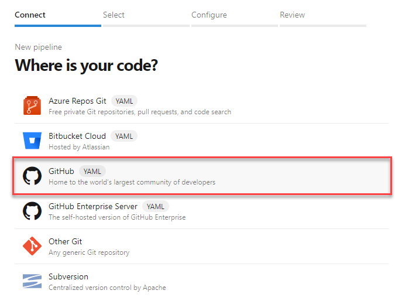

1. Select the forked repo.

    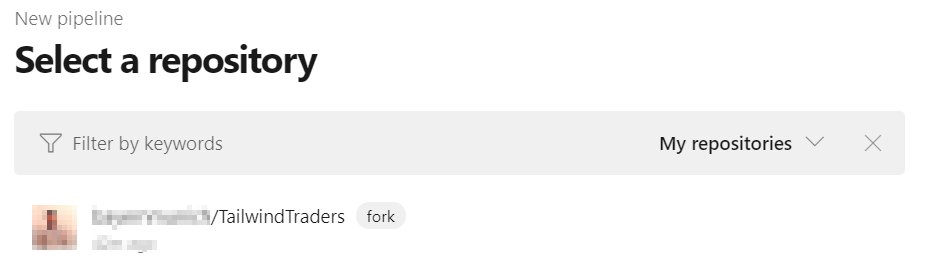

    Every build pipeline is simply a set of tasks. Whether it's copying files, compiling source, or publishing artifacts, the existing library of tasks covers the vast majority of scenarios. You can even create your own if you have specialized needs not already covered. We're going to use YAML, a markup syntax that lends itself well to describing the build pipeline. Select **Starter pipeline** as a starting point based on an analysis of our source project. We'll replace the contents with the final YAML required for our project.

1. Select the **Starter pipeline** template.

    

1. Replace the default template with the below YAML snippet and substitute variables section with relevant values below.

    ```yaml
    variables:
      azureSubscription: name-of-your-azure-subscription
      resourcegroup: name-of-your-resource-group
      location: location of your resources
      ImageName: website

    steps:
    - task: AzureResourceGroupDeployment@2
      displayName: Azure Deployment
      inputs:
        azureSubscription: $(azureSubscription)
        resourceGroupName: $(resourcegroup)
        location: $(location)
        csmFile: Deploy/deployment.json

    - task: keesschollaart.arm-outputs.arm-outputs.ARM Outputs@5
      displayName: ARM Outputs
      inputs:
        ConnectedServiceNameARM: $(azureSubscription)
        resourceGroupName: $(resourcegroup)

    - task: Docker@1
      displayName: 'Build an image'
      inputs:
        azureSubscriptionEndpoint: $(azureSubscription)
        azureContainerRegistry: $(acr).azurecr.io
        dockerFile: Source/Tailwind.Traders.Web/Dockerfile
        arguments: '-t $(acr).azurecr.io/$(ImageName):$(Build.BuildId)'
        imageName: '$(ImageName):$(Build.BuildId)'
        includeLatestTag: true

    - task: Docker@1
      displayName: 'Push Image'
      inputs:
        azureSubscriptionEndpoint: $(azureSubscription)
        azureContainerRegistry: '$(acr).azurecr.io'
        command: 'Push an image'
        imageName: '$(ImageName):$(Build.BuildId)'
    ```

   > **Note:** YAML is very strict with indentation. If you are new to YAML, it is recommended that you use tools to format and validate the code. There are several free tools available on the web.

1. Click **Save and run**.

    

1. Confirm the Save and run to commit the YAML definition directly to the master branch of the repo.

    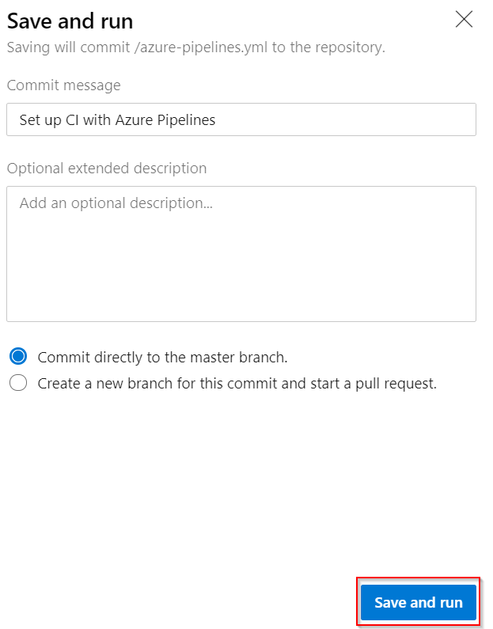

1. Follow the build through to completion.
  
    

### Adding a build status badge

An important sign for a quality project is its build status badge. When someone finds a project that has a badge indicating that the project is currently in a successful build state, it's a sign that the project is maintained effectively.

1. Click the build pipeline to navigate to its overview page.

   

1. From the ellipses dropdown, select Status badge.

   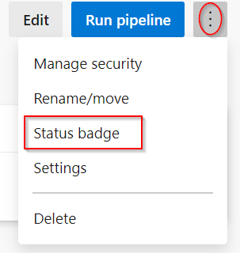

1. The Status badge UI provides a quick and easy way to integrate the build status wherever you want. Often, you'll want to use the provided URLs in your own dashboards, or you can use the Markdown snippet to add the status badge to locations such as Wiki pages. Click the Copy to clipboard button for Sample Markdown.

   

1. Return to Visual Studio Code and open the README.md file.

   

1. Paste in the clipboard contents at the beginning of the file.

   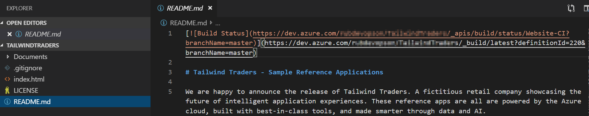

1. Press **Ctrl+S** to save the file.

1. From the Source Control tab, enter a commit message like Added build status badge and press Ctrl+Enter to commit. Confirm if prompted.

   

1. In Git, only changes need to be staged first to be included in the commit. If you are prompted to choose whether you want VS Code automatically to stage all changes and commit them directly, choose Always.

   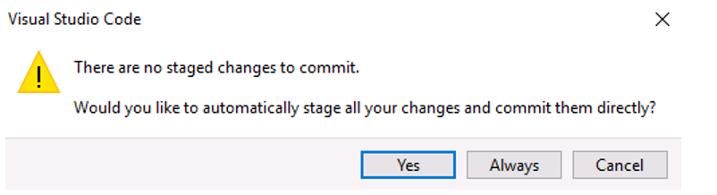

1. If you receive an error prompting you to configure user .name and user.email in git, open a command prompt and enter the following command to set your user name and email address:

    ```git
    git config --global user.name "Your Name"
    git config --global user.email "Your Email Address"
    ```

1. Press the Synchronize Changes button at the bottom of the window to push the commit to the server. Confirm if prompted.

   

1. You will need to sign in to GitHub, if you have not already signed in.

   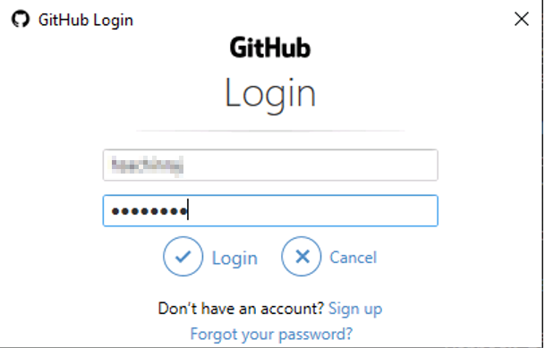

1. Go to the readme file on the browser and you will see the status. It's that easy :)

   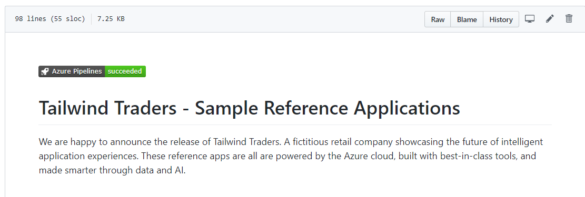

### Configuring the Azure Continuous Delivery Pipeline

Now that the build pipeline is completed we can turn our attention to creating a release pipeline.

Like the build templates, there are many packaged options available that cover common deployment scenarios, such as publishing to Azure. But to illustrate how flexible and productive the experience is, we will build this pipeline from an empty template.

1. Select **Releases**. You will see 2 release pipelines already created by the Demo Generator. But, let's go ahead and define our own pipeline.

    

1. Click **New pipeline** and click **Empty job**.

    

   The first item to define in a release pipeline is exactly what will be released and when. In our case, it’s the output generated from the build pipeline. Note that we could also assign a schedule, such as if we wanted to release the latest build every night.

1. Select the associated artifact.

    

1. Set Source to the build pipeline created earlier and Default version to Latest. Change the Source alias, if you want, to something like "_Website-CI" and click Add. Note that this is an identifier (typically a short name) that uniquely identifies an artifact linked to the release pipeline. It cannot contain the characters: \ / : * ? < > | or double quotes.

    

    As we did with continuous integration starting on a source commit, we also want to have this pipeline automatically start when the build pipeline completes. It’s just as easy.

1. Click the **Triggers** button on the artifact.

    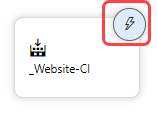

1. **Enable** continuous integration.

    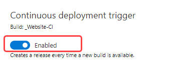

    We also have the option of adding quality gates to the release process. For example, we could require that a specific user or group approve a release before it continues, or that they approve it after it’s been deployed. These gates provide notifications to the necessary groups, as well as polling support if you’re automating the gates using something dynamic, such as an Azure function, REST API, work item query, and more. We won’t add any of that here, but we could easily come back and do it later on.

1. Click the **pre-deployment** conditions button.

    

1. Review pre-deployment condition options.

    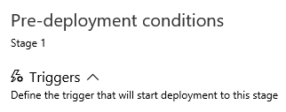

    In this pipeline, we’re going to need to specify the same resource group in multiple tasks, so it’s a good practice to use a pipeline variable. We’ll add one here for the new Azure resource group we want to provision our resources to. Note that there are also a variety of deployment options we can configure, as well as a retention policy.

1. Select the **Variables** tab and add the following variables as detailed below.

    |Name  |Value  |
    |---------|---------|
    |ACR_LoginServer| Your ACR Login Server|
    |ACR_PASSWORD| Your ACR password|
    |ACR_USERNAME| Your ACR username|
    |appservice-name| Your  appservice-name |
    |ImageName | Your Image Name |
    |resourcegroup | Your resourcegroup name |

    

   Also, just like the build pipeline, the release pipeline is really just a set of tasks. There are many out-of-the-box tasks available, and you can build your own if needed. The first task our release requires is to set up the Azure deployment environment if it doesn’t yet exist. After we add the task, I can authorize access to the Azure account I want to deploy to and instruct it to use the variable name we just specified for the resource group name.

1. Select the **Tasks** tab.

    

1. Click the **Add task** button.

    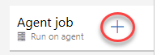

1. Search for **azure cli** and add the **Azure CLI** task.

    

1. Select the newly created task and authorize your Azure subscription. Note you will need to disable popup-blockers to sign in to Azure for authorization. If the pop-up window hangs, please close and try it again.

    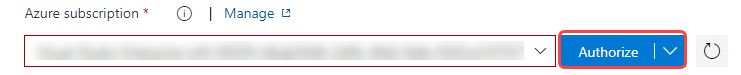

1. Configure the task as shown below-

    

    Copy the below script and paste it in the Inline Script section.

    `call az webapp config container set -n $(appservice-name) -g $(resourcegroup) -c website -r $(ACR_LoginServer) -u $(ACR_USERNAME) -p $(ACR_PASSWORD)`

1. Click the **Add task** button.

    

1. Search for **Azure App Service deploy** and add the task.

    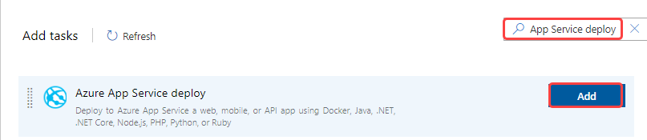

1. Configure the task as detailed below.

    

1. Search for **Azure App Service manage** and add the task.

    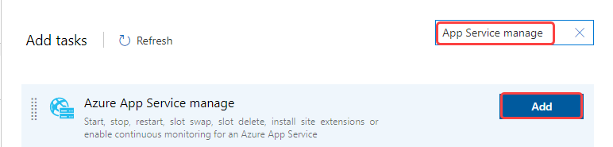

1. Configure the task as detailed below.

    

1. **Save** the pipeline.

    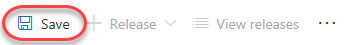

1. Click **Create release**.

    

1. Click **Create** to start a new release.

    

1. Click **Release-1** to follow the new release.

    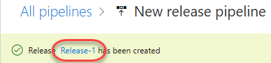

1. Click **In progress** to follow the release process.

    

1. Note that it will take a few minutes for the app to finish deploying due to heavy first-time operations. Move ahead to the next step while it works in the background.

    

1. Select the App Service Deploy task to view the detailed log. You should find the URL to the published website here. Ctrl+Click the link to open it in a separate tab.

    

1. This will open the web page of Tailwind Traders.

    

## Walkthrough: Integrating GitHub with Azure Boards

Teams using Azure Pipelines to continuously build and deploy their code already have a deep integration between their code and their CI/CD pipelines. Adding Azure Boards to the mix deepens the integration, providing links from the build summary to the related code and work items for end-to-end traceability.

By connecting Azure Boards with GitHub repositories, you enable linking between GitHub commits and pull requests to work items. You can use GitHub for software development while using Azure Boards to plan and track your work. Azure Boards provides the scalability to grow as your organization and business needs grow.

1. Navigate to **Boards --> Backlogs --> Tailwind Traders Team** in your Azure DevOps project.

    

1. Click the **Settings** gear icon and choose **Working with bugs**. For this scenario, choose **Bugs are managed with requirements.**

    

1. Click **New Work Item** and select the *Bug* from drop-down and add the title **Rephrase the description-For $100 or more orders**. Click **Add to top** to create the bug.

    

1. Click **View as board**.

    

1. Drag the bug to the *Active* column. This will set the status of the bug to *Active* state. Make note of the ID which will be used later for a commit and pull request.

    

1. Now, let's connect this project to use the GitHub repository. Choose **Project Settings --> GitHub connections --> Connect your GitHub Account**.

    

1. After the authorization is complete, the page returns to your Azure DevOps portal. In the Add GitHub repositories dialog, you'll see the list of repositories for which you are an administrator.

    

1. Check the ones that you want to add and then choose *Save*. When done, you should see the new connection with the selected repository listed.

    

1. Return to the web app and notice the description **For $100 or more orders**.

    

1. Open an instance of **Visual Studio Code**. 

    > We’ll start off by creating a new branch for this task. The work itself is pretty straightforward. We just need to locate the place where airports are provided to the user experience and make sure they’re being sorted by city name.

1.	Click the **master** branch at the bottom of the window.

    

1.	From the top of the screen, click **Create new branch**.

    

1. Create a branch **Rephrase-Title** in your GitHub account. 

    

1. In the *Explorer* tab of **Code**, open the file **ClientApp\src\assets\locales\translation.json**. 

    

1. Search for **home.hero.orders** and rephrase the sentence *For $100 or more orders* with **For orders worth $100 or more**. Save the file. 

    

    > We'll commit it using a comment that includes special syntax to link it to the Azure Boards task we saw earlier. Now this commit will become trackable from project management, as long as we include the phrase "Fixes AB#ID".


1. Switch to the Source Control tab and enter a commit message of “Changes airport sorting. Fixes AB#2605.”, but replace 2605 with the actual ID of the Azure Boards task. Press Ctrl+Enter and confirm the commit if prompted.

    

    > In this case, we're inheriting the title from the commit, but having the pull request mention "Fixes ##ID" will link and complete the target work item when the pull request is merged. The syntax used is **Fixes AB#[Work Item ID]** to create a link and update the state automatically when the changes reach the **master** branch. 

1. Click the **Publish Changes** button at the bottom of the screen.

    

1. When the push has completed, return to the GitHub browser tab. With the commit pushed, we'll create a pull request to drive those changes back into the master branch.

1. Click **Compare & pull request**, which should appear on its own. If not, refresh.

    

1. Change the **base fork** to point at your project. By default, it points at the original **Microsoft** repo, so be sure to change it.

    

1. The title should initialize to the commit message entered earlier. Click **Create pull request**.

1. Return to Visual Studio Code. Now we’ll switch to the other side of the pull request and take on the role of reviewer in Visual Studio Code. We can use Visual Studio Code to check out the pull request, analyze changes, and comment. Assuming we trust the fix, we can merge the pull request to update master and kick off the CI/CD.

1. Under **GitHub Pull Requests | All**, right-click the pull request and select **Checkout Pull Request**.

    

1. Expand the Changes in **Pull Request** tree. Select the **Description** from under the original pull request. If you don't see the **Description** option, click the **Pull Request #** at the bottom of the screen and review the details of the PR. 

    


1. Click **Merge Pull Request** and confirm the merge.

    

1. Once the deployment works its way through build and release, we can confirm the new functionality. Follow the CI/CD pipeline through to completion. Refresh the web app site to view the changes.

1. To confirm if the change shows up correctly, trigger the CI and then CD pipeline configured earlier. Once it completes, refresh the web app and confirm if you are able to see the changes.

    

1. Return to the Azure DevOps portal and open the Kanban board. Since the bug we were working on was linked in a pull request that was approved, Azure DevOps will automatically transition the state of the work item to **Resolved**. You can also see that the related GitHub commits and pull request were linked to the work item.

    

1. The commit and pull request information should now be visible now with the click of the **GitHub** icon in the Bug workitem card.

    


## Walkthrough: Using Microsoft Teams as Your DevOps Hub

Microsoft Teams is the chat-centered workspace that provides instant access to everything needed for DevOps teamwork. It is that dedicated hub that brings your teams, conversations, content, and tools from across Azure DevOps, GitHub, and Office together into one place.

1. Open **Microsoft Teams** which you configured earlier.

1. Open the **Conversations** tab.

     
 
    > Microsoft Teams apps and connectors are available for a wide variety of platforms, including Azure DevOps and GitHub. This team has subscribed to updates from Azure DevOps for work item and pipeline updates, as well as updates on GitHub pull requests. This makes it really easy for everyone to be aware of what’s going on, as well as to act as a single place for discussion about changes as they occur. Explore the various notifications that have come through over the course of the demo. However, you can also manually link items from GitHub and Azure DevOps in conversation. 
    
1. From the **Messaging extensions** menu, select **Azure DevOps**. This will provide a set of options to easily share and discuss information specific to that integration.

    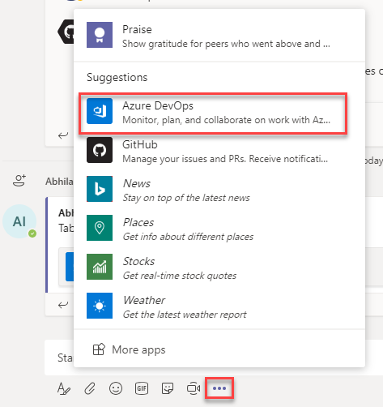
 
1. Select the recently closed **bug**.

    
 
1. Provide a message and press Enter to share with the team.

    
 
1. Select the **Pull Requests** tab. This provides a way to check in on GitHub pull requests without having to leave the context of other conversations and collab oration being done for this specific project.

    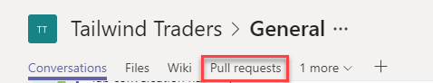
 
1. You can open pull requests directly from Teams. Click the newly created one to open it in a new browser tab. Close the tab later.
 
1. Switch to the Stories Board tab. This provides interactive access to the Azure DevOps Kanban board directly from Microsoft Teams.

    
 

### Managing DevOps Processes from Microsoft Teams

Microsoft Teams is a great place to manage certain DevOps processes, such as approving deployments. To illustrate this, we’ll add a pre-deployment approval to the release pipeline and invoke it using the same GitHub pull request model as before.

1. Return to the Azure DevOps browser tab. Navigate to **Pipelines**, select the release pipeline, click **Edit** to edit the pipeline.

    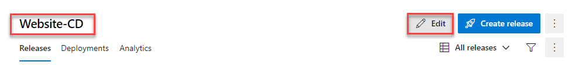
 
1. Click **Pre-deployment conditions** for Stage *Dev*.

    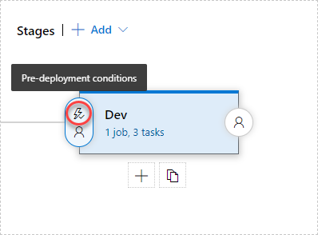 
 
1. Select the option to Enable the Pre-deployment approvals and add yourself as an approver. Click Save.

    
 
1. Return to the GitHub browser tab. You will now make a minor change to the codebase so that you can create a pull request and generate an approval request.

1. Select the Code tab. Click the Edit button to make a quick update to the **readme** file. Make a minor change (add a new line). Check the **Create a new branch** and give it a name. Click **Propose file change**.

    

    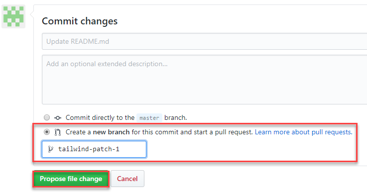
 
1. Click **Create pull request**.

    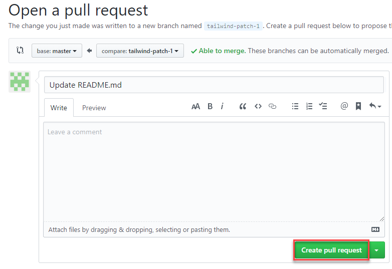
 
1. Switch to *Microsoft Teams*. Previously, you would have integrated **GitHub** connector with Teams (If not, please refer the pre-requisites section). Using this connector, you should be able to see new conversation notifications for the commit and pull request.

    
 
1. Return to GitHub and click **Merge pull request**. Click Confirm merge.

    
 
1. Navigate to *Microsoft Teams*. Previously, you would have integrated **Azure DevOps** connector with GitHub. So, when the release pipeline is ready to deploy, you will receive a notification in Teams. Click the link to be directed to Azure DevOps portal to approve the release.

    
 
15.	When the deployment succeeds, you will receive another notification of success in the Teams tab.
 

### Summary

Many organizations have their projects hosted in GitHub, and we just showed how you can set up automated deployment to Azure in minutes. And it doesn’t matter what kind of application they’re building or what kind of environment they’re deploying to. Once this automation is in place, companies can turn their focus to developing business value rather than on the infrastructure.