# Integrating Azure Pipelines, GitHub, and Azure Boards

## Key Takeaways

The key takeaways of the demo are:

* **DevOps** unifies people, process and technology, automates software releases for delivering continuous value to the users. Microsoft provides the only comprehensive DevOps solution that spans from development to project management to deployment to operations.

* **Azure DevOps** provides a fully integrated set of enterprise DevOps services covering the entire DevOps lifecycle.

* **Azure Boards** provides a wealth of project management functionality . By connecting Azure Boards with GitHub repositories, teams can take advantage of the rich project management capabilities that spans Kanban boards, backlogs, team dashboards, and custom reporting

## Before you begin

1. You will need a [GitHub](https://github.com) account.

1. You will need an Azure subscription.

1. An [Azure DevOps](https://dev.azure.com) account.

1. Provision the **Tailwind Traders** project to your Azure DevOps organization with the [Azure DevOps Demo Generator](https://azuredevopsdemogenerator.azurewebsites.net/?name=tailwind%20traders) Follow the [simple walkthrough](https://docs.microsoft.com/en-us/azure/devops/demo-gen/use-demo-generator-v2?view=azdevops&viewFallbackFrom=vsts") to create the project on your Azure DevOps organization.

1. You will need the [Tailwind Traders Website source code](https://github.com/Microsoft/TailwindTraders-Website).

## Walkthrough: Integrating GitHub with Azure Pipelines

### Installing Azure Pipelines and configuring CI pipeline

1. Navigate to the **GitHub Market Place**. The GitHub Marketplace provides a variety of tools from Microsoft and 3rd parties that help you extend your project workflows. Click Marketplace from the top navigation to visit it.

    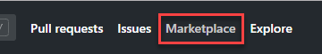

1. Search for **pipelines** and select **Azure Pipelines**.

    

1. The Azure Pipelines offers unlimited build minutes with 10 free parallel jobs for public repositories, and 1800 build minutes per month with 1 parallel job if you’re using a private repository. Click **Install it for free** under *Pricing and Setup* towards the bottom of the page.

    

1. If you have multiple GitHub accounts, select the one you forked the Website to from the **Switch billing account** dropdown.

    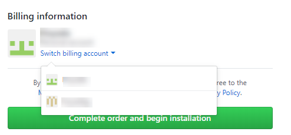

1. Click **Complete order and begin installation**.

    

1. You have the option to specify repositories to include, but for the purposes of this demo, just include all of them. Note that Azure DevOps requires the listed set of permissions to fulfill its services. Click **Install**.

    

1. You may be prompted to confirm your GitHub password to continue and also be prompted to log in to your Microsoft account. Make sure you’re logged into the one associated with your Azure DevOps account. Next, you may need to choose the Azure DevOps account and project for which Azure Pipelines need access.

    

1. You will be directed to the **New pipeline** page of the chosen Azure DevOps project. However, since Azure DevOps Demo Generator has already provisioned the project along with Azure Pipelines, let us use them.

    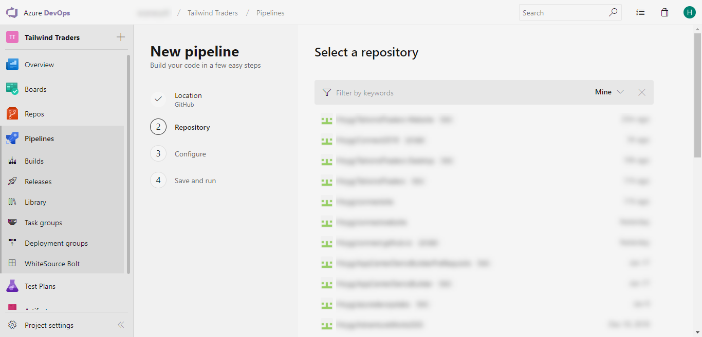

1. Navigate to **Pipelines –> Builds**. Select **Website-CI** and click **Edit**.

    

1. Your build pipeline will look like below. With this pipeline, we are creating following Azure resources for the application deployment.
    
      - Azure Container Registry
      - Web App for Containers

    Then we will build the application Docker image and push the image to ACR provisioned.

   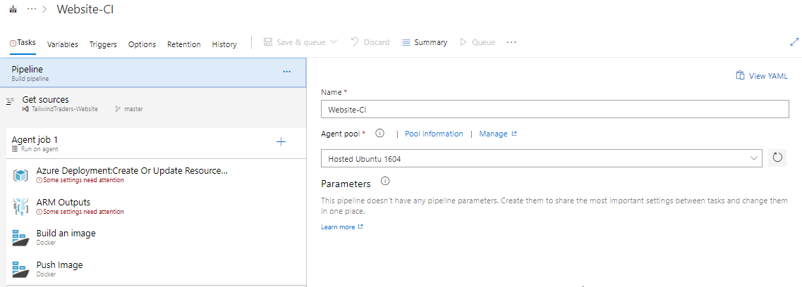

1. In the **Tasks**, choose **Get sources --> GitHub**. 

    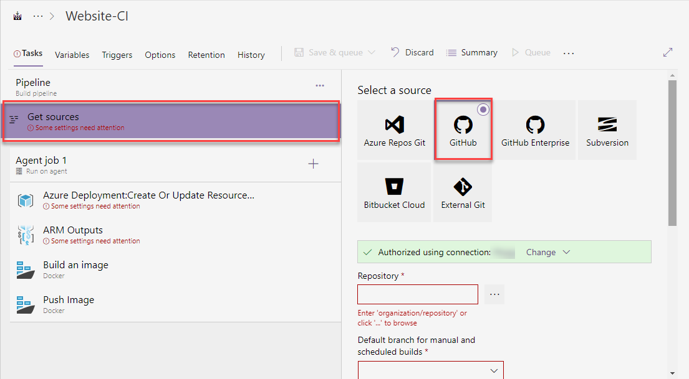

1. Click the ellipsis **...** button under *Repository* and choose the forked GitHub repository.

    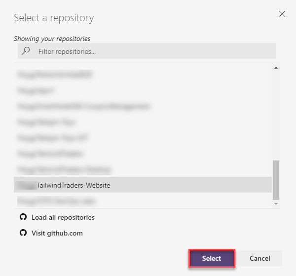

    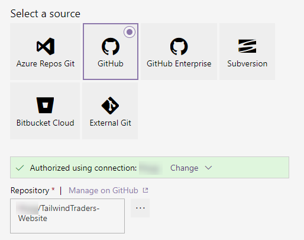

1. Select [Azure Resource Group Deployment](https://github.com/Microsoft/azure-pipelines-tasks/blob/master/Tasks/AzureResourceGroupDeploymentV2/README.md) task.
This task is used to create or update a resource group in Azure using the [Azure Resource Manager templates](https://azure.microsoft.com/en-in/documentation/articles/resource-group-template-deploy/). To deploy to Azure, an Azure subscription has to be linked to Azure Pipelines. Select your **Azure subscription** from Azure subscription dropdown. Click **Authorize**. If your subscription is not listed or to specify an existing service principal, follow the [Service Principal creation](https://docs.microsoft.com/en-us/azure/devops/pipelines/library/connect-to-azure?view=vsts) instructions.

    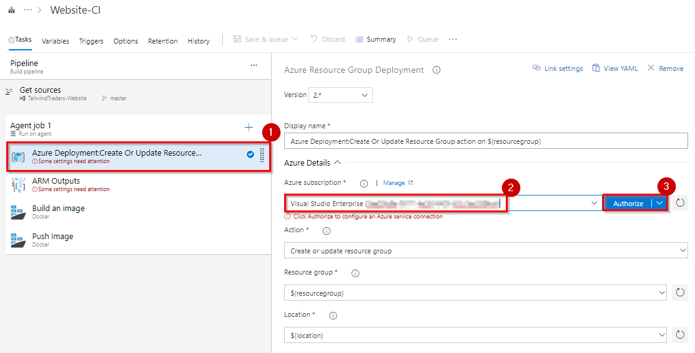

1. Select [ARM Outputs](https://github.com/keesschollaart81/vsts-arm-outputs) task.  This task enables you to use the ARM Deployment outputs in your Azure Pipelines. Select your **Azure subscription** from Azure subscription dropdown.

   

1. Select **Build an Image** task. Here we are using [Docker task](https://docs.microsoft.com/en-us/azure/devops/pipelines/tasks/build/docker?view=vsts) to build and push application image. Select your **Azure subscription** from Azure subscription dropdown and do the same for **Push image** task as well.

    

1. Select **Variables**. In this section, we have defined Azure resource group name, location and other required parameters for the build pipeline as variables.

      

1. Now **Save** the changes and **Queue** the build. All the tasks in the pipeline will be executed sequentially and you can see the progress of the build in the live console.
  
    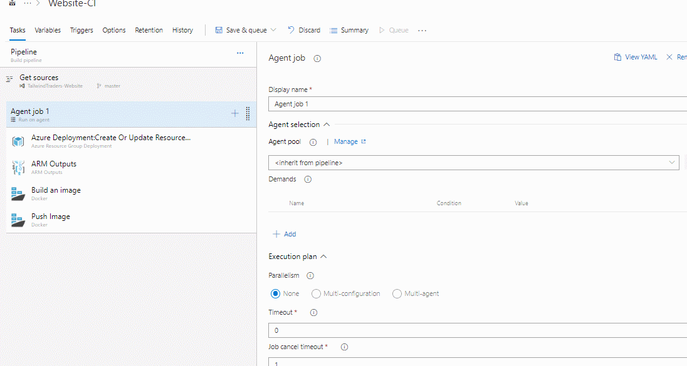

1. Once the build is success go to your Azure portal and navigate to resource group **TailwindTraderWeb**. You should be able to see the following resources which were deployed during the build.

   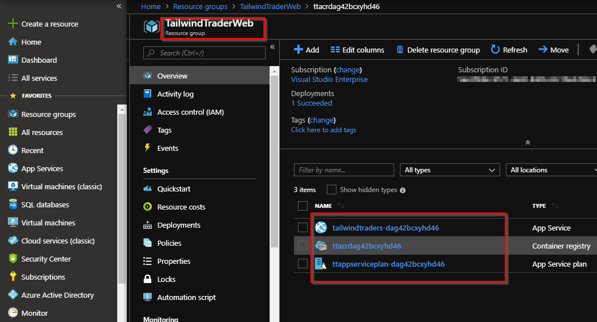

   And you will see a repository with the name **website** in your Container registry under **Repositories**.
  
   

## Configure Release(CD) pipeline

By using a combination of manual deployment approvals, gates, and manual intervention within a release pipeline in Azure Pipelines, you can quickly and easily configure a release pipeline with all the control and auditing capabilities you require for your DevOps CI/CD processes. **Release Gates** allow you to configure automated calls to external services, where the results are used to approve or reject a deployment. You can use gates to ensure that the release meets a wide range or criteria, without requiring user intervention.
In addition, you can install an extension that integrates with **[ServiceNow](https://docs.microsoft.com/en-us/azure/devops/pipelines/release/approvals/servicenow?view=azdevops)** to help you control and manage your deployments though service management methodologies such as ITIL. 

1. Navigate to **Pipeline » Releases**. Select **Website-CD** and click **Edit** pipeline.
   
    

1. Select **Dev** stage and click **View stage tasks** to view the pipeline tasks.

    

    You will see the tasks as below.

    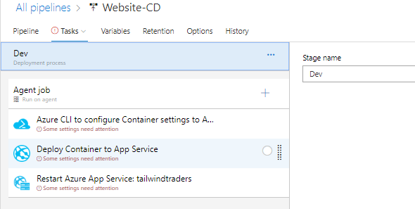

1. Select **Variables**. You need to enter your ACR and App service (which were provisioned during the build) details here. We will make use of these variable values in our pipeline tasks.
   
    

   To get the details to navigate to the Azure resource group provisioned earlier.
   Make a note of App service name

    

   Navigate to ACR and select **Access keys**. Make a note of the following details

   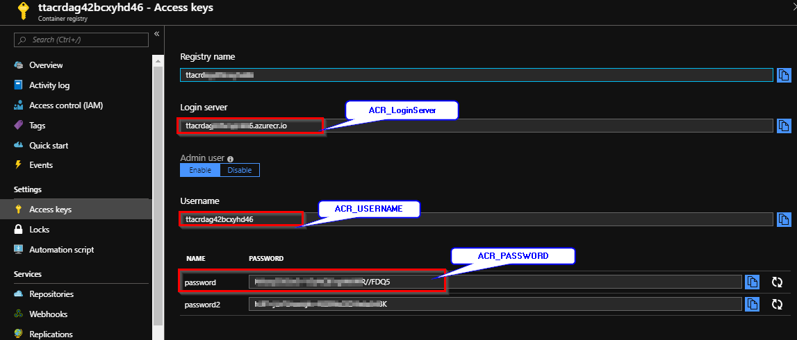

   Enter the above values for the appropriate variables.

1. Come back to **Tasks** and select **Azure CLI to configure Container settings to App service** task. Here we are using Azure CLI script to set the container settings for the Azure app service we created. Select the **Azure service connection** from the drop down. 
 
    

1. Select **Deploy Container to App Service** task. Make sure you have selected **Azure subscription** and choose **App service name** value from the drop-down.
     
     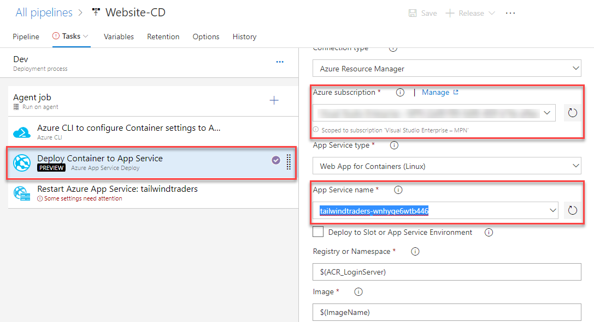

1. Select **Restart Azure App Service: tailwindtraders** task. Select the required parameters as shown below. We are using this task here to restart the app service.
 
   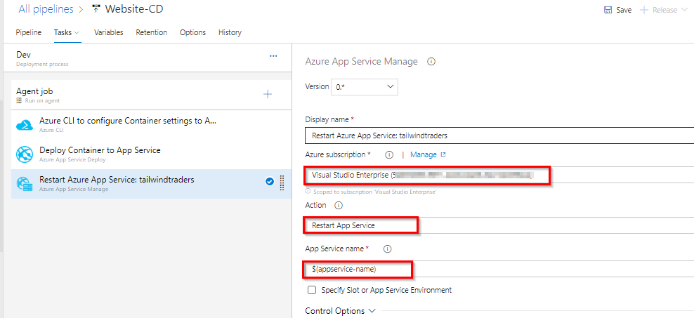

1. **Save** the changes and click **+ Release -> Create a release**.

    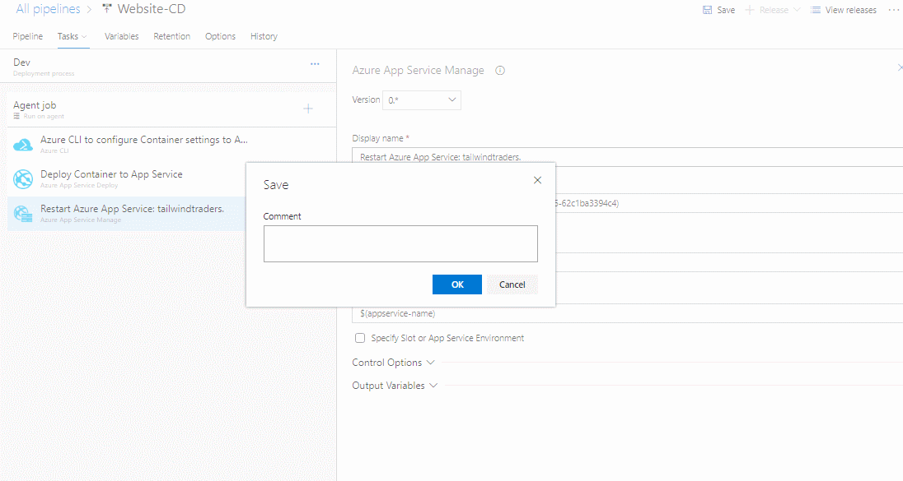

1. Once the release succeeds, navigate to your Azure portal. Select the app service that was created previously and browse to view the deployed application.

   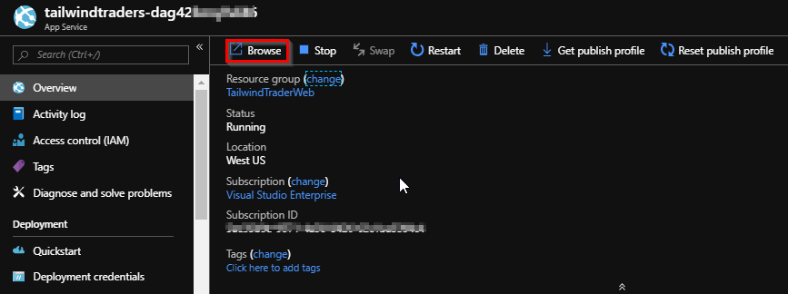

   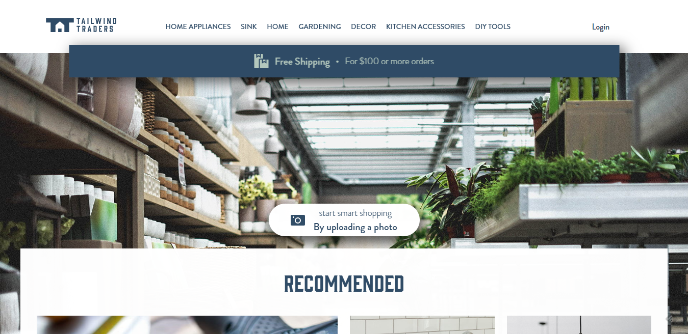

## Walkthrough: Integrating GitHub with Azure Boards

Teams using Azure Pipelines to continuously build and deploy their code already have a deep integration between their code and their CI/CD pipelines. Adding Azure Boards to the mix deepens the integration, providing links from the build summary to the related code and work items for end-to-end traceability.

By connecting Azure Boards with GitHub repositories, you enable linking between GitHub commits and pull requests to work items. You can use GitHub for software development while using Azure Boards to plan and track your work. Azure Boards provides the scalability to grow as your organization and business needs grow.

1. Navigate to **Boards --> Backlogs --> Tailwind Traders Team** in your Azure DevOps project.

    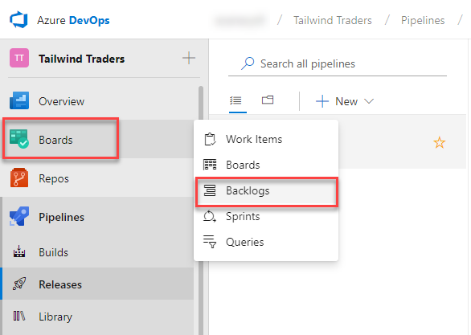

1. Click the **Settings** gear icon and choose **Working with bugs**. For this scenario, choose **Bugs are managed with requirements.**

    

1. Click **New Work Item** and add a *Bug* with the title **Fix the Shipping typo**. Press Enter to create.

    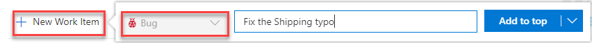

1. Click **View as board**.

    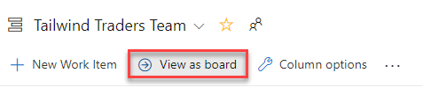

1. Drag the bug to the *Active* column. This will set the status of the bug to *Active* state. Make note of the ID which will be used later for a commit and pull request.

    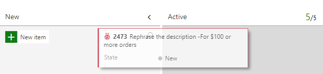

1. Now, let's connect this project to use the GitHub repository. Choose **Project Settings --> GitHub connections --> Connect your GitHub Account**.

    

1. After the authorization is complete, the page returns to your Azure DevOps portal. In the Add GitHub repositories dialog, you'll see the list of repositories for which you are an administrator.

    

1. Check the ones that you want to add and then choose *Save*. When done, you should see the new connection with the selected repository listed.

    

1. Return to the web app and notice the spelling of *Free Shipping**.

    

1. Let's go and fix the typo. Return to Visual Studio and clone the GitHub repository to your machine. Open the solution and create a new branch **FixTypos**. 

    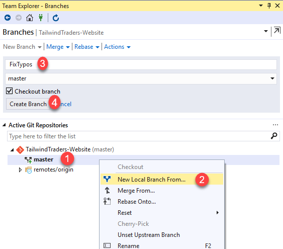

1. In the *Solution Explorer*, open the file **translation.json** under *Tailwind.Traders.Web\ClientApp\src\assets\locales\translation.json*. 

    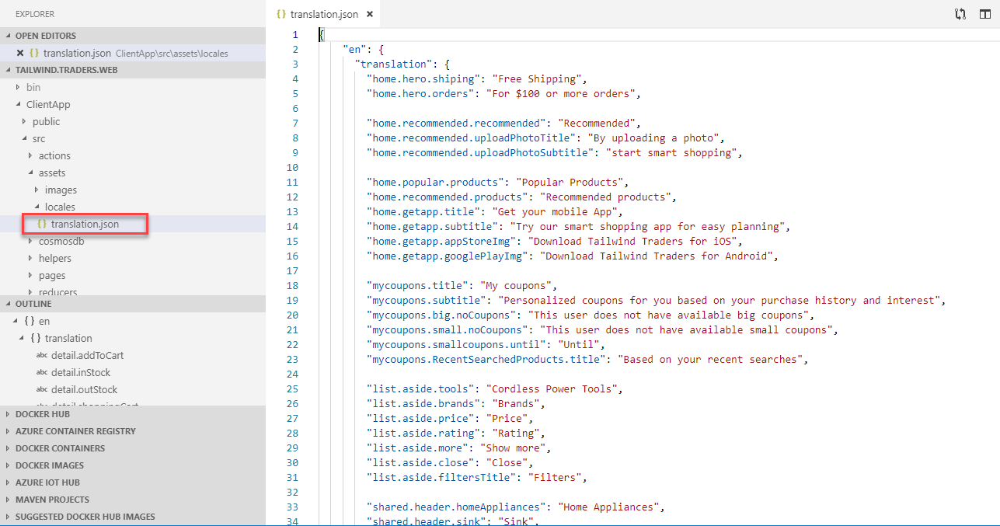

1. Search for **home.hero.shiping** and replace the word *Shiping* with **Shipping**. Save the file. 

    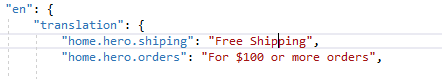

1. Click **Changes** in the *Team Explorer*, provide a commit message **Fixed Typos ##WorkItemID** and choose **Commit Staged and Push**. 

    

    > In this case, we're inheriting the title from the commit, but having the pull request mention "Fixes ##ID" will link and complete the target work item when the pull request is merged. The syntax used is **Fixes AB#[Work Item ID]** to create a link and update the state automatically when the changes reach the **master** branch. 

1. When the push has completed, return to the GitHub browser tab. With the commit pushed, we'll create a pull request to drive those changes back into the master branch.

1. Click **Compare & pull request**, which should appear on its own. If not, refresh.

    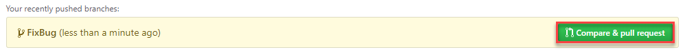

1. Change the **base fork** to point at your project. By default it points at the original **Microsoft** repo, so be sure to change it.

    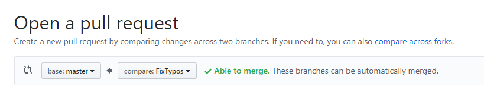

1. The title should initialize to the commit message entered earlier. Click **Create pull request**.

1. Return to Visual Studio. Under **Team Explorer**, click **Pull Requests**. Double-click the previously created Pull Request. You should see all details related to that pull request like the **status, Description, Reviewers(if any), Changes**.

    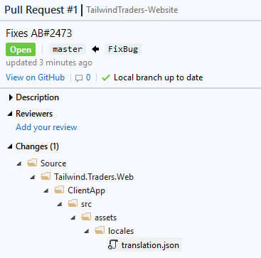

1. Right-click the **translation.json** file and choose **View Changes** to view the file in a diff mode.

    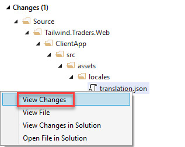
    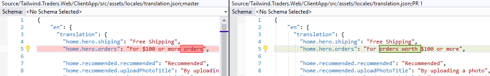

1. Click the **View on GitHub** to open the pull request on the browser. Click **Merge pull request**. 

    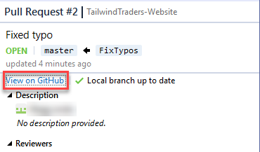

1. On the browser, click **Merge pull request** to merge the changes to the **master** branch.

    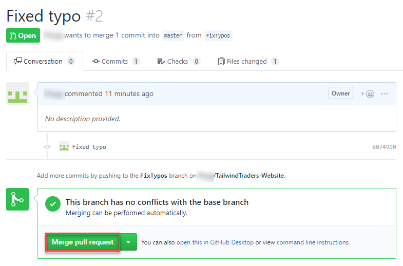

1. To confirm if the change shows up correctly, trigger the CI and then CD pipeline configured earlier. Once it completes, refresh the web app and confirm if you are able to see the changes.

    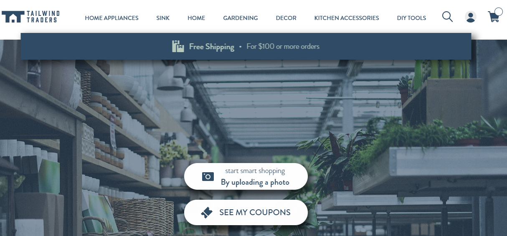

1. Return to the Azure DevOps portal and open the Kanban board. Since the bug we were working on was linked in a pull request that was approved, Azure DevOps will automatically transition the state of the work item to **Resolved**. You can also see that the related GitHub commits and pull request were linked to the work item.

    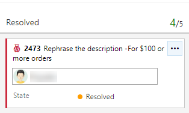

1. The commit and pull request information should now be visible under the **Development** tab in the Bug work item.

    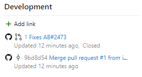
