# Managing backend with Azure Kubernetes Service (AKS)

## Key Takeaway

There are 2 features for the developers and operations team to consider as key takeaways from this demo:

1. **Introduction to AKS** - Azure Kubernetes Service (AKS) allows you to managed Kubernetes based orchestration service. It provides auto-patching, auto-scaling and updates support which enables you to use the full breadth of the Kubernetes ecosystem. In this demo you will learn how you can deploy containers in AKS by creating the cluster, deploy the services and managing the resources in Azure.
1. **Azure Dev Spaces** - Azure Dev Spaces allows you to test and iteratively develop your entire microservices application running in Azure Kubernetes Service (AKS) without the need to replicate or mock dependencies. Azure Dev Spaces reduces the burden and complexity of collaborating with your team in a shared Azure Kubernetes Service (AKS) cluster as well as running and debugging containers directly in AKS.

1. **Virtual Nodes** - A first-of-its-kind serverless computing option with AKS enables you to provision and scale your Kubernetes based apps more efficiently. Virtual Node enables you to elastically provision additional nodes inside your Kubernetes clusters in just seconds. This gives you the flexibility and the portability of containers while also ensuring that you pay only for the compute resources that you need and use.

# Before you begin

Pre-requisites for this deployment:

- Download or clone the code repository [Tailwind Traders Backend](https://github.com/Microsoft/TailwindTraders-Backend)
- A terminal with
  - Bash environment with [jq](https://stedolan.github.io/jq/) installed **-OR-**
  - Powershell environment
- [Azure CLI 2.0](https://docs.microsoft.com/en-us/cli/azure/install-azure-cli?view=azure-cli-latest) installed.
- [Kubectl](https://kubernetes.io/docs/tasks/tools/install-kubectl/) installed.
- Docker installed

**Note**: The easiest way to have a working Bash environment on Windows is [enabling the WSL](https://docs.microsoft.com/en-us/windows/wsl/install-win10) and installing a Linux distro from the Windows Store.

Let us explore Azure Kubernetes Service to demonstrate how you will be able to take advantage of Kubernetes on Azure to deploy containers and save money using our new Virtual Node service for scaling

## Walkthrough: Deploying the backend services

1.  Creating the **Azure Resources**

    A PowerShell script is provided in the path `TailwindTraders-Backend/Deploy/powershell/Deploy-Arm-Azure.ps1` which needs to be executed to create resources required for the lab scenario.

    Open PowerShell in **Administrator** mode, navigate to the local path where **Tailwind Traders Backend** repo has been cloned and execute the script below -

    ```
    .\Deploy-Arm-Azure.ps1
    ```

    Provide a non-existent **Resource Group** name, valid **Location** as input parameters.

    Make a note of the output details of **Service Principal**, **Db Admin** and **Db Password** since it is required in the further exercises.

1.  Connecting **kubectl to AKS**

    From the terminal type:

    - `az aks get-credentials -n <your-aks-name> -g <resource-group-name>` to download the configuration files that `kubectl` needs to connect to your AKS.

    At this point if you type `kubectl config current-context` the name of your AKS cluster should be displayed. That means that `kubectl` is ready to use your AKS.

    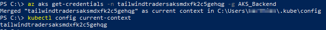

1.  Installing **Tiller on AKS**

    Helm is a tool to deploy resources in a Kubernetes cluster in a clean and simple manner. It is composed of two tools, one client-side (the Helm client) that needs to be installed on your machine, and a server component called _Tiller_ that must be installed on the Kubernetes cluster.

    To install Helm, refer to its [installation page](https://docs.helm.sh/using_helm/#installing-helm). Once Helm is installed, _Tiller_ must be deployed on the cluster. For deploying _Tiller_, navigate to the `/Deploy` under TailwindTraders-Backend repository and run the `add-tiller.sh` (from Bash) or the `Add-Tiller.ps1` (from `/Deploy/powershell`).

    Once installed, helm commands like `helm ls` should work without any error.

    If you face an error - "Error: could not find a ready tiller pod", then run **helm init --upgrade** to upgrade tiller and execute the `helm ls` command again.

1.  Configuring **services** with auto generation of \_gvalues file

    Before deploying services using Helm, you need to setup the configuration by editing the file `helm/gvalues.yaml` and put the secrets, connection strings and all the configuration.

    Generating a valid _gvalues_ file can be a bit harder, so there is a PowerShell script that can do all work by you. This script assumes that all resources are deployed in the same resource group, and this resource group contains only the Tailwind Traders resources. Also assumes the Azure resources have been created using the tools provided in this repo.

    To auto-generate your _gvalues_ file just go to `/Deploy/powershell` folder and from a PowerShell window, type the following:

    ```
      .\Generate-Config.ps1 -resourceGroup <your-resource-group> -sqlPwd <sql-password> -outputFile helm\__values\<name-of-your-file>
    ```

    The parameters that `Generate-Config.ps1` accepts are:

    - `-resourceGroup`: Resource group where all Azure resources are. **Mandatory**
    - `-sqlPwd`: Password of SQL Servers and PostgreSQL server. This parameter is **mandatory** because can't be read using Azure CLI
    - `-forcePwd`: If `$true`, the scripts updates the SQL Server and PostgreSQL to set their password to the value of `sqlPwd`. Defaults to `$false`.
    - `-outputFile`: Full path of the output file to generate. A good idea is to generate a file in `/Deploy/helm/__values/` folder as this folder is ignored by Git. If not passed the result file is written on screen.
    - `-gvaluesTemplate`: Template of the _gvalues_ file to use. The parameter defaults to the `/Deploy/helm/gvalues.template` which is the only template provided.

    The script checks that all needed resources exist in the resource group. If some resource is missing or there is an unexpected resource, the script exits.

    Once the file is generated in the `/Deploy/helm/__values/`folder, copy the file outside the `__values` folder and rename it as `gvalues.yaml`.

    > **Note:** If you don't want to edit the `helm/gvalues.yaml` file you can create a copy and name it whatever you want (i. e. `helm/gvalues-prod1.yaml`). This allows you to maintain various environments. Note that **this file contains secrets so do not push into the repo!**, you can put the file in `/Deploy/helm/__values/` folder which is added to `.gitignore` to avoid accidental pushes.

1.  Create **secrets on the AKS**

    Docker images are stored in an ACR (a private Docker Registry hosted in Azure).

    Before deploying anything on AKS, a secret must be installed to allow AKS to connect to the ACR through a Kubernetes' service account.

    To do so from a Bash terminal run the file `./create-secret.sh` with following parameters:

    - `-g <group>` Resource group where AKS is
    - `--acr-name <name>` Name of the ACR
    - `--clientid <id>` Client id of the service principal to use
    - `--password <pwd>` Service principal password

    Please, note that the Service principal must be already exist. To create a service principal, you can run the command `az ad sp create-for-rbac`.

    If using PowerShell, run the `.\Create-Secret.ps1` inside `powershell` folder with following parameters:

    - `-resourceGroup <group>` Resource group where AKS is
    - `-acrName <name>` Name of the ACR

    This will create the secret in AKS **using ACR credentials**. If ACR login is not enabled, you can create a secret by using a service principal. For use an Azure service principal following additional parameters are needed:

    - `-clientId <id>` Client id of the service principal to use
    - `-password <pwd>` Service principal password

1.  **Build** & **deploy** images to ACR

    You can **manually use docker-compose** to build and push the images to the ACR. If using compose you can set following environment variables:

        * `TAG`: Will contain the generated docker images tag
        * `REGISTRY`: Registry to use. This variable should be set to the login server of the ACR

    Once set, you can use `docker-compose build` and `docker-compose push` to build and push the images.

    Additionally, there is a PowerShell script in the `Deploy/powershell` folder, named `Build-Push.ps1`. You can use this script for building and pushing ALL images to ACR. Parameters of this script are:

        * resourceGroup: Resource group where ACR is. Mandatory.
        * acrName: ACR name (not login server). Mandatory.
        * dockerTag: Tag to use for generated images (defaults to `latest`)
        * dockerBuild: If `$true` (default value) docker images will be built using `docker-compose build`.
        * dockerPush: If `$true` (default value) docker images will be push to ACR using `docker-compose push`.

    This script uses `az` CLI to get ACR information, and then uses `docker-compose` to build and push the images to ACR.

    To build an push images tagged with v1 to an ACR named my-acr in resource group named my-rg:

    ```
     .\Build-Push.ps1 -resourceGroup my-rg -dockerTag v1 -acrName my-acr
    ```

    It might take around 10 minutes to complete the build process.

    To just push the images (without building them before):

    ```
      .\Build-Push.ps1 -resourceGroup my-rg -dockerTag v1 -acrName my-acr -dockerBuild $false
    ```

1.  Deploying **Services**

    > **Note**: If you want to add SSL/TLS support on the cluster (needed to use https on the web) please read following section **before installing the backend**.

    To deploy the services from a Bash terminal, run the `./deploy-images-aks.sh` script with the following parameters:

    - `-n <name>` Name of the deployment. Defaults to `my-tt`
    - `--aks-name <name>` Name of the AKS
    - `-g <group>` Name of the resource group
    - `--acr-name <name>` Name of the ACR
    - `--tag <tag>` Docker images tag to use. Defaults to `latest`
    - `--charts <charts>` List of comma-separated values with charts to install. Defaults to `*` (all)
    - `-f <values-file>`: Values file to use (defaults to `gvalues.yaml`)

    If using PowerShell, you must run `.\Deploy-Images-Aks.ps1` inside `powershell` folder with following parameters:

    - `-name <name>` Name of the deployment. Defaults to `my-tt`
    - `-aksName <name>` Name of the AKS
    - `-resourceGroup <group>` Name of the resource group
    - `-acrName <name>` Name of the ACR
    - `-tag <tag>` Docker images tag to use. Defaults to `latest`
    - `-charts <charts>` List of comma-separated values with charts to install. Defaults to `*` (all)
    - `-valueSFile <values-file>`: Values file to use (defaults to `gvalues.yaml`)
    - `-tlsEnv prod|staging` If **SSL/TLS support has been installed**, you must use this parameter to enable https endpoints. Value must be `staging` or `prod` and must be the same value used when you installed SSL/TLS support. If SSL/TLS is not installed, you can omit this parameter.

    This script will install all services using Helm and your custom configuration from file `gvalues.yaml`

    The parameter `charts` allow for a selective installation of charts. Is a list of comma-separated values that mandates the services to deploy in the AKS. Values are:

    - `pr` Products API
    - `cp` Coupons API
    - `pf` Profiles API
    - `pp` Popular products API
    - `st` Stock API
    - `ic` Image classifier API
    - `ct` Shopping cart API
    - `mgw` Mobile API Gateway
    - `wgw` Web API Gateway

    So, using `charts pp,st` will only install the popular products and the stock API.

1.  Deploying the **Images** to the storage account

    To deploy the needed images on the Azure Storage account just run the `/Deploy&powershell/Deploy-Pictures-Azure.ps1` script, with following parameters:

        -resourceGroup <name>: Resource group where storage is created
        -storageName <name>: Name of the storage account

    Script will create blob containers and copy the images (located in `/Deploy/tailwindtraders-images` folder) to the storage account.

1.  Enabling **SSL/TLS** on the cluster (**_Optional_**)

    SSL/TLS support is provided by [cert-manager](https://github.com/jetstack/cert-manager) that allows auto-provisioning of TLS certificates using [Let's Encrypt](https://letsencrypt.org/) and [ACME](https://en.wikipedia.org/wiki/Automated_Certificate_Management_Environment) protocol.

    To enable SSL/TLS support, you must do it **before deploying your images**. The first step is to add cert-manager to the cluster by running `images/add-cert-manager.sh` or `images/Add-Cert-Manager.ps1`. Both scripts accept no parameters and they use helm to configure cert-manager in the cluster. **This needs to be done only once**

    Then you should run `powershell/Enable-Ssl.ps1` with following parameters:

    - `sslSupport`: Use `staging` or `prod` to use the staging or production environments of Let's Encrypt
    - `aksName`: The name of the AKS to use
    - `resourceGroup`: Name of the resource group where AKS is
    - `domain`: Domain to use for the SSL/TLS certificates. Is **optional** and if not used it defaults to the public domain of the AKS. Only need to use this parameter if using custom domains

    Output of the script will be something like following:

    ```
        NAME:   my-tt-ssl
        LAST DEPLOYED: Fri Dec 21 11:32:00 2018
        NAMESPACE: default
        STATUS: DEPLOYED

        RESOURCES:
        ==> v1alpha1/Certificate
        NAME             AGE
        tt-cert-staging  0s

        ==> v1alpha1/Issuer
        NAME                 AGE
        letsencrypt-staging  0s
    ```

    You can verify that the _issuer_ object is created using `kubectl get issuers`:

    ````
        PS> kubectl get issuers
        NAME                  AGE
        letsencrypt-staging   4m
        ```

    You can verify that the _certificate_ object is created using `kubectl get certificates`:

        ```
        PS> kubectl get certificates
        NAME              AGE
        tt-cert-staging   4m
    ````

    The _certificate_ object is not the real SSL/TLS certificate but a definition on how get one from Let's Encrypt. The certificate itself is stored in a secret, called `letsencrypt-staging` (or `letsencrypt-prod`). You should see a secret named `tt-letsencrypt-xxxx` (where `xxxx` is either `staging` or `prod`).

    ```
        PS> kubectl get secrets
        NAME                  TYPE                                  DATA      AGE
        acr-auth              kubernetes.io/dockerconfigjson        1         2d
        default-token-6tm9t   kubernetes.io/service-account-token   3         3d
        letsencrypt-prod      Opaque                                1         3h
        letsencrypt-staging   Opaque                                1         4h
        tt-letsencrypt-prod   kubernetes.io/tls                     2         5m
        ttsa-token-rkjlg      kubernetes.io/service-account-token   3         2d
    ```

    The SSL/TLS secret names are:

    - `letsencrypt-staging`: Secret for the staging _issuer_. This is NOT the SSL/TLS certificate
    - `tt-letsencrypt-staging`: Secret for the staging SSL/TLS certificate.
    - `letsencrypt-prod`: Secret for the prod _issuer_. This is NOT the SSL/TLS certificate
    - `tt-letsencrypt-prod`: Secret for the prod SSL/TLS certificate.

    At this point **the support for SSL/TLS is installed, and you can install Tailwind Traders Backend on the repo**.

    > **Note:** You don't need to do this again, unless you want to change the domain of the SSL/TLS certificate. In this case you need to remove the issuer and certificate objects (using `helm delete my-tt-ssl --purge` and then reinstall again)

    > **Note** Staging certificates **are not trust**, so browsers will complain about it, exactly in the same way that they complain about a self-signed certificate. The only purpose is to test all the deployment works, but in any production environment you must use the `prod` environment. Main difference is the Let's Encrypt API call rates are more limited than the staging ones.

    Another way to validate your certificate deployment is doing a `kubectl describe cert tt-cert-staging` (or `tt-cert-prod`). In the `Events` section you should see that the certificate has been obtained:

    ```
        Events:
        Type    Reason          Age   From          Message
        ----    ------          ----  ----          -------
        Normal  CreateOrder     10m   cert-manager  Created new ACME order, attempting validation...
        Normal  DomainVerified  9m    cert-manager  Domain "e43cd6ae16f344a093dc.eastus.aksapp.io" verified with "http-01" validation
        Normal  IssueCert       9m    cert-manager  Issuing certificate...
        Normal  CertObtained    9m    cert-manager  Obtained certificate from ACME server
        Normal  CertIssued      9m    cert-manager  Certificate issued successfully
    ```

## Walkthrough: Deploying the website

1. ARM template is provided so that you can automate the creation of the resources for the website. Select the **Deploy to Azure** button (or right click and select the Open in new tab option) to spin up App Service, Azure Container Registry (ACR).

   [](https://portal.azure.com/#create/Microsoft.Template/uri/https%3A%2F%2Fraw.githubusercontent.com%2FMicrosoft%2FTailwindTraders-Website%2Fmaster%2FDeploy%2Fdeployment.json)

   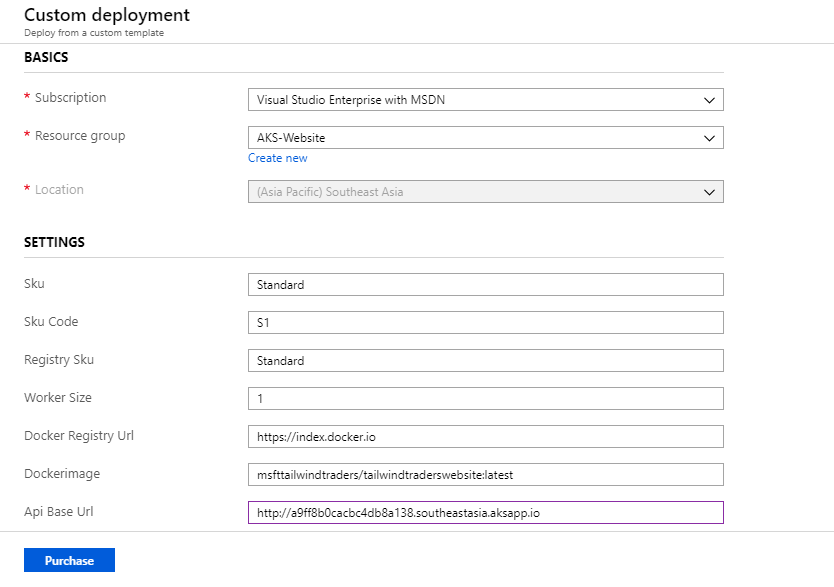

1. When deploying to Azure pay attention to parameter - **Api Base Url**.

   - The base url is the URL of the created Kubernetes service's **HTTP application routing domain**. Refer below image for the **Url** to be copied from your created Kubernetes service, which is deployed in the backend resource group. It defaults to the public test environment provided by Microsoft.

   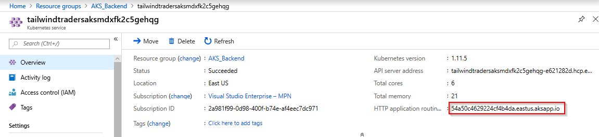

1. Below resources are created after the deployment.

   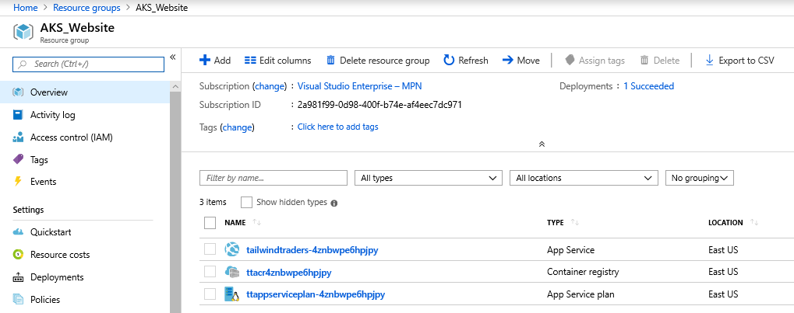

1. To see the website, navigate to the **App Service** and click on the **URL**.

   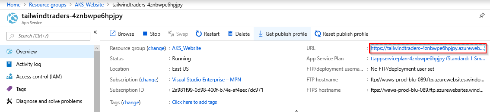

   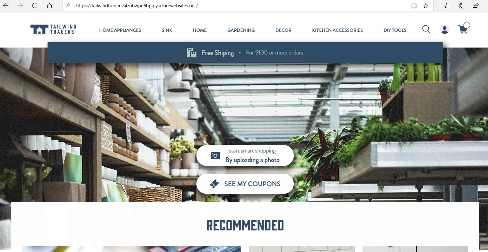

1. In order to see if the backend is working, navigate to the tabs under the website. If you are not using SSL/TLS, load the page in **_http://_** mode or click on **Load unsafe scripts** in Chrome browser.

   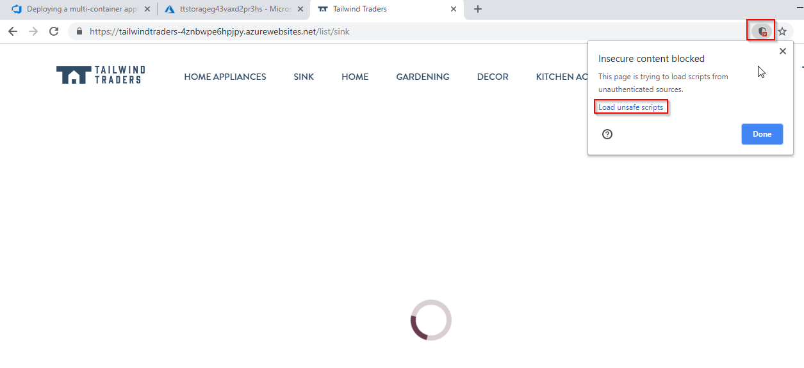

## Walkthrough: Azure Dev Spaces

Azure Dev Spaces allow debug and develop micro services in a team environment without disturbing other people work. Every developer has its own space where changes can be deployed without impacting other people.

You will need the following to be installed -

- [Visual Studio Code installed](https://code.visualstudio.com/download).
- The [Azure Dev Spaces for VS Code](https://marketplace.visualstudio.com/items?itemName=azuredevspaces.azds), [Java Extension Pack](https://marketplace.visualstudio.com/items?itemName=vscjava.vscode-java-pack), [Java for Azure Dev Spaces (Preview)](https://marketplace.visualstudio.com/items?itemName=vscjava.vscode-java-debugger-azds) extensions for Visual Studio Code installed.
- [Azure CLI installed](/cli/azure/install-azure-cli?view=azure-cli-latest) (version greater than 2.0.62).

To enable Azure Dev Spaces on your AKS cluster, use the use-dev-spaces command to enable Dev Spaces on your AKS cluster and follow the prompts. The below command enables Dev Spaces on the AKS cluster inside the resource group and creates a Dev Space called dev. When prompted for a Kubernetes namespace to be used as a Dev Space, enter `dev`. When prompted for the parent devspace, select `None` (0).

```cmd
    $ az aks use-dev-spaces -g <<ResourceGroup>> -n <<AKS>>

    Installing Dev Spaces commands...
A separate window will open to guide you through the installation process.
An Azure Dev Spaces Controller will be created that targets resource '<<AKS>>' in resource group '<<ResourceGroup>>'. Continue? (y/N): y

Creating and selecting Azure Dev Spaces Controller '<<AKS>>' in resource group '<<ResourceGroup>>' that targets resource '<<AKS>>' in resource group '<<ResourceGroup>>'...2m 40s

Select a dev space or Kubernetes namespace to use as a dev space.
 [1] default
Type a number or a new name: dev

Dev space 'dev' does not exist and will be created.

Select a parent dev space or Kubernetes namespace to use as a parent dev space.
 [0] <none>
 [1] default
Type a number: 0

Creating and selecting dev space 'dev'...1s

Managed Kubernetes cluster '<<AKS>>' in resource group '<<ResourceGroup>>' is ready for development in dev space 'dev'. Type `azds prep` to prepare a source directory for use with Azure Dev Spaces and `azds up` to run.
```

### Introduce a bug in the stock API

Let's take on the role of _Alice_, a developer who is trying to reproduce a bug in stock API that makes the API return all products out of stock.

In this scenario, comment a particular line of code in your local repository under `Source/Services/Tailwind.Traders.Stock.Api/src/main/java/Tailwind/Traders/Stock/Api/StockController.java`. You don’t have to compile after commenting the line of code.

```
     response.setProductStock(stock.getStockCount());
```

### Prepare source for Dev Spaces

Deploy using Dev Spaces is done using the same Helm charts (located in `/Deploy/helm`) used in the standard deployment. You need to have a valid _gvalues.yaml_ configuration file created. From a PowerShell command line in folder `/Source` type:

```ps
   .\prepare-devspaces.ps1 -file <path-to-your-gvalues-file>
```

This will copy your _gvalues_ file in `/Deploy/helm` folder with the name `gvalues.azds.yaml`. Dev spaces deployment files expect to have the _gvalues_ file in that folder with that name (**note**: File is added in `.gitignore`).

### Deploying the service account and secrets in the namespace

Run Create-Secret.ps1 inside /Deploy/powershell it will create ttsa and ACR secret related to your **namespace**.

- `-resourceGroup`: Name of the resource group **Required for this demo**.
- `-acrName`: Name of your Azure Container Registry **Required for this demo**.
- `-clientId`: Service Principal Id.
- `-password`: Service Principal Password.
- `-namespace`: Name of your namespace defined above, default is empty. **Required for this demo for example `dev`**.

### Deploy all the APIs to the dev Dev Space

The `dev` Dev Space acts as a root Dev Space, where "shared" version of code is deployed. This could be the code deployed by a CD pipeline.
To deploy, just run `azds up -d -v` from a command line, once in these folders:

- `/Source/Services/Tailwind.Traders.Cart.Api`
- `/Source/Services/Tailwind.Traders.Coupon.Api`
- `/Source/Services/Tailwind.Traders.Login.Api`
- `/Source/Services/Tailwind.Traders.PopularProduct.Api`
- `/Source/Services/Tailwind.Traders.Product.Api`
- `/Source/Services/Tailwind.Traders.Profile.Api`
- `/Source/Services/Tailwind.Traders.Stock.Api`
- `/Source/ApiGWs/Tailwind.Traders.Bff`
- `/Source/ApiGWs/Tailwind.Traders.WebBff`

Once finished, the `azds list-up` command should list all APIs in root the Dev Space `dev`:

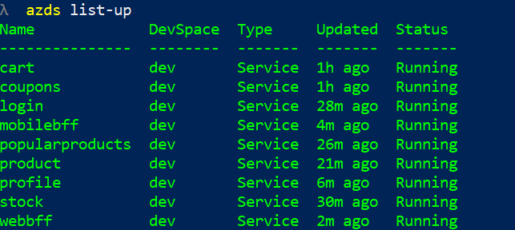

### Deploy Web to the dev Dev Space

This needs to be done from the [TailwindTraders Web repository](https://github.com/Microsoft/TailwindTraders-Website)

Just run `azds up -d -v` from a command line in the folder:

- `/Source/Tailwind.Traders.Web`

### Try the parent Dev Space

The parent `dev` Dev Space is deployed, and ready to be tested. Run `azds list-uris --all` to get all the entry points for all APIs and the web:

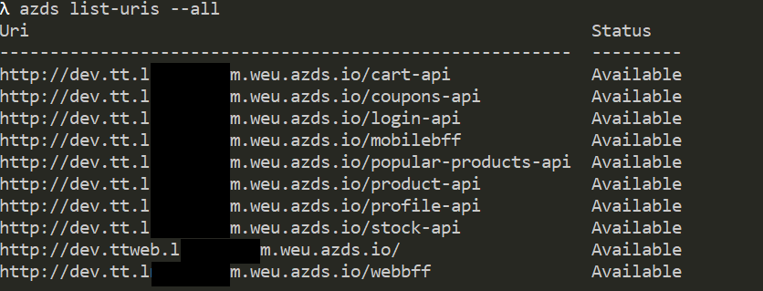

When deploying on a Dev Space, all services are exposed using an ingress, even though they are internal ones; for easy testing.

Now, grab the URL of the web and paste in your browser:

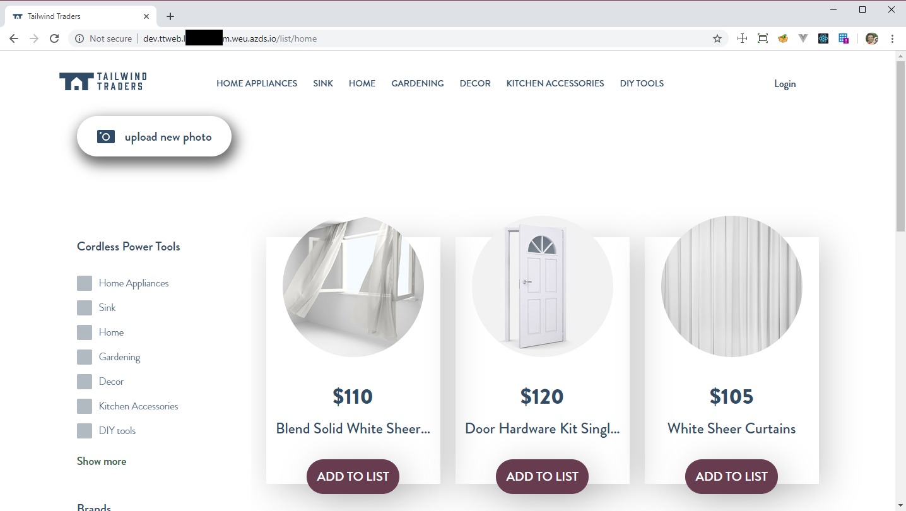

### Bug Scenario

Web shows all products "out of stock":


Data seems to be correct in the database, but no matter what product id is passed, stock api always return no stock:

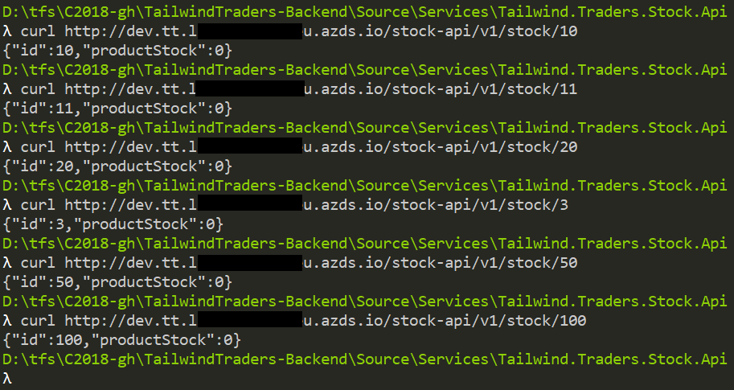

### Creating a child Dev Space for debugging

Alice is assigned to solve this bug, so she creates a new Dev Space for herself. Type `azds space select` and create a new Dev Space child of `dev` as this new Dev Space has to be a child Dev Space of the `dev` root Dev Space:

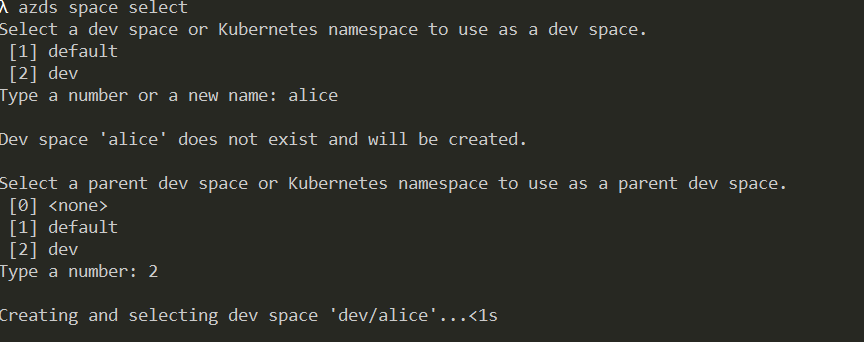

Alice can verify that she is in her own Dev Space by typing `azds space list` and checking the `dev/alice` Dev Space is selected (marked with an asterisk):

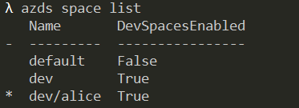

Great! Alice is in her own Dev Space, so all changes she deploys will be isolated to her and won't affect other developers in the same development environment. Alice gets her own entry points (URIs) to access their own versions of the services. If the service is not deployed in her Dev Space,the service deployed in the parent Dev Space (`dev`) will be used instead. Just like earlier, the command `azds list-uris` shows the URLs of the services. However, since Alice selected her `dev/alice` Dev Space, now she sees her own URIs:

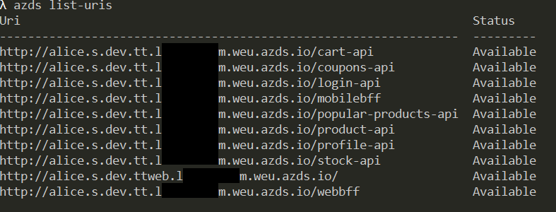

### Deploy the ttsa service account on her namespace

**Before deploying any API to her own Dev Space** Alice has to deploy the `ttsa` service account. She needs to do it only once using `kubectl`. The file to deploy is `/Deploy/helm/ttsa.yaml` and it must be deployed in the namespace `alice` because that iss the name of her Dev Space:

```
   kubectl apply -f Deploy\helm\ttsa.yaml -n alice
```

### Debugging the Tasks API using Visual Studio Code

It's time for Alice to use Visual Studio Code to debug the Task API. Alice goes to the her local repository folder `/Source/Services/Tailwind.Traders.Stock.Api` and opens it with Visual Studio Code. Then selects the command _Azure Dev Spaces: Prepare configuration files for Azure Dev Spaces_ from the _Command Palette_ or (Ctlr+Shift+P):

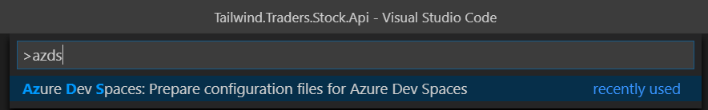

Visual Studio Code will ask for the base image to use (select the one based on Azul Zulu):

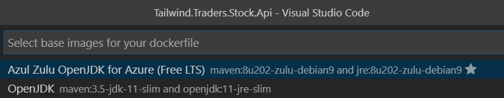

Finally, VS Code will ask for the default port. Choose 8080:

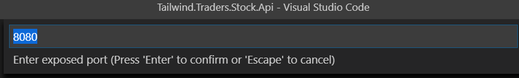

Once finished, a `launch.json` and a `tasks.json` file is generated in the `.vscode` directory. Now the debug window of VSCode should have the option "Launch Java program (AZDS)":

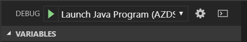

> **Note** If there is any problem in performing these steps, **just delete the `.vscode` folder and rename the folder `.generated.vscode` to `.vscode`**. The `.generated.vscode` folder contains the final scripts that VS Code needs for using Dev Spaces.

Alice uses this option to launch the Tasks API on her own Dev Space. This will take a while since VS Code needs to update all code in the Alice Dev Space (under the hoods a `azds up` is performed).

Visual Studio Code will show a **localhost** address in the status bar:


Alice can use this address to access the Tasks API **running on her Dev Space**. Don't be confused because of the _localhost_ address. Tasks API is not running in Alice's machine, it is running in AKS, the _localhost_ address is just tunneled. A `azds list-uris` run from command prompt will give the same info:

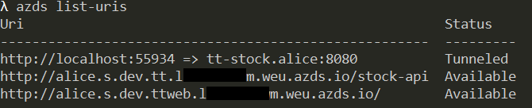

For starting her debug session, Alice puts a break point in the file `src/main/java/Tailwind/Traders/Stock/Api/StockController.java` in line where `stock` is checked against `null` in method `StockProduct`:

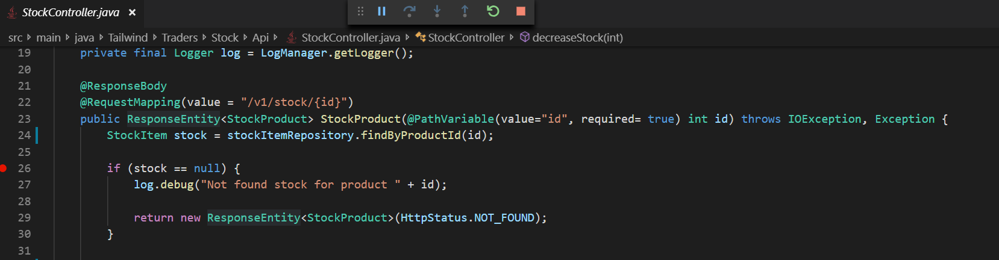

She now needs to trigger the breakpoint. There are two options:

1. Alice can use the _localhost_ address to make a direct call to the Task API. This is possible if she knows which this call is.
2. If Alice is a new developer she maybe doesn’t know what this call is, but she knows how to reproduce the error: using the web and going to the details of one product.

Using option 1 is as easy as doing a call with curl to the endpoint `/v1/stock/{product_id}`:

```
  curl http://localhost:55934/v1/stock/1
```

That will trigger the endpoint and the breakpoint should be hit:

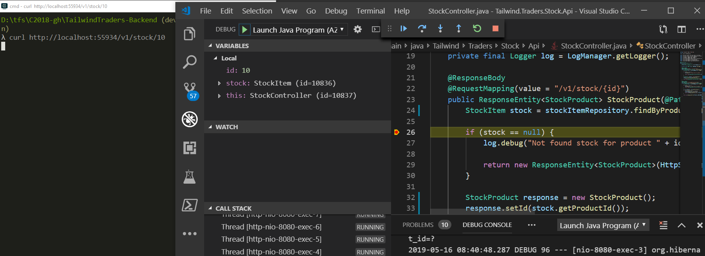

The second option (using the web) shows how Dev Spaces is powerful. **Even though Alice has not deployed the web on her Dev Space**, she gets a new URL to access the web. The command `azds list-uris` gives this new url:


Note that the URLs starts with `alice.s`. So, Alice can open a web browser and navigate to the URL of the web (`alice.s.dev.ttweb.xxxxxxx`):

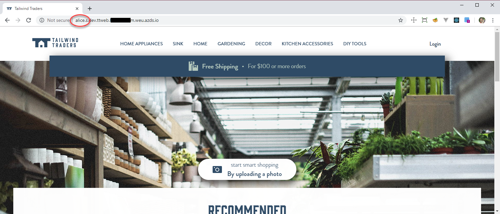

She now can use the web, navigate to a product detail **and the breakpoint will be hit**:

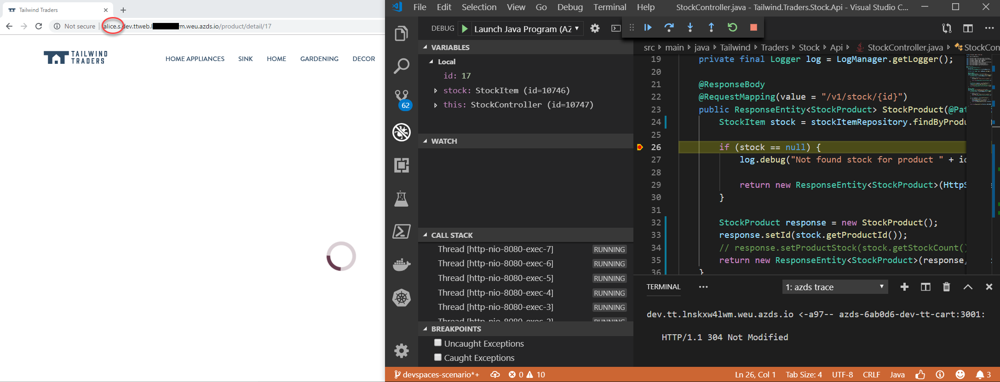

Now Alice can use the debug tools incorporated with Visual Studio Code to find the error. Seems that some developer left a line commented, and this is the source of the error:

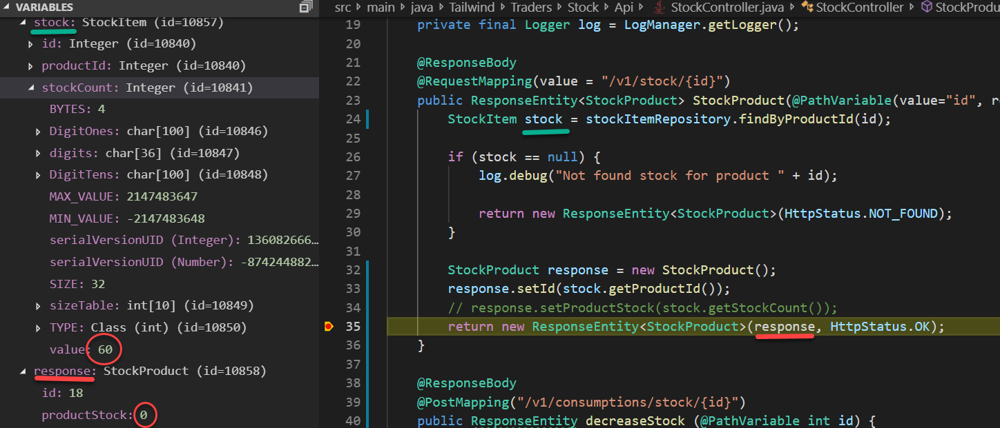

Now Alice can stop the debug session and just fix the code by uncommenting the line. Then **she can start a new debug session just to ensure the error is gone**. She doesn’t need to re-build the project, starting a new session will synchronize the file she changed locally and rebuild the API in her Dev Space.

Once the new debug session is started, Alice just refreshes the browser window to check if the error has disappeared:

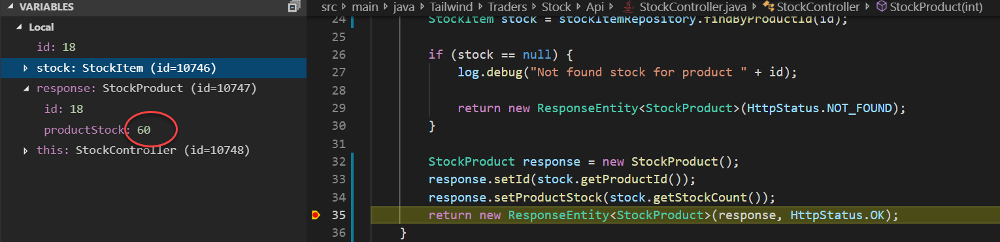

Just to recap, Alice did all this debug session **without impacting any other developer**. The web now works as expected in her Dev Space while it is still failing in the `dev` namespace:

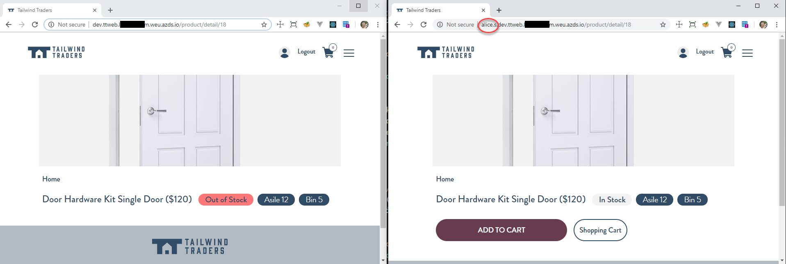

Alice can now commit the code and close the bug! CD pipeline will deploy the updated version of _Tasks API_ to the `dev` Dev Space, and all developers will get the fix.

Instead of rebuilding and redeploying a new container image each time code edits are made, Azure Dev Spaces incrementally recompiles code within the existing container to provide a faster edit/debug loop.

## Walkthrough: Virtual Nodes

Azure Kubernetes Service (AKS) virtual node allows you to elastically provision additional pods inside Container Instances that start in seconds. With a few clicks in the Azure portal, turn on the virtual node feature and get the flexibility and portability of a container-focused experience in your AKS environment without needing to manage the additional compute resources. And since your Azure Container Instances containers can join the same virtual network as the rest of your cluster, you can build Kubernetes services that seamlessly span pods running on virtual machines (VMs) and Azure Container Instances.

The goal of this demo is to view the AKS "virtual nodes" feature, that enables running some AKS pods in ACI.

### Key Takeaway

Virtual Nodes is a key feature of AKS that run some pods in ACI to allow for high scalability in scenarios where scalability can vary a lot. This demo starts with a "standard" deploy of Tailwind Traders Backend, and then this deploy is updated to allow some APIs to run on virtual nodes.

### Create the AKS with Virtual Nodes enabled

The **ARM script** provided with Tailwind Traders is not configured to create an AKS with virtual nodes feature enabled, and as this feature cannot be added to an AKS after its creation, **You will need to create an AKS with virtual nodes enabled**. You can:

- [Use Azure portal to create an AKS with virtual nodes enabled](https://docs.microsoft.com/en-us/azure/aks/virtual-nodes-portal)
- [Use the CLI to create an AKS with virtual nodes enabled](https://docs.microsoft.com/en-us/azure/aks/virtual-nodes-cli)
- Run the powershell script `/Deploy/demos/vnodes/Create-Aks.ps1`.

The PowerShell script has following parameters:

- `-resourceGroup`: Resource group to use. **Mandatory**. If not exists will be created.
- `-location`: Location where to create the resource group if needed. Defaults to `eastus2`
- `-aksName`: Name of the AKS cluster to create. Defaults to `ttvnodes`

### Create an ACR

Type following command to create an ACR:

```
az acr create -g <resource-group> -n <acr-name> --admin-enabled true --sku Standard
```

### Deploy Azure infrastructure

Run the `/Deploy/powershell/Deploy-Arm-Azure.ps1` script with following parameters:

- `-resourceGroup`: Resource group where to deploy all Azure infrastructure. If not exists it is created.
- `-location`: Location where create the resource group if needed
- `-deployAks`: Set it to `$false` so that the AKS is **NOT** created

### Deploy the Backend in the AKS

The next step is to deploy the backend in the AKS. Since you have already created this in the first section of this lab, you can move to the next step.

If you are following only this section of the lab, then there is a standard deployment, with no virtual nodes enabled. Follow steps described in the [Tailwind Traders Backend Deployment Guide](../../DeploymentGuide.md)

### Scenario

In this demo, a stress situation like _Black Friday_ is simulated. On a Black Friday, a lot of product queries are expected, so the Products API, needs to be able to handle high load. For this scenario, the deployment of the "Products API" will be updated to use virtual nodes.

### Updating the "Products API" deployment

Run `helm ls` command to find the _Products API_ release name. If you did not override the `-name` parameter in the `Deploy-Images-Aks.ps1` script, the release should be named `my-tt-product`.

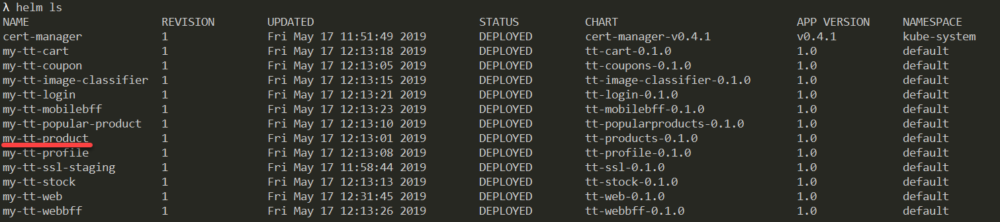

The first update will be just to force Products API to run on virtual nodes. This is accomplished by adding some `nodeSelector` and `tolerations` to the product API pods. The exact values are in file `/Deploy/helm/vnodes/vnodes.yaml`.

**From a command line located in `/Deploy/helm` folder**, type following command to upgrade the helm release adding these new values:

```
helm upgrade --reuse-values --recreate-pods -f vnodes\vnodes.yaml my-tt-product .\products-api.
```

A `kubectl get pods -o wide` should make clear that the _Products API_ pod is running on the virtual node:

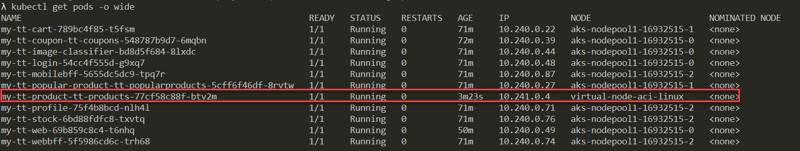

If you go to the azure portal, to the AKS associated resource group (the one that has the name like `MC_<resrource-group>_<aks-name>_<region-name>`) you should see the ACI running the products API pod:

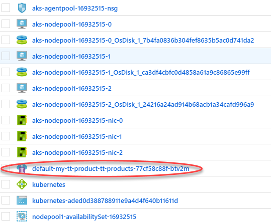

_Congratulations! You are running the products API on virtual nodes_.

### Scaling the products API manually

You can manually scale the products API by typing:

```
kubectl scale deployment/my-tt-product-tt-products --replicas=10
```

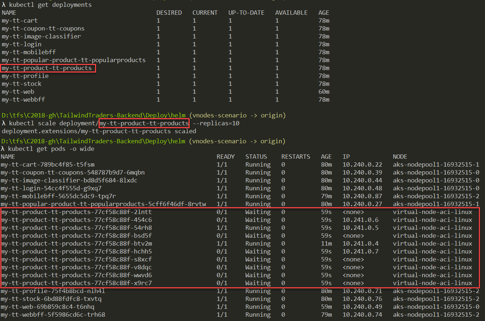

Each pod that runs in the virtual node is an ACI instance in the `MC_XXX` resource group:


### Auto scaling the products API

Apart from scaling manually, the products API can be configured to scale automatically using a Kubernetes standard _Horizontal Pod Autoscaler (HPA)_. The HPA definition is in file `/Deploy/helm/vnodes/hpa.yaml`.

Before deploying it, just scale down the products api deployment to one pod:

```
kubectl scale deployment/my-tt-product-tt-products --replicas=1
```

This will remove all pods (and the ACI resources) except one.

To deploy the HPA, just upgrade the helm release again, but including the `hpa.yaml` file. **From a command line located in `/Deploy/helm` folder** type:

```
helm upgrade --reuse-values --recreate-pods -f vnodes\hpa.yaml my-tt-product .\products-api
```

Once upgraded, the `kubectl get hpa` should return one result:

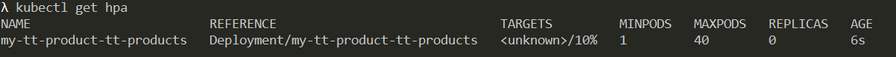

### Start the "Black Friday" simulation

Just run the script `/Deploy/demos/vnodes/BlackFriday.ps1` with following parameters:

- `-aksName`: Name of the AKS
- `-resourceGroup`: Resource group

The script will simulate a variable load against the Products API.

After the simulation, you can cleanup the demo for exploring further -

Delete the products API release:

```
helm delete my-tt-product --purge
```

Then use the `/Deploy/powershell/Deploy-Images-Aks.ps1` with the parameter `-charts pr` to redeploy again only the products api:

```
.\Deploy-Images-Aks.ps1 -resourceGroup <resource-group> -aksName <aks-name> -acrName <acr-name> -valuesFile <path-to-gvalues-file> -charts pr -tlsEnv staging
```

## Summary

Azure makes development teams working with micro services and Kubernetes more efficient by combining the capabilities of Visual Studio and AKS Dev Spaces. Operations team become more reliable by using powerful services like Virtual Nodes to spin up instant serverless containers when you need it the most.
