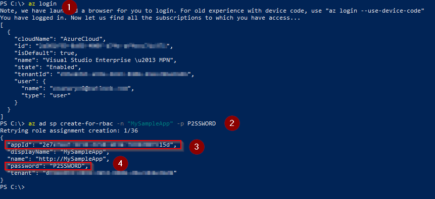
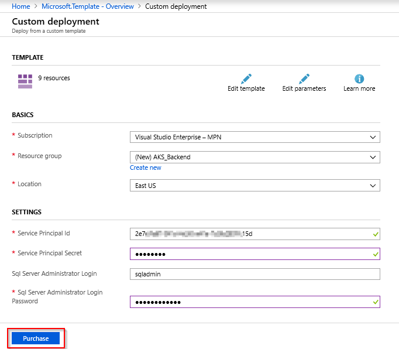
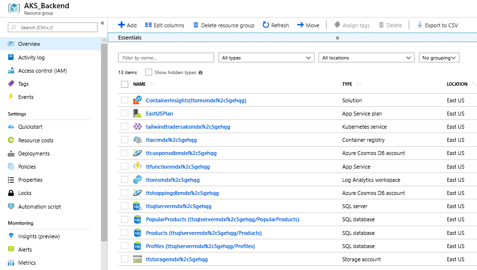
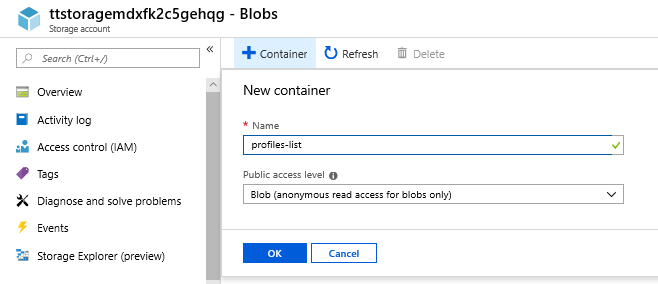
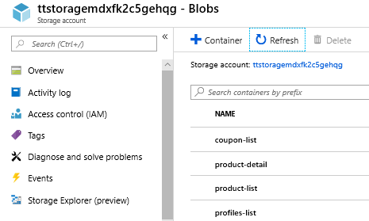
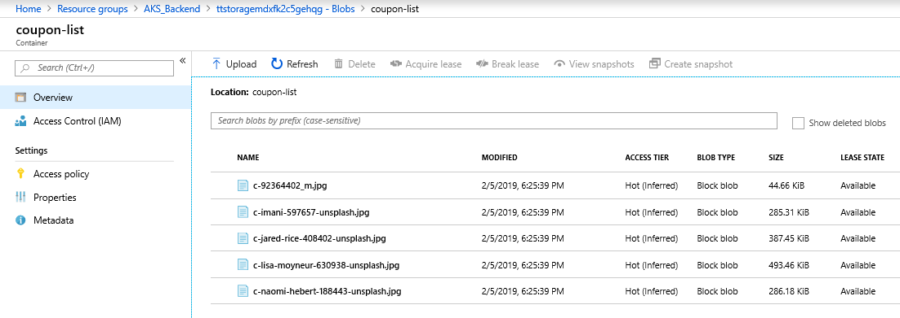
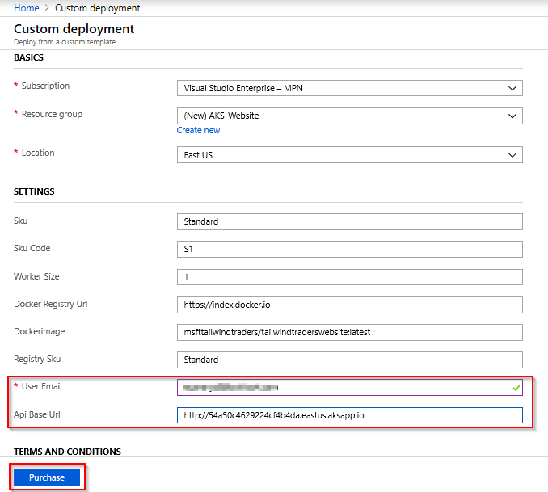
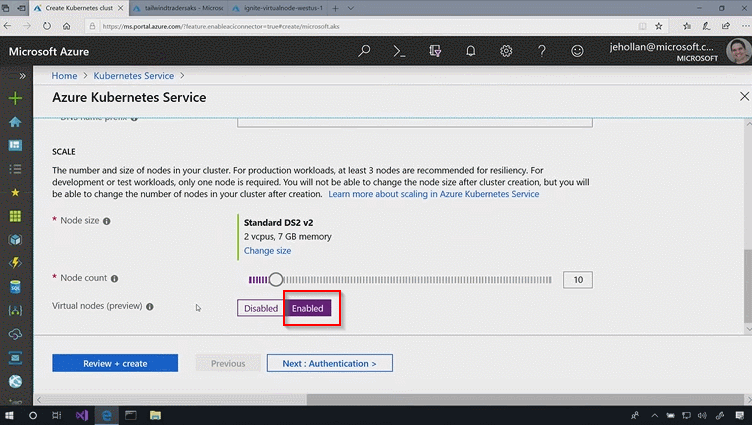

# Managing backend with Azure Kubernetes Service (AKS)

## Key Takeaway

There are 2 features for the developers and operations team to consider as key takeaways from this demo:

 1. **Introduction to AKS** - Azure Kubernetes Service (AKS) allows you to managed Kubernetes based orchestration service. It provides auto-patching, auto-scaling and updates support which enables you to use the full breadth of the Kubernetes ecosystem. In this demo you will learn how you can deploy containers in AKS by creating the cluster, deploy the services and managing the resources in Azure.
 1. **Virtual Nodes** - A first-of-its-kind serverless computing option with AKS enables you to provision and scale your Kubernetes based apps more efficiently. Virtual Node enables you to elastically provision additional nodes inside your Kubernetes clusters in just seconds. This gives you the flexibility and the portability of containers while also ensuring that you pay only for the compute resources that you actually need and use.

 # Before you begin

Pre-requisites for this deployment:

* Download or clone the code repository [Tailwind Traders Backend](https://github.com/Microsoft/TailwindTraders-Backend)
* A terminal with
    * Bash environment with [jq](https://stedolan.github.io/jq/) installed **-OR-**
    * Powershell environment
* [Azure CLI 2.0](https://docs.microsoft.com/en-us/cli/azure/install-azure-cli?view=azure-cli-latest) installed.
* [Kubectl](https://kubernetes.io/docs/tasks/tools/install-kubectl/) installed.
* Docker installed

**Note**: The easiest way to have a working Bash environment on Windows is [enabling the WSL](https://docs.microsoft.com/en-us/windows/wsl/install-win10) and installing a Linux distro from the Windows Store.

 Let us explore Azure Kubernetes Service to demonstrate how you will be able to take advantage of Kubernetes on Azure to deploy containers and save money using our new Virtual Node service for scaling

## Walkthrough: Deploying the backend services

1. Open Powershell terminal in Administrator mode. 

    - Type `az login` and press Enter. Authorize your login in the browser.

    - If you have more than one subscription type `az account list -o table` to list all your Azure subscriptions. Then type  `az account set --subscription <subscription-id>` to select your subscription

    - Type ``az ad sp create-for-rbac -n “MySampleApp” -p P2SSWORD`` in the command prompt to get the Service Principal Client and the Service Principal Client Secret.

    ``appId`` is the **Service Principal Client ID**

    ``P2SSWORD`` is the **Service Principal Client Secret**. Both will be required for the next step.

    

1. Creating the **Azure Resources**

    An ARM template is provided so you can automate the creation of the resources required for the backend services. Select the **Deploy to Azure** button (or right click and select the ***Open in new tab*** option) to spin up **Azure Kubernetes Service (AKS), Azure Container Registry (ACR), Azure SQL Server, Azure CosmosDB (MongoDB and GlobalDocumentDB), App Service (Function App)** and **Storage account**. Enter required details for the below fields, agree to the ***Terms and Conditions***, and then Select the **Purchase** button.

    <a href="https://portal.azure.com/#create/Microsoft.Template/uri/https%3A%2F%2Fraw.githubusercontent.com%2FMicrosoft%2FTailwindTraders-Backend%2Fmaster%2FDeploy%2Fdeployment.json"></a>

    

    > Note: This deployment can take up to 12 minutes. Do not use **West US** location if you are using MSDN subscription.

1. Navigate to your resource group to see the list of resources created.

    

1. Now that the Storage is created, upload images manually.

    a. Create four blob containers in the storage with public access. Use the below zip file names as the container names. Download and extract the images to corresponding folders locally. 

    - product-list.zip: https://1drv.ms/u/s!Asa-selZwiFlg_QVhlC9O8sRaYcAvQ 
    - coupon-list.zip: https://1drv.ms/u/s!Asa-selZwiFlg_QT-bBrsoBLq2yrSQ
    - product-detail.zip: https://1drv.ms/u/s!Asa-selZwiFlg_QUACkViDBOqpII_Q
    - profiles-list.zip: https://1drv.ms/u/s!Asa-selZwiFlg_QSAl40JUEPiKivDw

    

    

    b. Upload the images of each zip folder in the corresponding container.

    

1. Connecting **kubectl to AKS**

    From the terminal type:

    - `az aks get-credentials -n <your-aks-name> -g <resource-group-name>` to download the configuration files that `kubectl` needs to connect to your AKS.

    At this point if you type `kubectl config current-context` the name of your AKS cluster should be displayed. That means that `kubectl` is ready to use your AKS.

    

1. Installing **Tiller on AKS**

    Helm is a tool to deploy resources in a Kubernetes cluster in a clean and simple manner. It is composed of two tools, one client-side (the Helm client) that needs to be installed on your machine, and a server component called _Tiller_ that has to be installed on the Kubernetes cluster.

    To install Helm, refer to its [installation page](https://docs.helm.sh/using_helm/#installing-helm). Once Helm is installed, _Tiller_ must be deployed on the cluster. For deploying _Tiller_ run the `add-tiller.sh` (from Bash) or the `Add-Tiller.ps1` (from Powershell).

    Once installed, helm commands like `helm ls` should work without any error.

1. Configuring **services**

    Before deploying services using Helm, you need to setup the configuration by editing the file `helm/gvalues.yaml` and put the secrets, connection strings and all the configuration.

    >**Note:** If you don't want to edit the `helm/gvalues.yaml` file you can create a copy and name it whatever you want (i. e. `helm/gvalues-prod1.yaml`). This allows you to mantain various environments. Note that **this file contains secrets so do not push into the repo!**, you can put the file in `/Deploy/helm/__values/` folder which is added to `.gitignore` to avoid accidental pushes.

    Please refer to the comments of the file for its usage. Just ignore (but not delete) the `tls` section (it is used if TLS is enabled).

1. Create **secrets on the AKS**

    Docker images are stored in a ACR (a private Docker Registry hosted in Azure).

    Before deploying anything on AKS, a secret must be installed to allow AKS to connect to the ACR through a Kubernetes' service account. 

    To do so from a Bash terminal run the file `./create-secret.sh` with following parameters:

    * `-g <group>` Resource group where AKS is
    * `--acr-name <name>`  Name of the ACR
    * `--clientid <id>` Client id of the service principal to use
    * `--password <pwd>` Service principal password

    If using Powershell run the `.\Create-Secret.ps1` with following parameters:

    * `-resourceGroup <group>` Resource group where AKS is
    * `-acrName <name>`  Name of the ACR
    * `-clientId <id>` Client id of the service principal to use
    * `-password <pwd>` Service principal password

    Please, note that the Service principal must be already exist. To create a service principal you can run the command `az ad sp create-for-rbac`.

1. **Build** & **deploy** images to ACR

    You can **manually use docker-compose** to build and push the images to the ACR. If using compose you can set following environment variables:

    * `TAG`: Will contain the generated docker images tag
    * `REPOSITORY`: Repository to use. This variable should be set to the login server of the ACR

    Once set, you can use `docker-compose build` and `docker-compose push` to build and push the images.

    Additionaly there is a Powershell script in the `Deploy` folder, named `Build-Push.ps1`. You can use this script for building and pushing ALL images to ACR. Parameters of this script are:

    * `resourceGroup`: Resource group where ACR is. Mandatory.
    * `acrName`: ACR name (not login server). Mandatory.
    * `dockerTag`: Tag to use for generated images (defaults to `latest`)
    * `dockerBuild`: If `$true` (default value) docker images will be built using `docker-compose build`.
    * `dockerPush`: If `$true` (default value) docker images will be push to ACR using `docker-compose push`.

    This script uses `az` CLI to get ACR information, and then uses `docker-compose` to build and push the images to ACR.

    To build an push images tagged with v1 to a ACR named my-acr in resource group named my-rg:

    ```
    .\Build-Push.ps1 -resourceGroup my-rg -dockerTag v1 -acrName my-acr
    ```

    To just push the images (without building them before):

    ```
    .\Build-Push.ps1 -resourceGroup my-rg -dockerTag v1 -acrName my-acr -dockerBuild $false
    ```

1. Deploying **services**

    >**Note**: If you want to add SSL/TLS support on the cluster (needed to use https on the web) plase read following section **before installing the backend**.

    To deploy the services from a Bash terminal run the `./deploy-images-aks.sh` script with the following parameters:

    * `-n <name>` Name of the deployment. Defaults to  `my-tt`
    * `--aks-name <name>` Name of the AKS
    * `-g <group>` Name of the resource group
    * `--acr-name <name>` Name of the ACR
    * `--tag <tag>` Docker images tag to use. Defaults to  `latest`
    * `--charts <charts>` List of comma-separated values with charts to install. Defaults to `*` (all)
    * `-f <values-file>`: Values file to use (defaults to `gvalues.yaml`)

    If using Powershell, have to run `.\Deploy-Images-Aks.ps1` with following parameters:

    * `-name <name>` Name of the deployment. Defaults to  `my-tt`
    * `-aksName <name>` Name of the AKS
    * `-resourceGroup <group>` Name of the resource group
    * `-acrName <name>` Name of the ACR
    * `-tag <tag>` Docker images tag to use. Defaults to  `latest`
    * `-charts <charts>` List of comma-separated values with charts to install. Defaults to `*` (all)
    * `-valueSFile <values-file>`: Values file to use (defaults to `gvalues.yaml`)
    * `-tlsEnv prod|staging` If **SSL/TLS support has been installed**, you have to use this parameter to enable https endpoints. Value must be `staging` or `prod` and must be the same value used when you installed SSL/TLS support. If SSL/TLS is not installed, you can omit this parameter.

    This script will install all services using Helm and your custom configuration from file `gvalues.yaml`

    The parameter `charts` allow for a selective installation of charts. Is a list of comma-separated values that mandates the services to deploy in the AKS. Values are:

    * `pr` Products API
    * `cp` Coupons API
    * `pf` Profiles API
    * `pp` Popular products API
    * `st` Stock API
    * `ic` Image classifier API
    * `ct` Shopping cart API
    * `mgw` Mobile Api Gateway
    * `wgw` Web Api Gateway

    So, using `charts pp,st` will only install the popular products and the stock api.

1. Enabling **SSL/TLS** on the cluster (***Optional***)

    SSL/TLS support is provided by [cert-manager](https://github.com/jetstack/cert-manager) that allows auto-provisioning of TLS certificates using [Let's Encrypt](https://letsencrypt.org/) and [ACME](https://en.wikipedia.org/wiki/Automated_Certificate_Management_Environment) protocol. 


    To enable SSL/TLS support you must do it **before deploying your images**. The first step is to add cert-manager to the cluster by running `./add-cert-manager.sh` or `./Add-Cert-Manager.ps1`. Both scripts accept no parameters and they use helm to configure cert-manager in the cluster. **This needs to be done only once**

    Then you should run `./Enable-Ssl.ps1` with following parameters:

    * `sslSupport`: Use `staging` or `prod` to use the staging or production environments of Let's Encrypt
    * `aksName`: The name of the AKS to use
    * `resourceGroup`: Name of the resource group where AKS is
    * `domain`: Domain to use for the SSL/TLS certificates. Is **optional** and if not used it defaults to the public domain of the AKS. Only need to use this parameter if using custom domains

    Output of the script will be something like following:

    ``` 
    NAME:   my-tt-ssl
    LAST DEPLOYED: Fri Dec 21 11:32:00 2018
    NAMESPACE: default
    STATUS: DEPLOYED

    RESOURCES:
    ==> v1alpha1/Certificate
    NAME             AGE
    tt-cert-staging  0s

    ==> v1alpha1/Issuer
    NAME                 AGE
    letsencrypt-staging  0s
    ```

    You can verify that the _issuer_ object is created using `kubectl get issuers`:

    ```
    PS> kubectl get issuers
    NAME                  AGE
    letsencrypt-staging   4m
    ```

    You can verify that the _certificate_ object is created using `kubectl get certificates`:

    ```
    PS> kubectl get certificates
    NAME              AGE
    tt-cert-staging   4m
    ```

    The _certificate_ object is not the real SSL/TLS certificate but a definition on how get one from Let's Encrypt. The certificate itself is stored in a secret, called `letsencrypt-staging` (or `letsencrypt-prod`). You should see a secret named `tt-letsencrypt-xxxx` (where `xxxx` is either `staging` or `prod`).

    ```
    PS> kubectl get secrets
    NAME                  TYPE                                  DATA      AGE
    acr-auth              kubernetes.io/dockerconfigjson        1         2d
    default-token-6tm9t   kubernetes.io/service-account-token   3         3d
    letsencrypt-prod      Opaque                                1         3h
    letsencrypt-staging   Opaque                                1         4h
    tt-letsencrypt-prod   kubernetes.io/tls                     2         5m
    ttsa-token-rkjlg      kubernetes.io/service-account-token   3         2d
    ```

    The SSL/TLS secret names are:

    * `letsencrypt-staging`: Secret for the staging _issuer_. This is NOT the SSL/TLS certificate
    * `tt-letsencrypt-staging`: Secret for the staging SSL/TLS certificate.
    * `letsencrypt-prod`: Secret for the prod _issuer_. This is NOT the SSL/TLS certificate
    * `tt-letsencrypt-prod`: Secret for the prod SSL/TLS certificate.

    At this point **the support for SSL/TLS is installed, and you can install Tailwind Traders Backend on the repo**.

    >**Note:** You don't need to do this again, unless you want to change the domain of the SSL/TLS certificate. In this case you need to remove the issuer and certificate objects (using `helm delete my-tt-ssl --purge` and then reinstall again)

    >**Note** Staging certificates **are not trust**, so browsers will complain about it, exactly in the same way that they complain about a self-signed certificate. The only purpose is to test all the deployment works, but in any production environment you must use the `prod` environment. Main difference is the Let's Encrypt API call rates are more limited than the staging ones.

    Another way to validate your certificate deployment is doing a `kubectl describe cert tt-cert-staging` (or `tt-cert-prod`). In the `Events` section you should see that the certificate has been obtained:

    ```
    Events:
    Type    Reason          Age   From          Message
    ----    ------          ----  ----          -------
    Normal  CreateOrder     10m   cert-manager  Created new ACME order, attempting validation...
    Normal  DomainVerified  9m    cert-manager  Domain "e43cd6ae16f344a093dc.eastus.aksapp.io" verified with "http-01" validation
    Normal  IssueCert       9m    cert-manager  Issuing certificate...
    Normal  CertObtained    9m    cert-manager  Obtained certificate from ACME server
    Normal  CertIssued      9m    cert-manager  Certificate issued successfully
    ```
## Walkthrough: Deploying the website

1. ARM template is provided so that you can automate the creation of the resources for the website. Select the **Deploy to Azure** button (or right click and select the Open in new tab option) to spin up App Service, Azure Container Registry (ACR).

    <a href="https://portal.azure.com/#create/Microsoft.Template/uri/https%3A%2F%2Fraw.githubusercontent.com%2FMicrosoft%2FTailwindTraders-Website%2Fmaster%2FDeploy%2Fdeployment.json"></a>

    

1. When deploying to Azure pay attention to parameters **User Email** and **Api Base Url**.

    - Enter the **email** of the logged user under **User Email** (need not be a valid email, but MUST have email format).

    - The base url is where the **Backend** is installed. Refer below image for the **Url** to be copied from your AKS cluster, which is deployed under backend resource group. Defaults to the public test environment provided by Microsoft.

        

1. Below resources are created after the deployment.

    

1. To see the website, navigate to the **App Service** and click on the **URL**. 

    

    

1. In order to see if the backend is working, navigate to the tabs under the website. If you are not using SSL/TLS, load the page in ***http://*** mode or click on **Load unsafe scripts** in Chrome browser.

    
    
## Walkthrough: Virtual Nodes (Optional)

 1. When you create a Kubernetes Service in the **Azure portal**, you can go to your **AKS cluster** and click on the **Scale** tab. In AKS, you can easily control the scale of Kubernetes cluster. You can see how many cores, memory is consumed. But if you think of an event like Black Friday this number can actually be extremely daunting. If you set this number too high you are going be paying for resources that you are not using. But if you set it too low your website is going to get overwhelmed and you are going to lose sales.

    

1. Click **Enabled** under Virtual Nodes. This one-of-a-kind feature in AKS called Virtual Nodes is going to spin up serverless containers when your Kubernetes cluster needs more resources. This gives your Kubernetes cluster almost instant and unlimited scale in just a few seconds.

    

1. Optionally, to know more about the Virtual Node feature you can run a load test (if you have one handy) which is going to push a massive load on the website. While load test is in progress you can go to your Resource Group and filter based on Container instances to see that Kubernetes would be creating serverless containers for you. And when the traffic slows down these are going to be de-provisioned. So you only pay for that burst traffic when you need it.
   

## Summary

Azure makes development teams working with microservices and Kubernetes more efficient by combining the capabilities of Visual Studio and AKS Dev Spaces. Operations team become more reliable by using powerful services like Virtual Nodes to spin up instant serverless containers when you need it the most.
