# Modernizing .NET Apps

## Key Takeaway

A developer benefits the following key takeaways:

1. With Visual Studio and Azure App Service, you can easily migrate your on-premise ASP.NET application to Azure.

1. With Logic Apps, you can easily modernize your application with workflows to add functionality to your app without changing or adding code to your existing codebase.

## Before you begin

1. You will need Visual Studio 2017 or later.

1. You will need an Azure Subscription in order to follow this demo script.

1. [Tailwind Traders Rewards source code](https://github.com/Microsoft/TailwindTraders-Rewards)

Let us explore an existing ASP.NET Web Forms application built on top of .NET Framework connected to a local SQL Server Database and migrate it to Azure. Then modernize it with cloud native solutions to support automated rewards program. We’ll show the benefits of moving the application to Azure so you can take advantage of Azure App Services.

## Walkthrough: Migrating a .NET app to Azure without code change

When the local infrastructure is outgrowing on which the application is hosted, you need to look at the other options of meeting the demands without burdening the teams. The Azure cloud offers a host of platforms and service offerings to host the applications. To start with, you will use an **Azure App Services** to host the application without any changes to the existing code!

1. By launching the new **Visual Studio 2019**, you will immediately notice its simplified “Open” experience.

    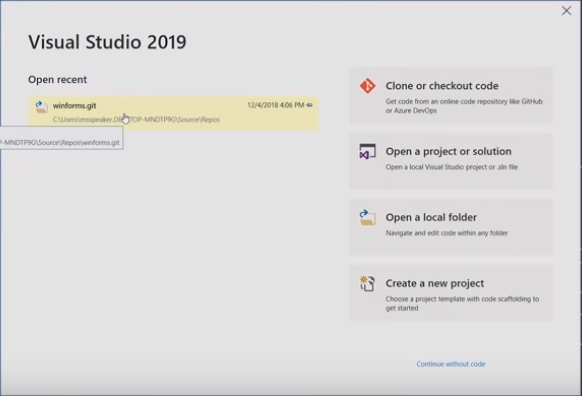

1. Click the **Clone or check out code** option and enter the **Tailwind Traders Rewards** repository URL – https://github.com/Microsoft/TailwindTraders-Rewards.git in the Code Repository Location and click **Clone**. Under the **Solutions and Folders**, click **Tailwind.Traders.Rewards.Website.sln** to open the solution.

    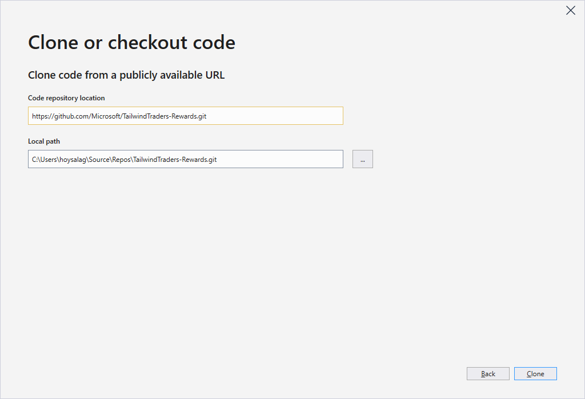

1. Right-click the project **Tailwind.Traders.Rewards.Website** and choose **Publish**. This is the same Publish dialog box that you can use to deploy onto **IIS6** in your local infrastructure. Using this *Publish* dialog, you will deploy the application to Azure cloud. 

    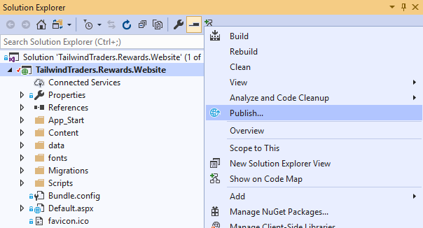

1. Choose **App Service** as the Publish target. Under the **Azure App Service** window, choose **Create New** and click **Create Profile**.

    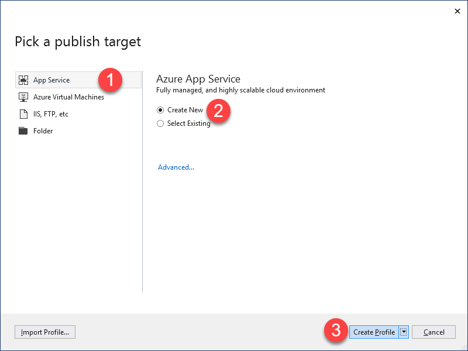

1. In the resulting window, enter your Azure subscription information, choose the **App Service**, create a new or choose an existing **Resource Group**, **Hosting Plan**, **Application Insights**. Click the **Create a SQL database** option on the right side and create a new Azure SQL server and an Azure SQL database within the resulting windows. Finally, click **Create** to create a publish profile. Alternatively, you can create the *Azure SQL database* directly on the Azure Portal.

    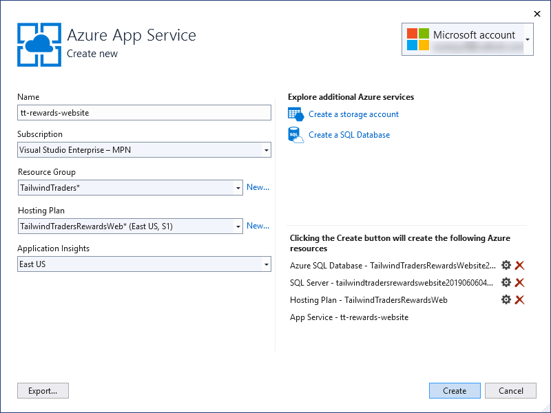

    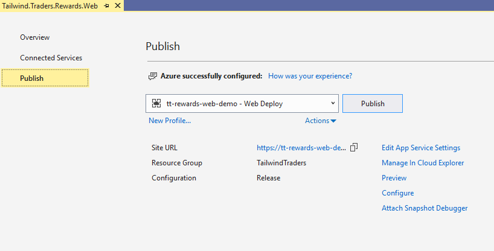

1. Click **Configure** in the Publish window to check the database connection strings. The database connection strings can be populated by clicking the ellipsis button and entering the SQL database details. On clicking publish, the web config file will be updated with this database string which is pointing to an **SQL Azure database**.  When the application is debugged locally, its the local IIS and the local SQL server which acts but when the app is published, this is going to be swapped with the created Azure services.

    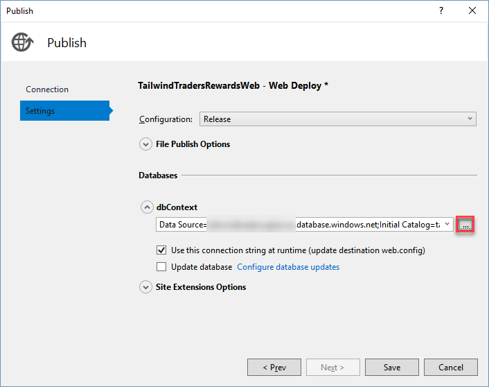

1. Click **Publish** to deploy the application to Azure App Service and the back-end to SQL Azure database.

    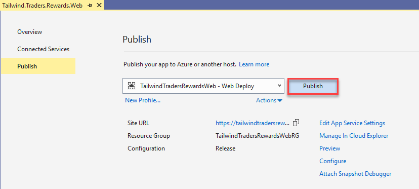

1. Once the app is published, you will see the status as **Publish succeeded** and the Azure web app is opened in the browser. The website is now showing with data from SQL Azure database.

    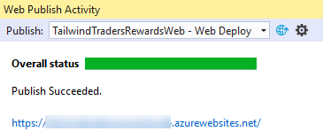

    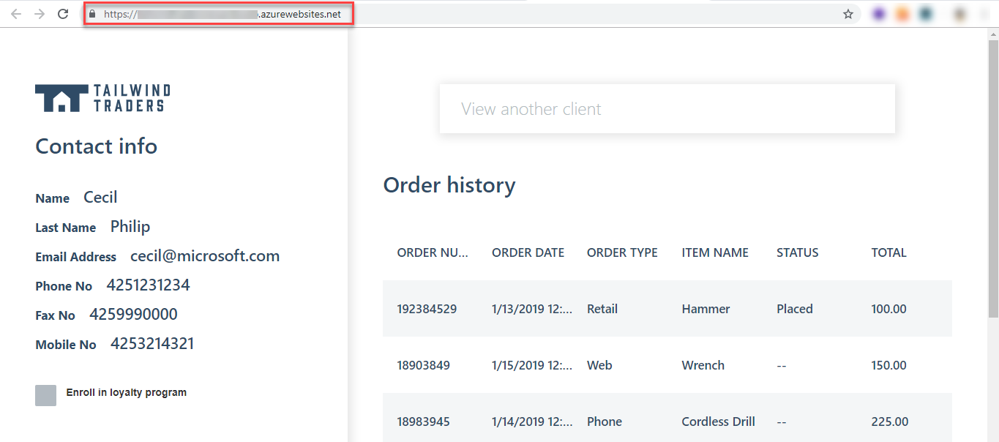

## Walkthrough: Azure App Service Features

Now that the Azure web app is running, let's look at some options available in the Azure Portal for this App service. 
 
 1. Navigate to the Azure Web App service in the Azure Portal. On the left blade, you will see a host of options available to configure for the existing web app. For instance, consider the **Deployment slots(Preview)** which allows you to set up different environments for the application. Slots are useful for DevTest and production environments, A/B testing or probably to verify a core functionality before swapping the site to production.

    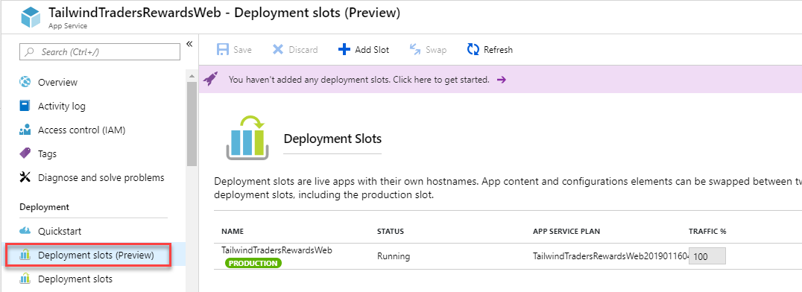

1. Scroll down to the option **SSL Settings** where you can set up custom domains. Scroll down further to another feature **Scale up**, **Scale out**. 

    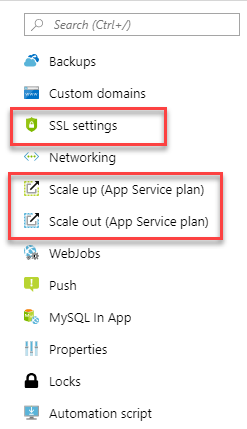

1. Let us explore the Scale up and Scale out options in Azure. A **Scale up** is the Azure websites cloud equivalent of moving your non-cloud web site to a bigger physical server. Scale up operations are useful to consider when your site is hitting a quota, signaling that you are outgrowing your existing mode or options.  In addition, scaling up can be done on virtually any site without worrying about the implications of multi-instance data consistency. 

    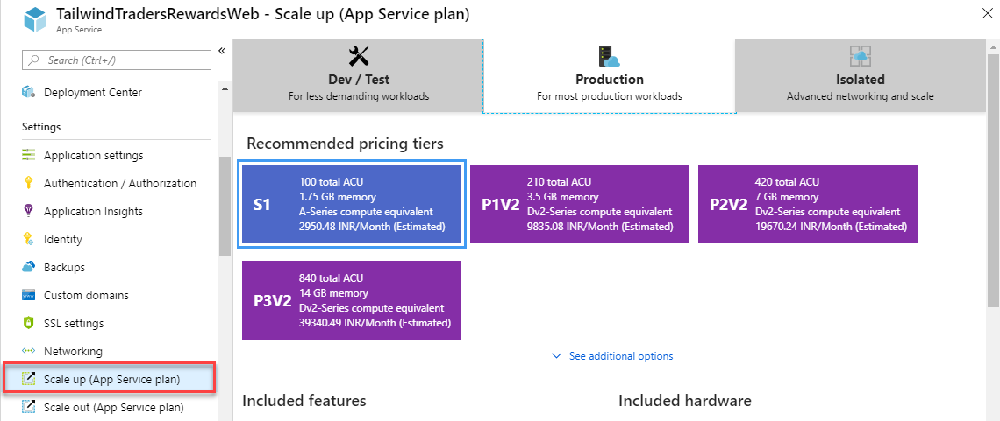

1. Whereas, **Scale out** operation is the equivalent of creating multiple copies of your web site and adding a load balancer to distribute the demand between them. When you scale out a web site in Windows Azure websites, there is no need to configure load balancing separately since this is already provided by the platform.  

    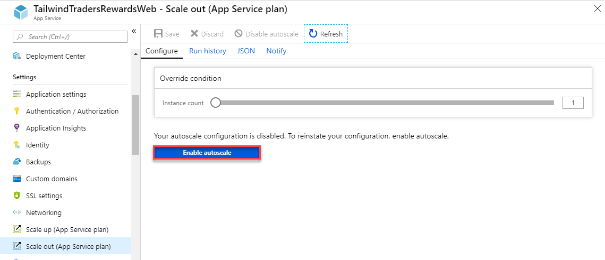

1. Choose **Scale out** option from the blade and click **Enable auto-scale**. Name the rule as **Rewards scale** and select the Resource group if required. Add a rule that whenever the CPU percentage exceeds 70%, additional instances should be automatically created for the existing App service. Save the changes

    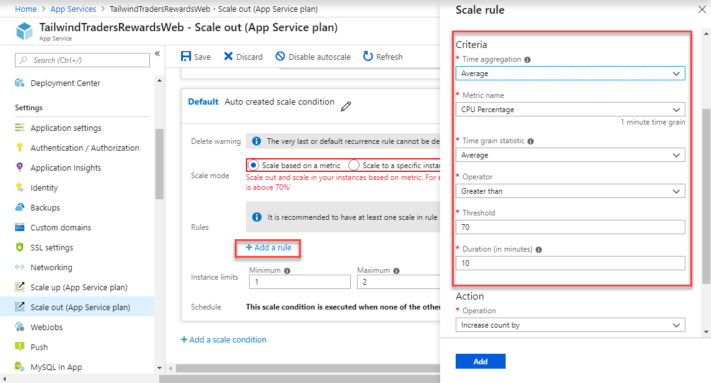

1. Another feature which is important is the ability to collect **logs and telemetry information** to monitor the application performance which is known as **Application Insights** in Azure. Click the feature and then click **Turn on site extension** to explore its services.

    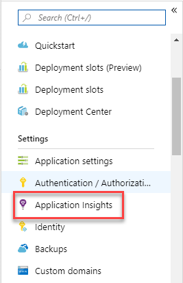
    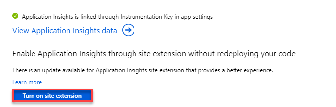

1. Take a look at your web application dashboard by clicking **View application insights data** to quickly notice the **server response time**, the **server requests**, **application exception failures**, etc.

    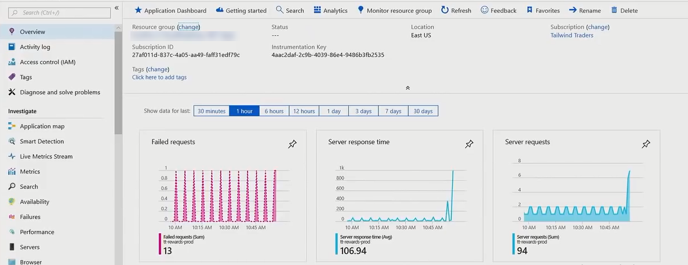

1. Click **Failures** in the left blade of the Application Insights page to dig down into the operations and exceptions that have happened in this application. You will notice that there are exceptions which you can further explore.

    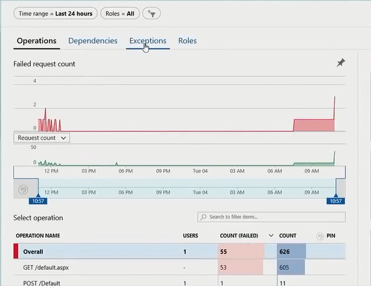

1. Click **Drill into...** to get details about the exception of this instance. Now on the right-hand side, you will see the exception details and information about the call stack.

    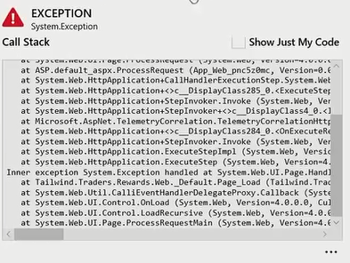

    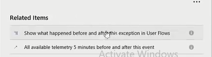

1. Under related items, click **User Flows**. This view allows you to see the path that the user took to get to that exception.

    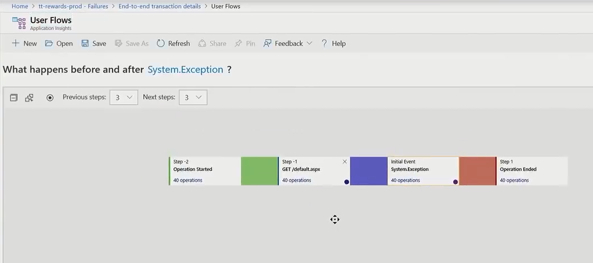

1. **Debug Snapshot** is another feature within the Application Insights that help you to download a snapshot of the exception to get an understanding of the state of the variables. You can load the downloaded snapshot into Visual Studio and engage the debugger to check the issues in the service that was running. It's almost like you're debugging in production except that you are bringing the production dump into your local Visual Studio and debug the exceptions locally.

    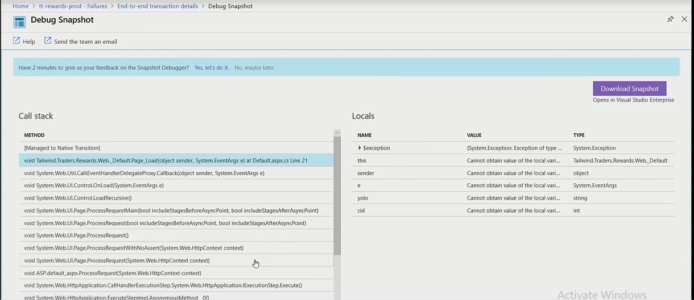

## Walkthrough: Azure Logic App

Now that we have seen how to deploy an application onto Azure and how to get some richer debug information, let's head back to the application mode. **Azure Logic Apps** simplifies how you build automated scalable workflows that integrate apps and data across cloud services and on-premises systems. We have a large number of connectors that we could use for instance the Azure service bus to make HTTP requests, SAP connectors, etc.

The scenario in this walkthrough is that when the customer enrolls in a loyalty program, depending on the country registered as either **Mexico** or **Spain**, the email content will be translated to the respective language. 

1. On the left side of the application, you will see an option **Enroll in loyalty program**. The supposed functionality of this option is that every time the checkbox is clicked, a workflow is started to verify the user, country registered and enroll them in Tailwind Traders' loyalty program with an email confirmation in their local language (for Spain and Mexico).  When you check that check-box, you will only see a *Enrollment in process* message.

    

1. Since this workflow is not embedded in the application yet, you will use the Azure features to implement the same. Go back to the Azure portal and create a new **Logic App**. Let's quickly harness the power of Logic Apps to create a trigger on an SQL Server table whenever the Customers table is modified (“Enroll in loyalty program” checkbox is checked).  

    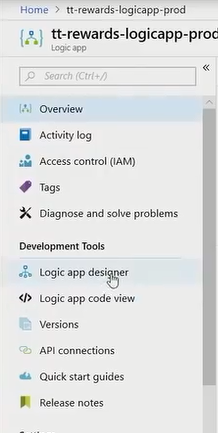

1. You are looking at the feature to create serverless workflows. Click the **Logic app designer** option in the left blade and notice the various templates and trigger options show up. Let's configure the workflow to implement the Loyalty program feature.

    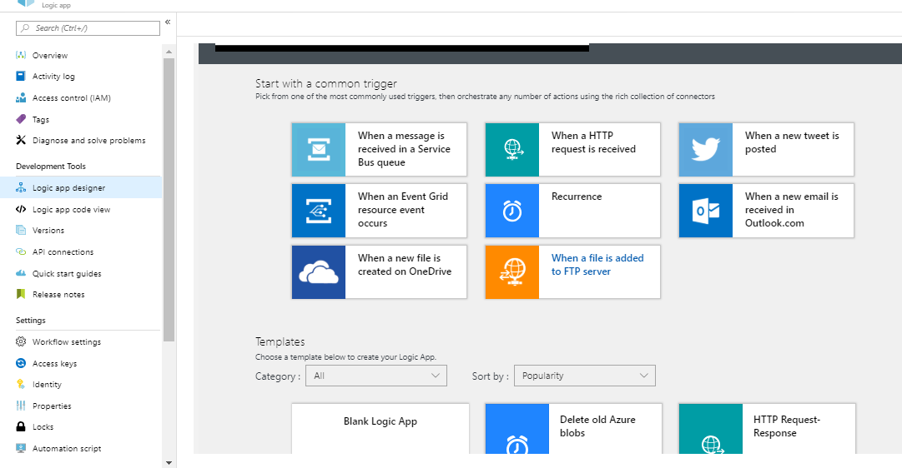

    > The workflow is to monitor the **Customers** table at an interval of every 10 seconds. When there is a change in the table data, the workflow starts to execute. Next, based on the modified row, the customer's information - Name and Mobile number is fetched for which a text message is sent.  All this information is fetched from the **Customers** table in the database.

1. Click **Blank Logic App** to create a blank logic app.

    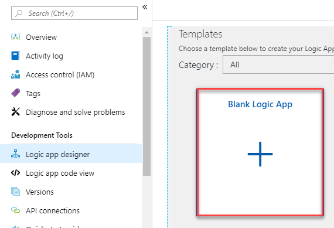

1. Search for **SQL Server** in the search bar, select **SQL Server** and then select the **When an item is modified** trigger.

    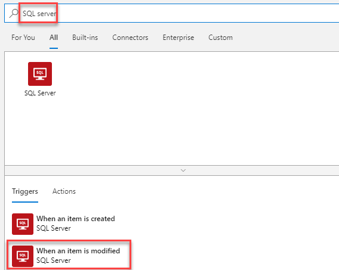

1. Provide the **SQL Server** credentials and choose the **Tailwind Traders** database and click **Create**. I am monitoring this customer table. Now at any time, when there's a change in this customer table the workflow is going to start to execute.

    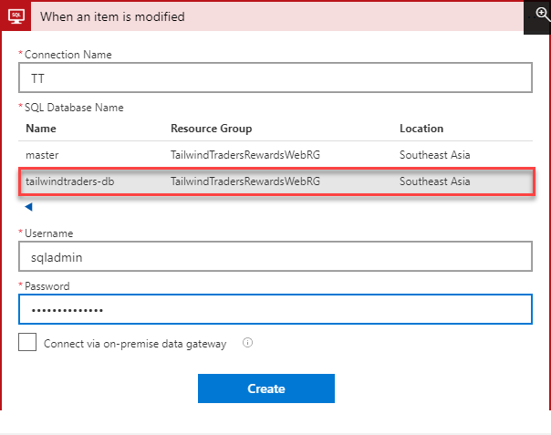

1. In the resulting window, choose **Customers** as the SQL table, set the **interval** as *10* and **Frequency** as *Seconds*. Click the **+ New step** icon to create a new step.

    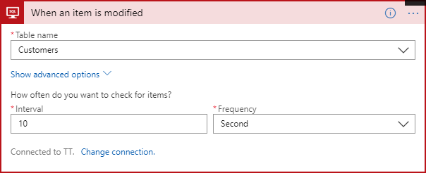

1. Search for **SQL** in the search box and choose **Get row** as the corresponding action.

    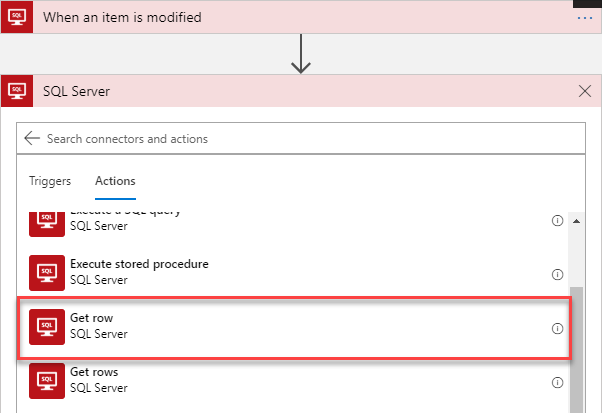

1. In the next window, select **Customers** as the Table name. Click the **Add dynamic content** below the **Row Id** textbox and select **Email** as the identifier for the **Row id** field. Click the **+ New step** icon to create a new step.

    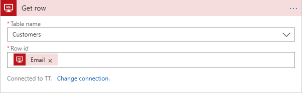
    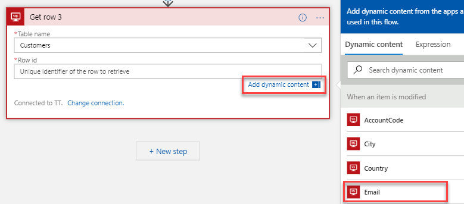

1. In the search box, enter **condition** as your filter. Select this action: *Condition - Control*. Change the clause to **Or**, choose **Country** as the dynamic content for both the rows and **Spain**, **Mexico** as values.

    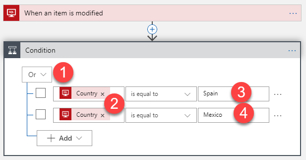

1. Under **If true** and **If false**, add the steps to perform based on whether the condition is met. Let's look at **If true**. Insert a new action **microsoft translator v2** and choose **translate text(preview)** under **Actions**. 

    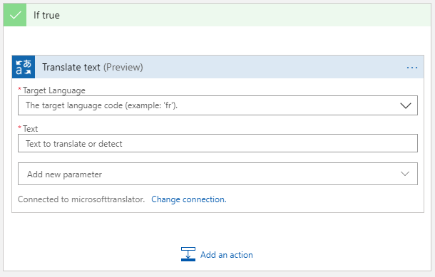

1. Choose the **Target Language** as **Spanish** and add the **Text** as in the below picture. Choose *FirstName, LastName, AccountCode* from the dynamic content list. 

    `Welcome to our rewards program ['FirstName']['LastName']
Your account code is ['AccountCode']`

    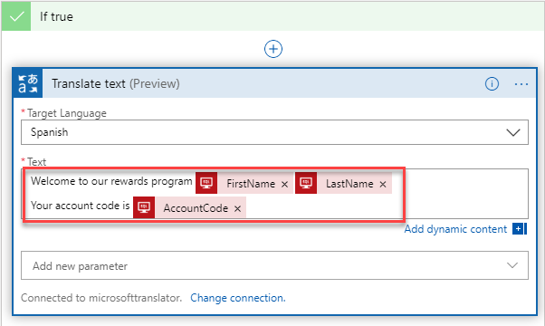

1. In the search bar, type **Send an email** and select the **Send and Email Office 365 Outlook** action to configure and send the email.

    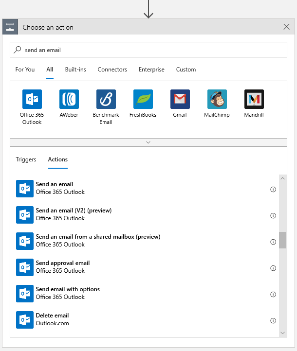

    > You need to sign in with a valid Office 365.

    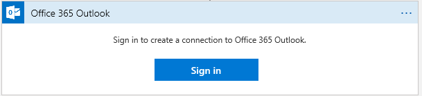

1. Using the **Dynamic Content** from the database enter **email** for **To** field, fill the **Subject** as *Tailwind Traders Rewards* and choose **Translated text** from dynamic content for **Body**.

    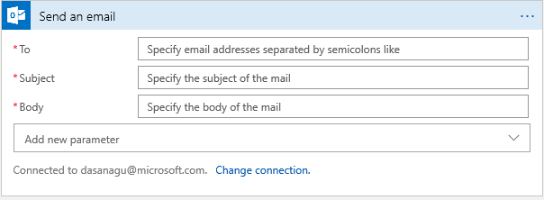
    
    > Instead of retrieving the database data for email-id, you can populate the **To** field with your email-id to receive an email in real time. 

1. Under **If false**, let's add an action **Send an email** from the search bar and select the **Send and Email Office 365 Outlook** action to configure and send the email. Using the **Dynamic Content** from the database enter **email** for **To** field, fill the **Subject** as *Tailwind Traders Rewards* and use *Dynamic Content* to write the email **Body** as shown in the picture.

    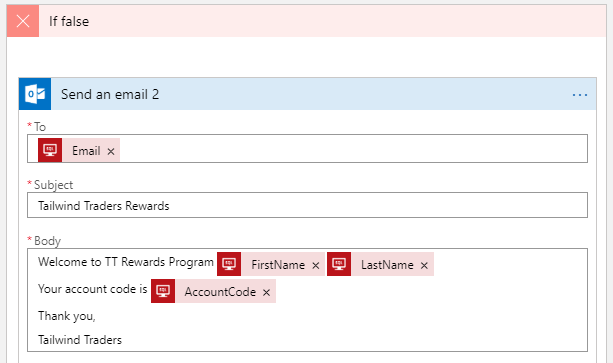
    
    > Instead of retrieving the database data for email-id, you can populate the **To** field with your email-id to actually receive an email in real time. 

1. Click to save the Logic app work flow and return to the website. Now, click the **Enroll in loyalty program** checkbox. Now, the corresponding records are going to be updated in the database which will essentially flip a flag that enrolls the customer to the loyalty program and sends them a welcome email in the respective language.

    

    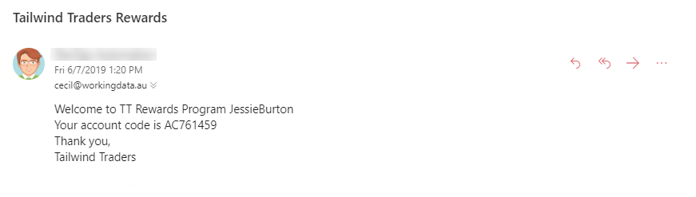
