# Productivity Improvements in Visual Studio 2019

## Key Takeaway

Visual Studio 2019 contains many new and exciting features and IDE productivity enhancements to support Windows app development, cross-platform mobile development, Azure development, web and cloud development, and more. A few core benefits are highlighted below:

 1. **Visual Studio 2019 Productivity** continues to innovate in maximizing the developer productivity, with new features such as Intellicode, Editor config for code styling preferences, code refactoring key bindings, and integrated GitHub experiences.

 1. **Windows UI Frameworks for OSS** - Microsoft is committed to expanding the OSS offerings and partnering with the community to bring best-in-class solutions across both server and client. To demonstrate this, WPF, Windows Forms, and Windows UI XAML UWP platform controls are all now on GitHub.

 1. **WPF and Windows Forms are coming to .NET Core** -Just as we had server <-> client symmetry with .NET Framework, the next logical step for .NET Core is to bring back support for WPF and Windows Forms. The side-by-side nature of the Core runtime enables developers to innovate in their applications at their own cadence.

1. **Visual Studio 2019** is the most productive IDE in the world with the newly-designed, compact menu which ensures developers can focus on their code. The new **Code Cleanup/document health indicator** enables a more productive inner-loop, for maintaining quality code and the **CodeLens** feature is will soon be available in the to-be-launched Community edition makes the IDE a fully ubiquitous productivity tool.

1. **Visual Studio IntelliCode** provides increased coding productivity by leveraging AI. The new custom model training service allows developers to receive AI-assisted Intellisense for their own types and API usages. Custom models can be easily shared amongst the teams, to ensure everyone stays as productive as possible.

# Before you begin

1. You will need **Windows 10 Enterprise version 1809**

1. You will need **Visual Studio 2019 Preview 1 or Later** – .NET Desktop Development and Universal Windows Platform development workloads installed [here](https://visualstudio.microsoft.com/thank-you-downloading-visual-studio/?sku=enterprise&ch=pre&rel=16).

1. You will need **.NET Core 3.0 Preview 1 or later** - You need to install it from [here](https://github.com/dotnet/core-sdk).

1. [GitHub extension for Visual Studio](https://visualstudio.github.com)

1. [Tailwind Traders Desktop App Source Code](https://github.com/Microsoft/TailwindTraders-Desktop).

1. [Visual Studio Intellicode Extension](https://marketplace.visualstudio.com/items?itemName=VisualStudioExptTeam.VSIntelliCode)

## Walkthrough: Productivity Features

## Task 1: New Look & Feel

The first thing you'll notice when you open Visual Studio 2019 is its new start window. It presents you with options to clone or check out code, open a project or solution, open a local folder, or create a new project.

1. Launch Visual Studio 2019. You will immediately notice that the new version has a new, simplified **New Project dialog** experience.

    

1. You will clone or check out code of **Tailwind Traders** directly by clicking **Clone or Checkout code** on the right side of the window. Enter the repository URL – https://github.com/Microsoft/TailwindTraders-Desktop.git in the Code Repository Location and click **Clone**. This is a WPF application with old code. Cloning the code brings it into the Visual Studio view.

    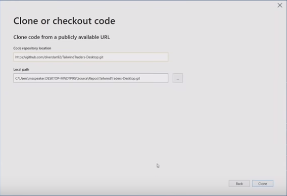

1. While the cloning is still in progress, the code is already available for use. It has brought up the folder view. On the right-hand side, it shows folder view along with the WPF application as if you have just opened it up in Explorer. Notice the cloning progress and the solution explorer view.

    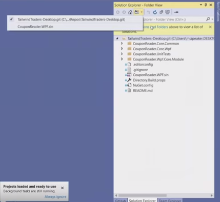

1. Under the **Solutions and Folders**, click **CouponReader.WPF.sln** to open the solution.  Notice that some tasks are still running in the background but you can still go and move around in the application.

    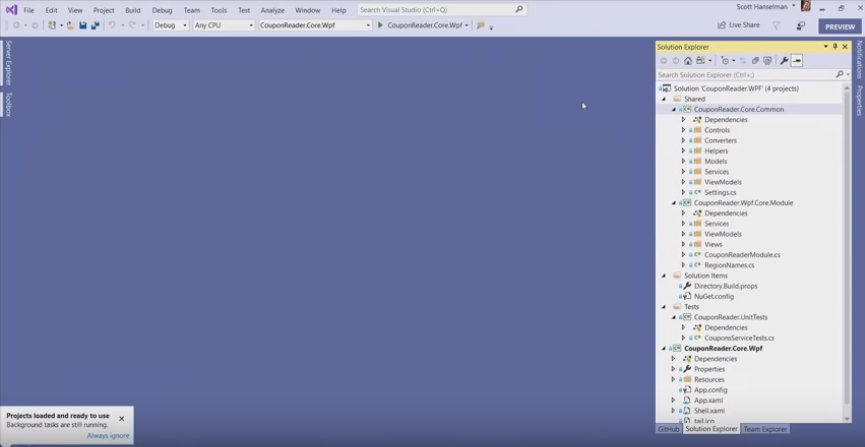

1. Under the **Edit** menu, choose **Go To** option and click **Go To All**. Type **CouponService.cs** in the text box and select the file which is under **CouponReader.Core.Common** project.

    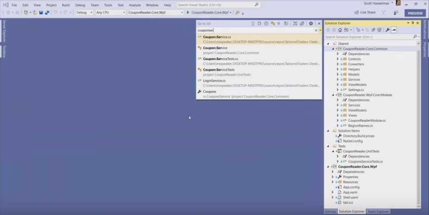

1. Notice that the compact **Visual Studio** menu which has basically moved up giving you an additional view of code which is almost a *Full-screen mode*. The menu is condensed and you have a bit more space for the code editor.

    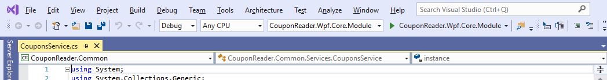

## Task 2: Finding code references and changes with CodeLens

**CodeLens** lets you stay focused on your work with contextual information about your code without leaving the editor. You can find references to a piece of code, changes to your code, linked bugs, work items, code reviews, and unit tests.

1. Click the **indicators** above a method to find out what happened to your code without leaving the editor. This feature, **CodeLens** was only in  **Enterprise** versions of Visual Studio earlier but it has changed in Visual Studio 2019 where it is also available for the **Community** edition. You can view the number of references a type or method has, information about unit tests covering the method, and data directly from Application Insights. To choose the indicators that you want to see, or to turn CodeLens off and on, go to Tools > Options > Text Editor > All Languages > CodeLens.

    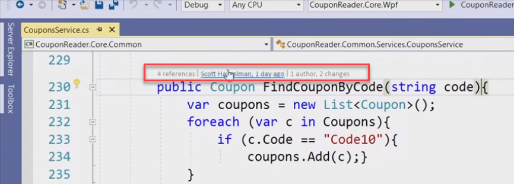

## Task 3: One-click code cleanup

Visual Studio 2019 shows a new **document health indicator** and a new **code cleanup** command. You can use this new command to identify and then fix both warnings and suggestions with the click of a button.

1. The **Document Health Indicator** is another feature that you will see as a small icon on the bottom right corner of the opened document making it easy to access code style configurations and run code cleanup. The indicator when hovered shows a summary of errors, warnings, and suggestions for the current document.

    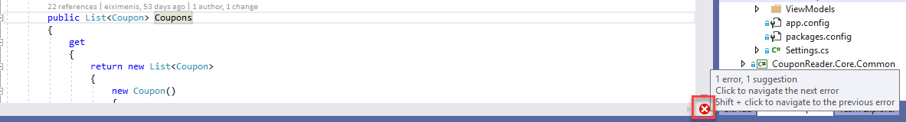

1. When you click the error icon, it directly takes you to the block of code with the squiggly where the error is seen. Once the error is rectified, the indicator turns green.

    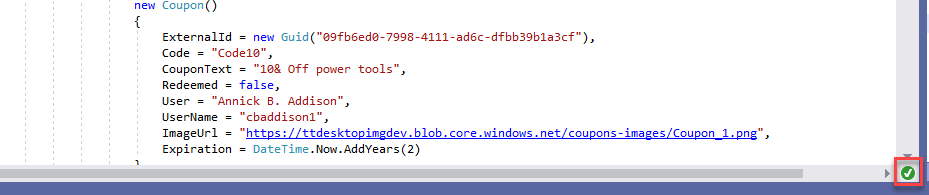

1. The code style settings for the health indicator can be managed by the team using the **EditorConfig** file. The settings in the EditorConfig file takes precedence over options selected in the **Options** dialog box. You can use an EditorConfig file to enforce and configure the coding style for your entire repository or project.

    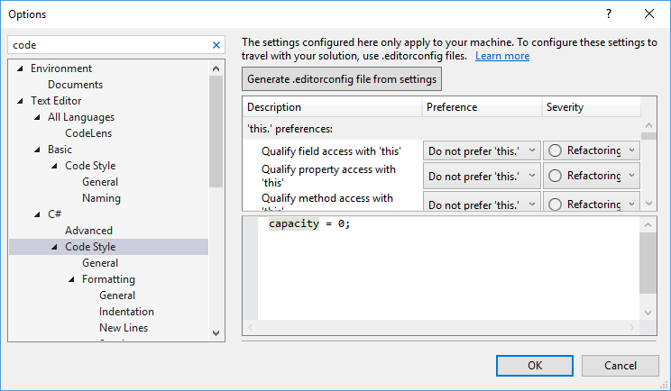

1. With the document health indicator is a new **code cleanup** command. You can use this new command to identify and then fix both warnings and suggestions with a right-click on the status indicator. The cleanup will format the code and apply any code fixes as suggested by the current settings, .editorconfig files, or Roslyn analyzers.  Click **Configure Code Cleanup** to configure its settings.

    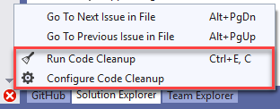

    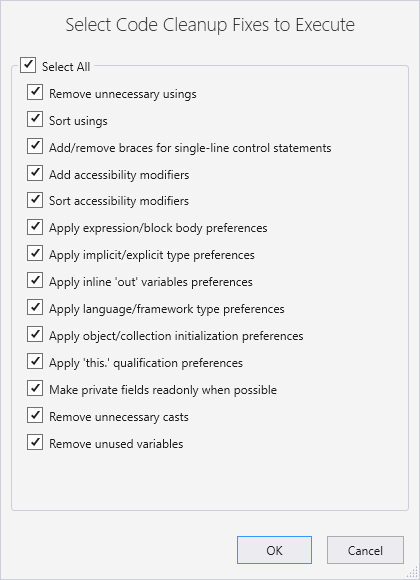

1. Press `Ctrl+EC` which brings up the **Code Cleanup Fixes** options. Select All the options and click **OK**. The code can be cleaned up in an arbitrarily selected block of code, all code in the current file, all files in a directory, the current project, or even the current solution. 

    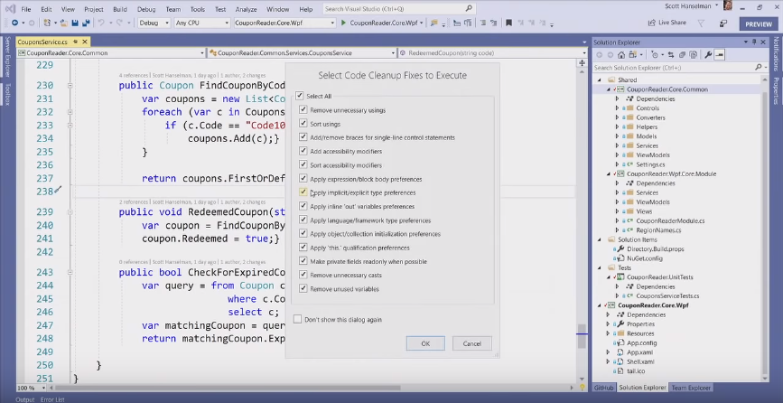

## Task 4: Refactorings and quick actions

Quick Actions let you easily refactor, generate, or otherwise modify code with a single action. 

**Foreach loop to LINQ query**

Foreach loops to LINQ queries or LINQ methods now join the other loop refactoring options including converting LINQ to Foreach, For loop to Foreach, and Foreach to For loop.

1. Under the **Edit** menu, choose **Go To** option and click **Go To All**. Type **MainViewModel.cs** in the text box and select the file which is under **CouponReader.Wpf.Core.Module**.

1. Here, let us look at the **OnNavigatedTo** method.

1. Select the **foreach** loop block of code and hit **Ctrl .(dot)**. Click the **Convert to LINQ (call form)** option. **Quick Actions** lets you easily refactor, generate, or otherwise modify code with a single action. Quick Actions can be applied by using the light bulb icon or screwdriver icon, or by pressing *Ctrl+.* when your cursor is on a line of code for which an action is available.

    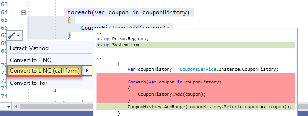

    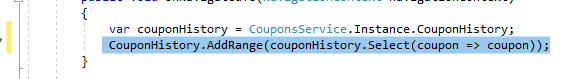

1. Press **Ctrl Z** to undo the change and close the file.

    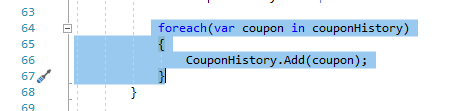

1. Let's explore the next feature by temporarily inserting a block of code in the **CouponsService.cs** file. Scroll down in the code file to line 236, hit enter and paste the following block of code.

    ```csharp
    public bool CheckForExpiredCoupon(string code)
    {
        var query = from Coupon c in Coupons
            where c.Code == code
            select c;
        var matchingCoupon = query.SingleOrDefault();
        return matchingCoupon.Expiration < DateTime.Now;
    }
    ```
1. Highlight the block of code as in the screenshot, hit **Ctrl .(dot)** and click the **Convert to foreach** option. Notice how the code can be effortlessly converted into **LINQ** or a **foreach** form. Click **Ctrl+Z** to undo the changes for now.

    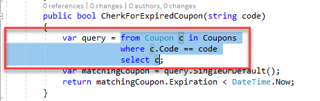

    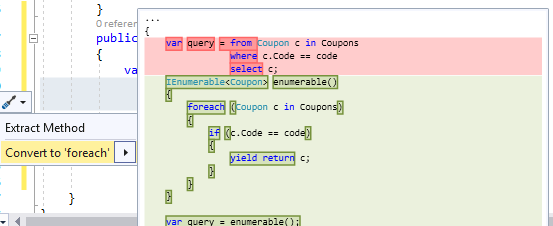

1. Search for the keyword **Code10**. With the first selection, click the keyword to un-highlight it and hit **Ctrl .(dot)**. Select **Introduce constant for all occurrences of "Code10"**. This option introduces a constant at the class level for all occurrences of the selected keyword. You can also look in the comments, strings and preview the changes. Click **Ctrl+Z** to undo the changes.

    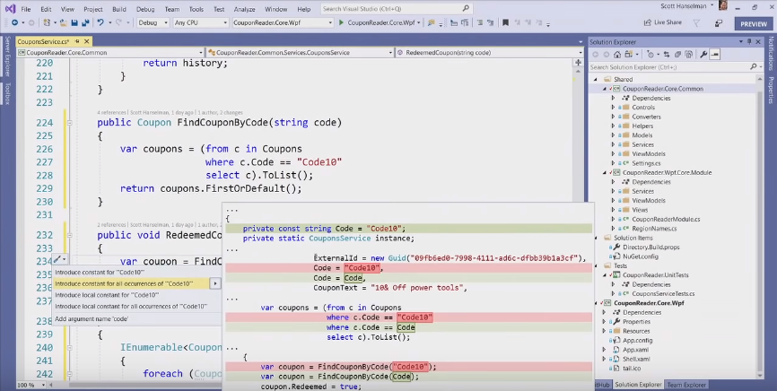

    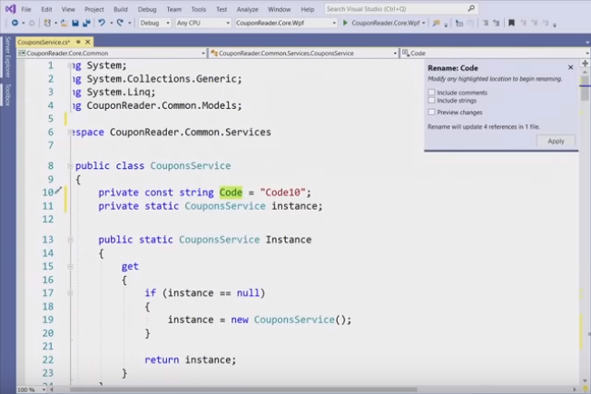

## Walkthrough: AI-assisted IntelliCode

**IntelliCode**, a context-aware, and AI-powered IntelliSense is a set of AI-assisted capabilities that improve developer productivity, with features like contextual IntelliSense, code formatting and style rule inference. It enhances the software development process by delivering context-aware code completion and guides developers to adhere to the patterns and styles of their team, finds difficult-to-catch code issues and focuses code reviews by drawing attention to areas that really matter

When you open Visual Studio after installing the updated IntelliCode extension, you’ll see a prompt that lets you know about training on your code, and will direct you to the brand new IntelliCode page to get started. Let's explore the Intellicode feature in detail.

1. Scroll to line `29` of the **CouponsService.cs** file under the *CouponReader.Core.Common* project. In the next line, paste the following line of code.

    `var defaultCoupon = new List<Coupon>();`

    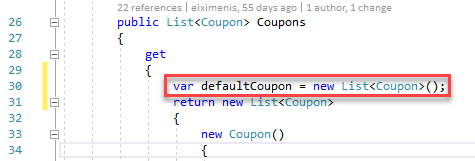

    1. In the next line, type **defaultCoupon.**  You will notice that it shows the members of a standard .NET List objects.

    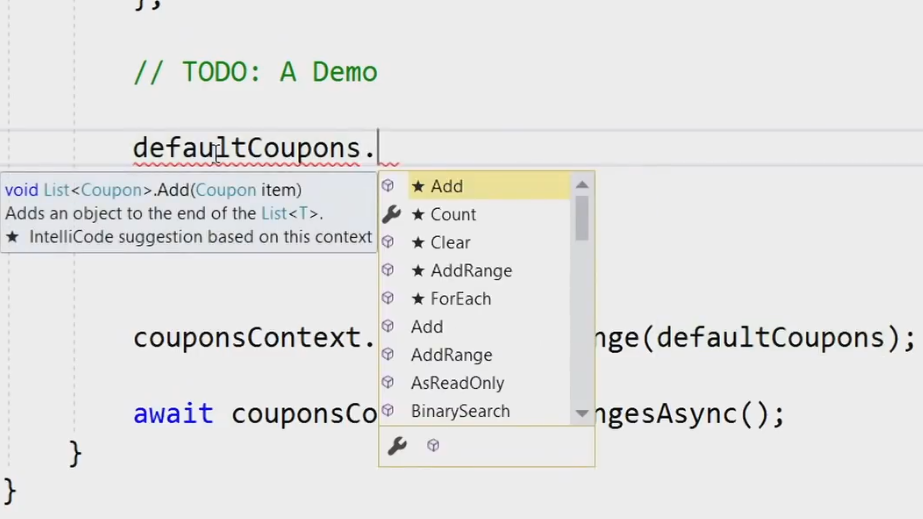

1. Now, undo and retype **if (defaultCoupon.** This time you are accessing the same *List* but within an *If* statement. It recognizes that you are likely to check its size or contents!

    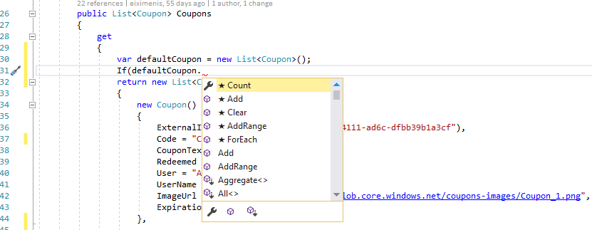

1. Go to the search bar and type **Intellicode** and hit <ENTER>. This quickly pulls up the IntelliCode models page. *Alternatively*, navigate to **Intellicode** page by clicking View | Other Windows | IntelliCode. Click **Train on my code**.

    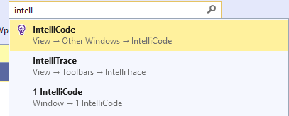

    

    > IntelliCode extracts only those elements of the code that are needed to create a model for recommending completion values. For example, it extracts the names of classes and methods and how often they're called in different circumstances. The extracted data is transmitted to the IntelliCode service, which uses machine learning algorithms to train a model for your code. It then returns the model to your computer where it's merged with the base model. You will see that out-of-the-box, we have *baseline* models for C#, C++, and XAML, which provides suggestions that were trained on open-source repositories.

1. After the training model is complete, you will notice the *Coupon* type in the training results.

    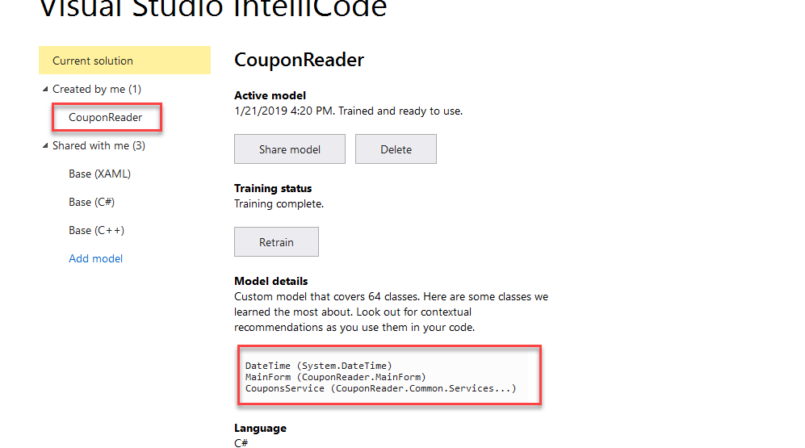

1. Once you’ve trained a model, you can share it with the rest of your team, so that everyone can reap the same productivity benefits. Sharing is as simple as sending a URL to other developers, who then associate that model with their Visual Studio account. Click the *Share model* button. You will see a prompt to copy the share link with your team.

    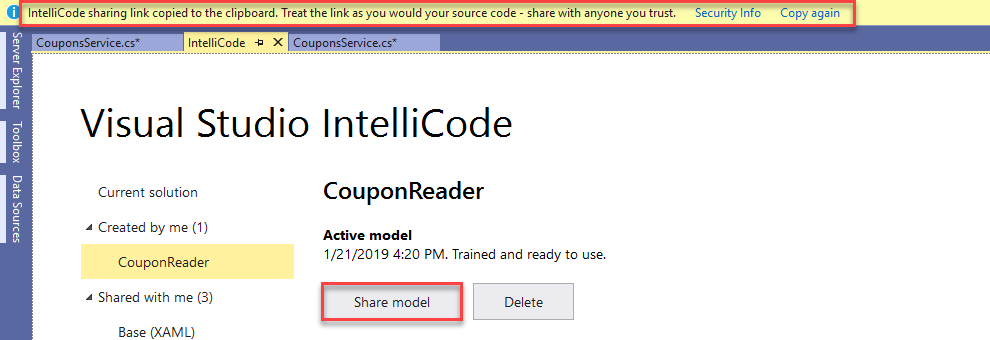

## Walkthrough: Live Unit Testing

Live Unit Testing automatically runs any impacted unit tests in the background and presents the results and code coverage live in the Visual Studio IDE in real time. As you modify your code, it provides feedback on how your changes impacted existing tests and whether the new code you've added is covered by one or more existing tests. Notice that one of the tests have failed. 

1. Type **Unit** in the **Search** textbox of Visual Studio at the top right corner and hit **Enter** which starts the **Live Unit Testing** session. 

    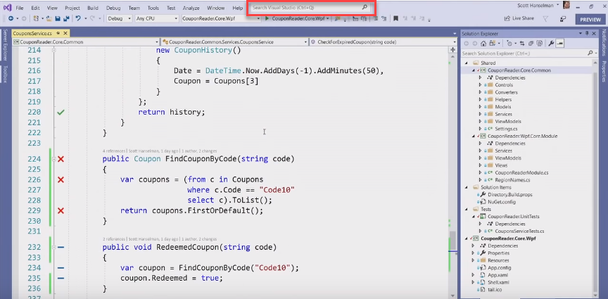

    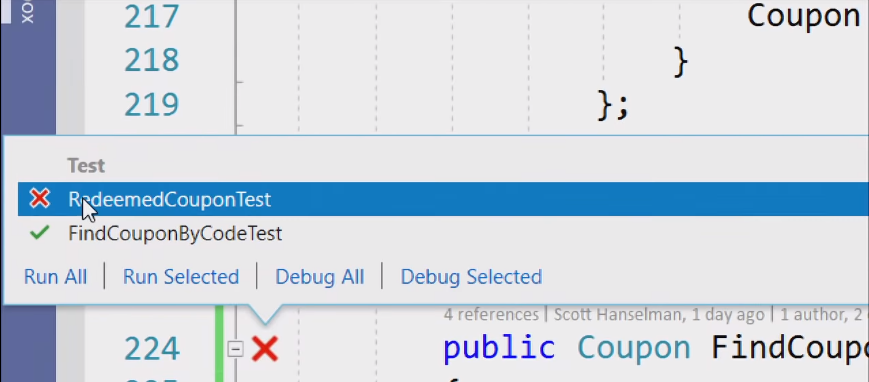

1. Click on the failed test - **RedeemedCouponTest** to go to its code. Hold **Ctrl** key and click **FindCouponbyCode** hyperlink.

    

1. In the resulting code, change **Code10** to **code**. Without having to save the changes or rerun the tests, the testing feature watches the code changes, automatically reran the tests successfully.

    

    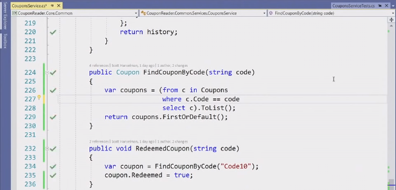

## Walkthrough: XAML Islands

XAML Islands is a technology that enables Windows developers to use new pieces of UI from the Universal Windows Platform (UWP) on their existing Win32 Applications, including Windows Forms and WPF technologies. This allows them to gradually modernize their apps at their own pace, making use of their current code as much as they want.

1. Press **F5** to start debugging the solution.

    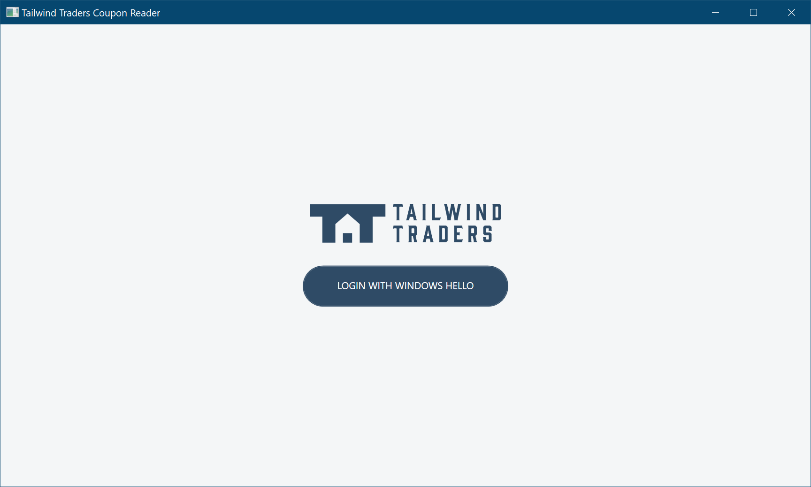

1. Once the application loads, click **LOGIN WITH WINDOWS HELLO** to access the application.

1. In the resulting window, type **Code20D** in the Scan textbox and click **Scan Code**.

    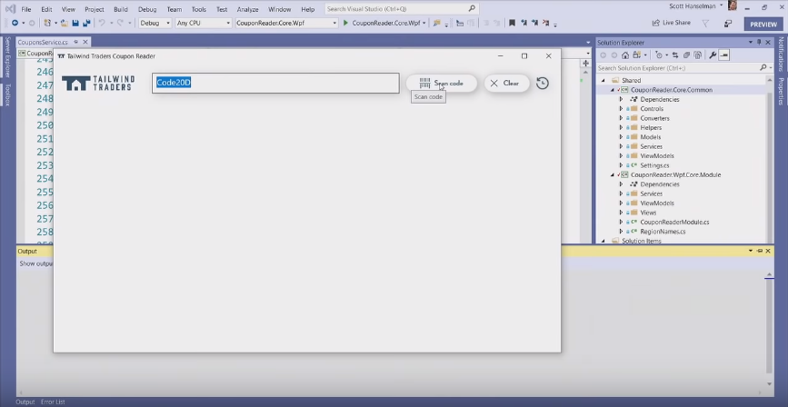

    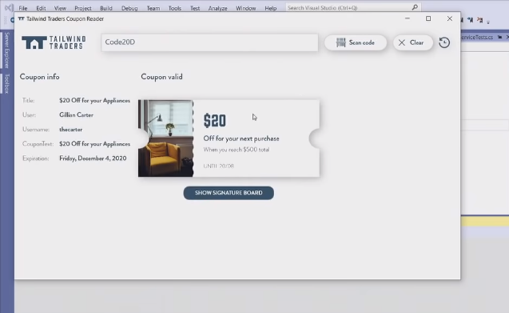

1. Click **SHOW SIGNATURE BOARD** button. The signature on the signature board is a Windows 10 user interface control that we are using inside of the WPF application with the power of **XAML** islands. You can move your mouse around the board to create a new signature.

    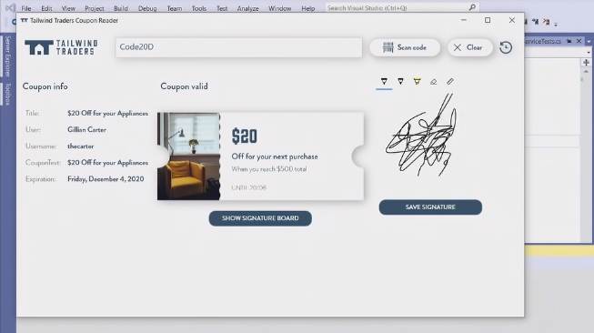

## Walkthrough: Manage pull requests within the IDE

Viewing, checking out, and reviewing pull requests are part of our everyday workflow as GitHub users. With Visual Studio, you no longer have to leave your editor to work in pull requests with your team.

1. Fork the [TailwindTraders-Desktop](https://github.com/Microsoft/TailwindTraders-Desktop) to your account

1. Login to your GitHub.com account in Visual Studio.

    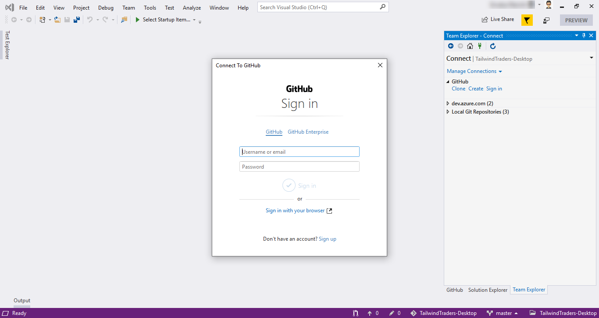

1. Once connected, it's quick to clone the repositories from your account or any organization you belong to. Click the clone button to bring up a dialog that shows all the repositories you have access to. Select the forked **TailwindTraders-Desktop** repository and click on clone.

    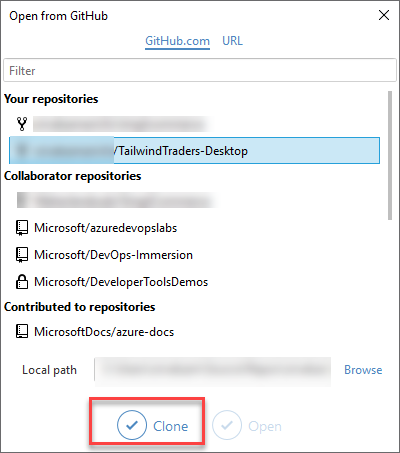

1. Click **Clt+Alt+F3** to open the branch view from the Visual Studio status bar. Click on the **New Branch**.

    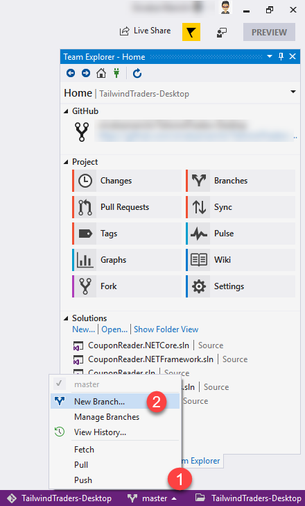

1. Name the branch as **development** and click on create.

    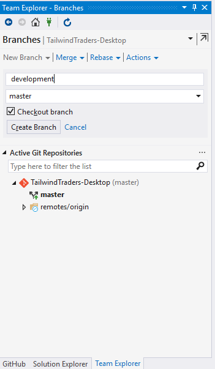

1. You will see the **development** branch being checked out in the Visual Studio status bar.

    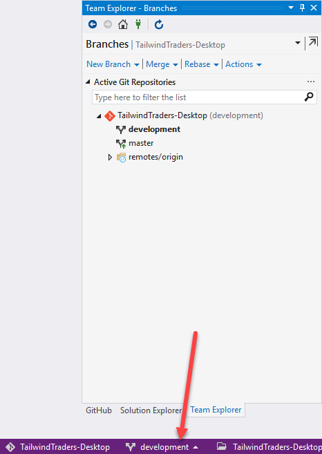

1. Load the solution **CouponReader.WPF**. Navigate to the below mentioned path, go to line number **262** and replace the text to **Reset**.

    > Designers/WPFNetFX/MainView.Xaml

    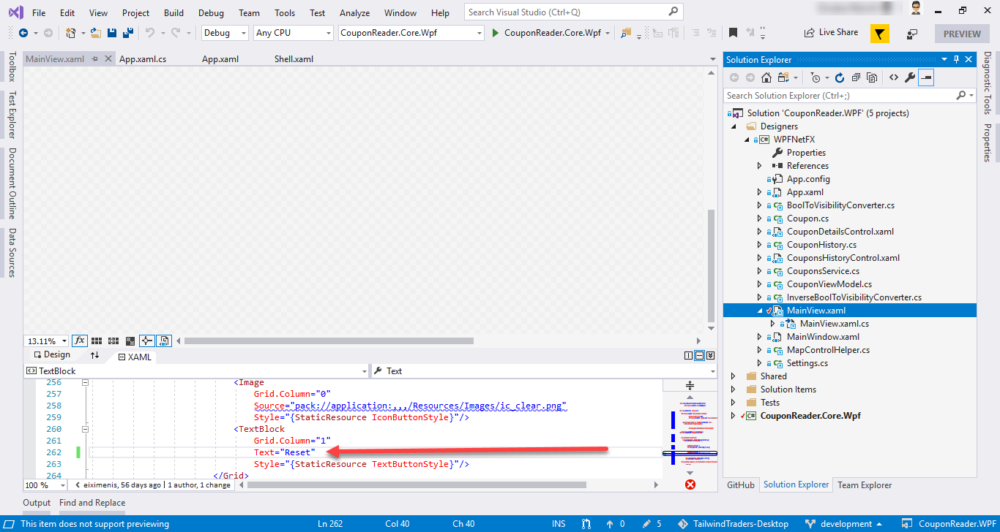

1. Give a commit message and click on **Commit all and push** to push the changes.

    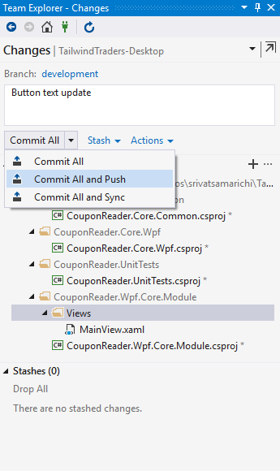

1. You will notice a success message toast notification.

    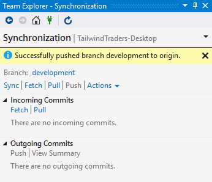

1. From the status bar in Visual Studio, click on the **Pull Request** icon to navigate to the pane.

    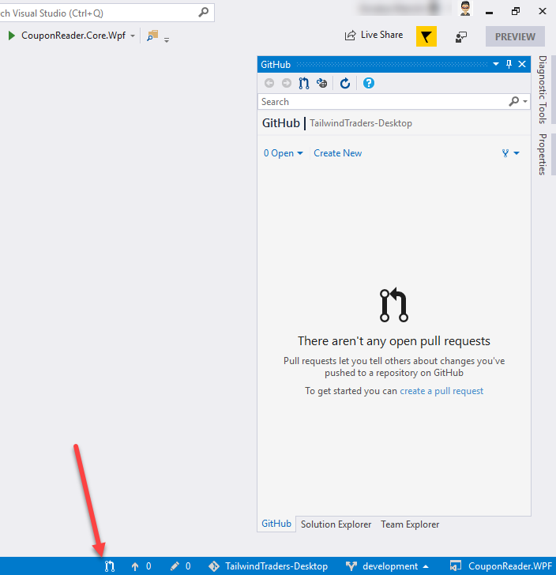

1. Click on **create a pull request** to create new. Select the branch and provide the description. Click on **Create pull request** button.

    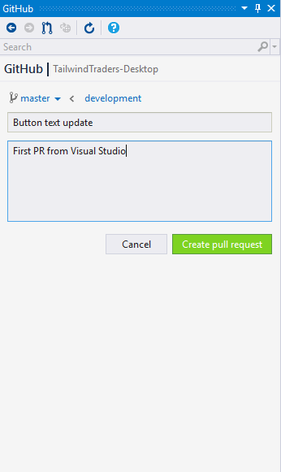

1. You will see the pull requests which was created in the GitHub pane.

    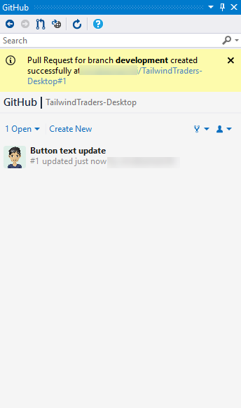

1. Open the browser and navigate to the forked repository to view the pull request created.

    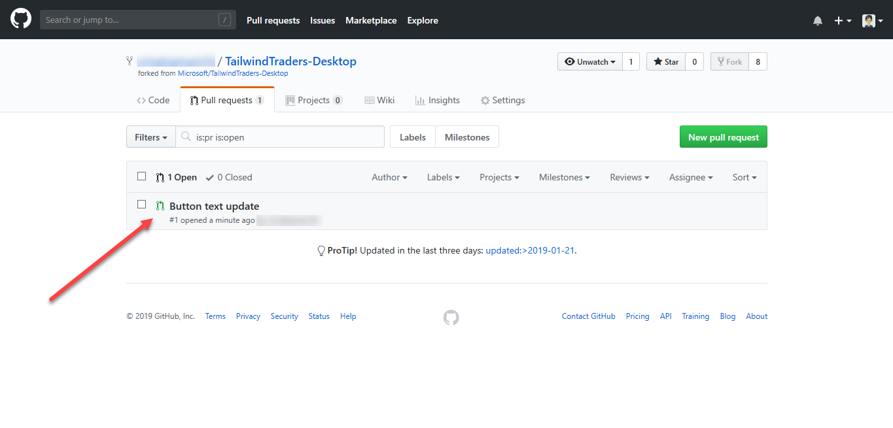

1. **Ship It Squirrel** is another open-source extension to signify support for someone's pull request when you feel it's ready to ship. Navigate to the GitHub repository on the browser and open a **Pull Request**. Type **:shipit:** in the comments box and click **Preview**. The extension shows in an animated view.
    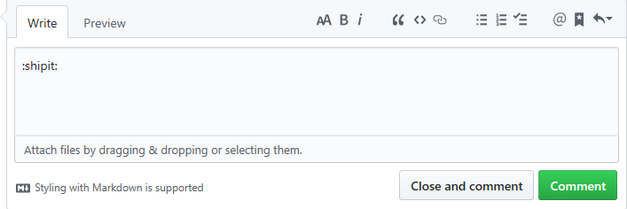

    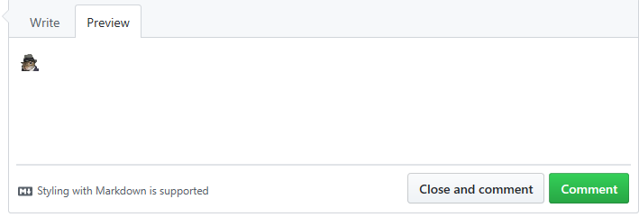