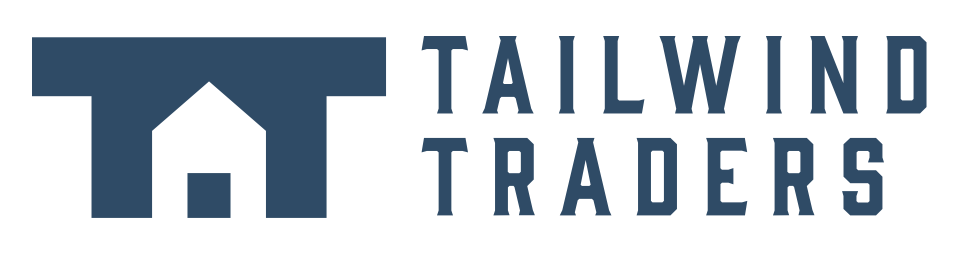
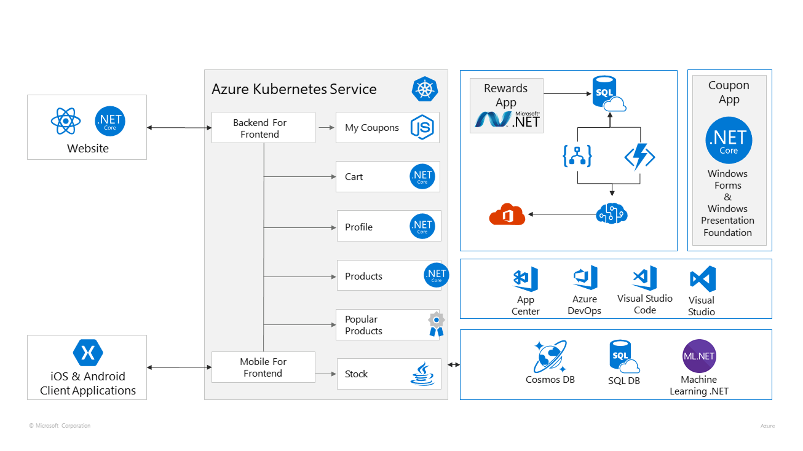
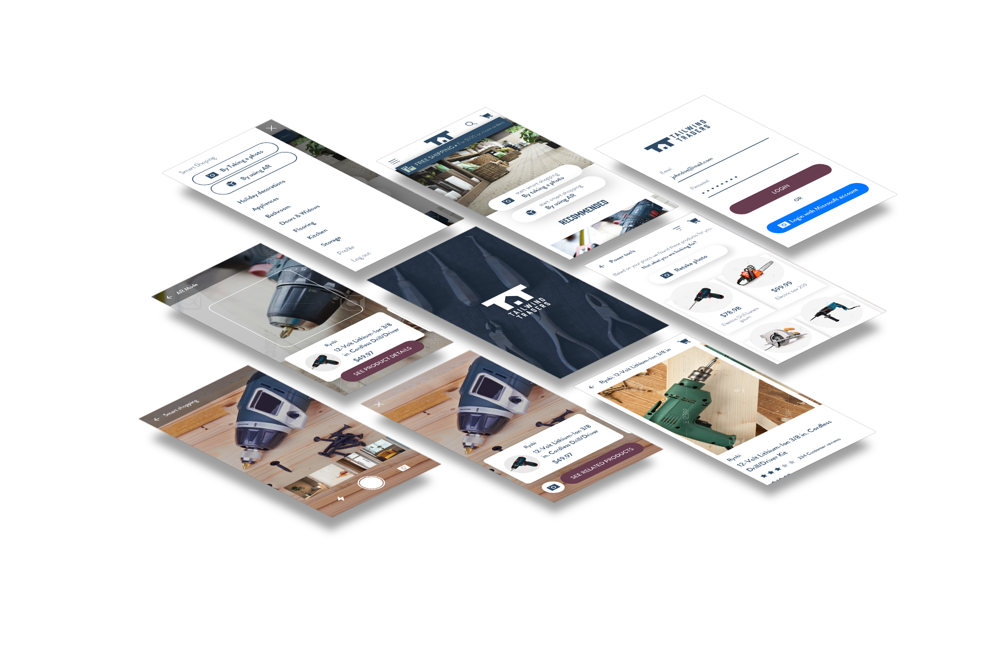
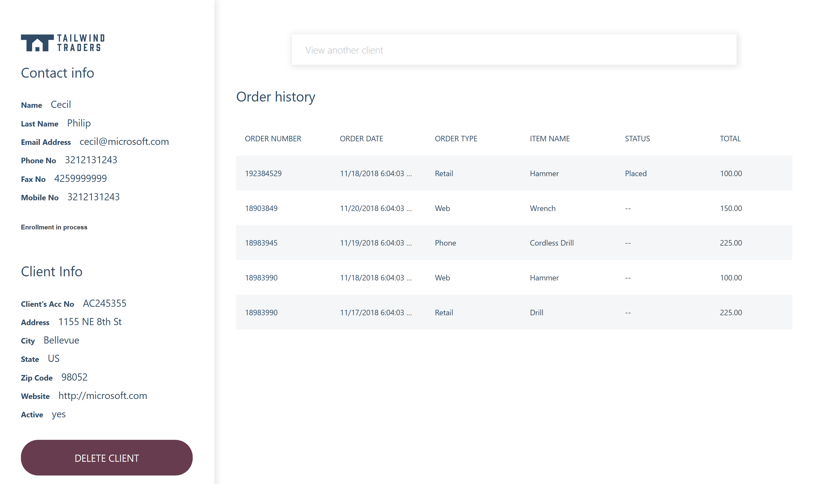
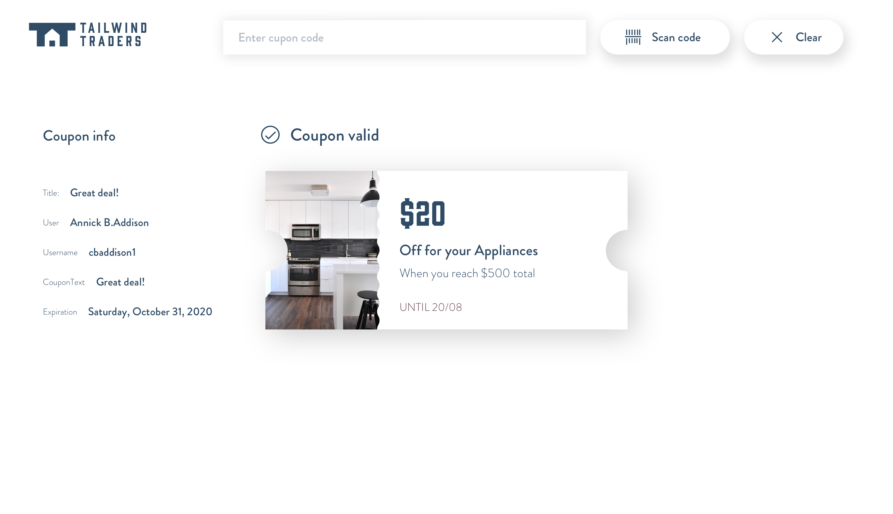

# Tailwind Traders Reference Apps
We are happy to announce the release of Tailwind Traders. A fictitious retail company showcasing the future of intelligent application experiences. These reference apps are all are powered by the Azure cloud, built with best-in-class tools, and made smarter through data and AI.

This release intends to share a simplified version of the reference sample apps used at Connect(); 2018 Keynotes.

# Repositories

For this demo reference, we built several consumer and line-of-business applications and a set of backend services. You can find all repositories in the following locations:

* [Backend (AKS)](https://github.com/Microsoft/TailwindTraders-Backend)
* [Website (ASP.NET & React)](https://github.com/Microsoft/TailwindTraders-Website)
* [Desktop (WinForms & WPF -.NET Core)](https://github.com/Microsoft/TailwindTraders-Desktop)
* [Rewards (ASP.NET Framework)](https://github.com/Microsoft/TailwindTraders-Rewards)
* [Mobile (Xamarin Forms 4.0)](https://github.com/Microsoft/TailwindTraders-Mobile)

As part of Connect(); 2018 we also released the [AI Vision Provision](https://github.com/Microsoft/AIVisualProvision) sample mobile app, which allows you to deploy Azure services from scanning Azure Services Logos or Text. The [AI Pet Detector](https://github.com/Microsoft/connect-petdetector) demo app is also available, learn how to create a Pet Detector image recognition with Azure Notebooks, Azure Machine Learning and Visual Studio Code.

# Demo Scripts

You can find the **[demo scripts](Documents/DemoScripts)** that show the power of Azure, Visual Studio and GitHub.

 * **[Integrating Azure Pipelines, GitHub and Azure Boards](https://github.com/Microsoft/TailwindTraders/tree/master/Documents/DemoScripts/Integrating%20Azure%20Pipelines,%20GitHub%20and%20Azure%20Boards)**  demonstrates the ability to easily use GitHub for hosting source code and use Azure Pipelines for continuous integration and continuous delivery to quickly deploy changes to Azure. Connect Azure Boards with GitHub repositories to take advantage of the rich project management capabilities provided by Azure Boards that spans Kanban boards, backlogs, team dashboards, and custom reporting, etc.
 
* **[Managing backend with Azure Kubernetes Service (AKS)](https://github.com/Microsoft/TailwindTraders/tree/master/Documents/DemoScripts/Managing%20backend%20with%20Azure%20Kubernetes%20Service%20(AKS))** learn how AKS allows you to managed orchestration of containers and also provides auto-patching, auto-scaling and updates support which enables you to use the full breadth of the Kubernetes ecosystem. Take advantage of Virtual Node that enables you to elastically provision additional nodes inside your Kubernetes clusters in just seconds, a first-of-its-kind serverless computing option with AKS enables you to provision and scale your Kubernetes based apps more efficiently.

* **[Modernizing .NET Apps](https://github.com/Microsoft/TailwindTraders/tree/master/Documents/DemoScripts/Modernizing%20.NET%20Apps)** move apps to the cloud and take advantage of cloud native solutions to modernize it and explore the benefits of Azure App Services.

* **[Productivity Improvements in Visual Studio 2019](https://github.com/Microsoft/TailwindTraders/tree/master/Documents/DemoScripts/Productivity%20Improvements%20in%20Visual%20Studio%202019)** the new version contains many new and exciting features and IDE productivity enhancements to support Windows app development, cross-platform mobile development, Azure development, web and cloud development, and more.

* **[Visual Studio App Center Capabilities](https://github.com/Microsoft/TailwindTraders/tree/master/Documents/DemoScripts/Visual%20Studio%20App%20Center%20Capabilities)** Automate the Build-Test-Distribute process for your mobile projects in GitHub. Continuous Integration and Continuous Delivery (CI/CD) with UI Test.

# Application Diagram

> BFF = [Backend For Frontend](https://docs.microsoft.com/en-us/azure/architecture/patterns/backends-for-frontends)

# Application Screens

# Sign Up for Microsoft Azure

You will need an Azure subscription to work with this demo code. You can:

- Open an account for free [Azure subscription](https://azure.com). You get credits that can be used to try out paid Azure services. Even after the credits are used up, you can keep the account and use free Azure services and features, such as the Web Apps feature in Azure App Service.
- [Activate Visual Studio subscriber benefits](https://azure.microsoft.com/pricing/member-offers/credit-for-visual-studio-subscribers/). Your Visual Studio subscription gives you credits every month that you can use for paid Azure services.
- Create an [Azure student account](https://azure.microsoft.com/free/students/) and get free credit when you create your account.

Learn more about it with [Microsoft Learn - Introduction to Azure](https://docs.microsoft.com/learn/azure).

# Blog posts and videos

Videos and blog posts from Connect(); 2018:

- [Scott Guthrie's blog post](https://blogs.microsoft.com/blog/2018/12/04/empowering-every-developer-to-achieve-more-at-microsoft-connect-2018)

- Scott Guthrie's Keynote:

- Scott Hanselman's Keynote:

# Contributing

This project welcomes contributions and suggestions.  Most contributions require you to agree to a
Contributor License Agreement (CLA) declaring that you have the right to, and actually do, grant us
the rights to use your contribution. For details, visit https://cla.microsoft.com.

When you submit a pull request, a CLA-bot will automatically determine whether you need to provide
a CLA and decorate the PR appropriately (e.g., label, comment). Simply follow the instructions
provided by the bot. You will only need to do this once across all repos using our CLA.

This project has adopted the [Microsoft Open Source Code of Conduct](https://opensource.microsoft.com/codeofconduct/).
For more information see the [Code of Conduct FAQ](https://opensource.microsoft.com/codeofconduct/faq/) or
contact [opencode@microsoft.com](mailto:opencode@microsoft.com) with any additional questions or comments.
